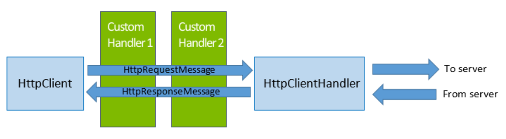

# Demystifying HttpClient APIs

As a Universal Windows Platform (UWP) app developer, if you are trying to communicate over HTTP with a web service or any server endpoint, you have multiple API choices. Two of the most used and recommended APIs for implementing the HTTP client role in a managed UWP app are `System.Net.Http.HttpClient` and `Windows.Web.Http.HttpClient`. These APIs should be preferred over older, discouraged APIs such as `WebClient` and `HttpWebRequest` (although a small subset of `HttpWebRequest` is available in UWP for backward compatibility).

We have received several questions about the differences between these APIs, equivalent functionalities between the two, which one to use when, and so on. In this post, we will try to address these questions and help clarify the purpose of these two APIs.

## Brief Overview

The `System.Net.Http.HttpClient` API was first introduced in .NET 4.5, and a variant was made available via a NuGet package down-level for .NET 4.0 and Windows Phone 8 Silverlight apps. The goal of this API was to provide a simpler, cleaner abstraction layer and flexibility for implementing the HTTP client role, as compared to the older HttpWebRequest API. For example, it allows chaining custom handlers, by which developers could intercept each request or response, and implement custom logic. Up until Windows 8.1, this API had a fully managed .NET implementation underneath. In Windows 10, the implementation of this API for UWP has been changed to layer it on top of Windows.Web.Http and the WinINet HTTP stack of Windows.

On the other hand, the `Windows.Web.Http.HttpClient` API, was first introduced in Windows 8.1 and was available on Windows Phone 8.1 as well. The primary motivation behind creating this API was to consolidate the disparate HTTP APIs available for different Windows app languages (C#, VB, C++, JavaScript) into a single one that supports all the features from each of those APIs. Most of the basic API design was derived from that of System.Net.Http and the implementation is based on the WinINet HTTP stack of Windows.

When using these APIs in a Windows Store app, the supported OS versions and programming languages are as follows:

| **API**                     | **OS Versions**                    | **Supported Languages**         |
| --------------------------- | ---------------------------------- | ------------------------------- |
| System.Net.Http.HttpClient  | Windows, Windows Phone 8 onwards   | .NET languages only             |
| Windows.Web.Http.HttpClient | Windows, Windows Phone 8.1 onwards | All Windows Store app languages |

## Which one should I use?

Since both of these APIs are available in UWP, the biggest question for HTTP developers is which one to use in their app. The answer is that it depends on a couple of factors:

1. **Do you need to integrate with native UI for collecting user credentials, control HTTP cache read and write behavior; or pass in a specific SSL client certificate for authentication?**If yes – then use Windows.Web.Http.HttpClient. At the time of this writing, the Windows.Web.Http API provides greater control over HTTP settings in UWP than the System.Net.Http API. In future versions, the System.Net.Http API may also be enhanced to support these features on UWP.
2. **Do you intend to write cross-platform .NET code (across UWP/ASP.NET 5/iOS and Android)?**If yes – then use `System.Net.Http` API. This allows you to write code that you can re-use on other .NET platforms such as ASP.NET 5 and .NET Framework desktop applications. Thanks to Xamarin, this API is also supported on iOS and Android, so you can reuse your code on these platforms as well.

## Object Model

Now that we understand the motivation behind creating these two similar APIs and the rationale for choosing between the two, let's look closer at the object model for each of these.

### System.Net.Http

The topmost abstraction layer is the `HttpClient` object, which represents the client entity in the client-server model of the HTTP protocol. This client can issue multiple requests (represented by `HttpRequestMessage`) to the server and receive the corresponding responses (represented by `HttpResponseMessage`). The entity body and content headers of each HTTP request or response is represented by the `HttpContent` base class, and derived classes such as `StreamContent`, `MultipartContent` and `StringContent`. They provide different representations of the HTTP entity body. Each of these classes provide a set of `ReadAs*` methods to read out the entity body of a request or response as a string, byte array or a stream.

Each `HttpClient` object has a handler object underneath that represents all the HTTP-related settings of that client. Conceptually, you can think of the handler as representing the HTTP stack underneath the client. It is responsible for sending the client's HTTP requests to the server and conveying the response back to the client.

The default handler class used in the `System.Net.Http` API is `HttpClientHandler`. When you create a new instance of an `HttpClient` object—for example, call `new HttpClient()`—an `HttpClientHandler` object is automatically created for you with the default HTTP stack settings. If you want to modify any of the default settings such as caching behavior, automatic compression, credentials or proxy, you can create your own instance of an `HttpClientHandler` directly, modify its properties and then pass it into the constructor of `HttpClient`, as follows:

```C#
`HttpClientHandler myHandler = ``new` `HttpClientHandler();``myHandler.AllowAutoRedirect = ``false``;``HttpClient myClient = ``new` `HttpClient(myHandler);`
```

#### Chaining of Handlers

One of the key advantages of the `System.Net.Http.HttpClient` API design is the ability to insert custom handlers and create a chain of handler objects underneath an `HttpClient` object. For example, let's say you are building an app that queries a web service for some data. You have custom logic to handle HTTP 4xx (client error) and 5xx (server error) responses from the server and want to take specific retry steps, such as trying a different endpoint or adding user credentials. You would ideally want to separate this HTTP-related work from the rest of your business logic which just cares about the data returned from the web service.

This can be achieved by creating a new handler class that derives from the `DelegatingHandler` class (e.g. CustomHandler1), then create a new instance of it and pass that in to the `HttpClient` constructor. The `InnerHandler` property of the `DelegatingHandler` class is used to specify the next handler in the chain – for example, you could add another custom handler (e.g. CustomHandler2) to the chain. For the last handler, you can set the inner handler to an `HttpClientHandler` instance – this will pass the request on to the HTTP stack of the OS. Here's how this looks conceptually:



And here is the sample code to achieve this:

```C#
public class CustomHandler1 : DelegatingHandler
{
    // Constructors and other code here.
    protected async override Task<HttpResponseMessage> SendAsync(
        HttpRequestMessage request, CancellationToken cancellationToken)
    {
        // Process the HttpRequestMessage object here.
        Debug.WriteLine("Processing request in Custom Handler 1");
 
        // Once processing is done, call DelegatingHandler.SendAsync to pass it on the 
        // inner handler.
        HttpResponseMessage response = await base.SendAsync(request, cancellationToken);
 
        // Process the incoming HttpResponseMessage object here.
        Debug.WriteLine("Processing response in Custom Handler 1");
 
        return response;
    }
}
 
public class CustomHandler2 : DelegatingHandler
{
    // Similar code as CustomHandler1.
}

public class Foo
{
    public void CreateHttpClientWithChain()
    {
        HttpClientHandler systemHandler = new HttpClientHandler();
        CustomHandler1 myHandler1 = new CustomHandler1();
        CustomHandler2 myHandler2 = new CustomHandler2();
 
        // Chain the handlers together.
        myHandler1.InnerHandler = myHandler2;
        myHandler2.InnerHandler = systemHandler;
 
        // Create the client object with the topmost handler in the chain.
        HttpClient myClient = new HttpClient(myHandler1);
    }
}

```

***Notes:***

1. If you intend to send the request to a remote server endpoint, the last Handler in a chain is typically `HttpClientHandler`, which actually sends the request out on the wire and receive the response from the HTTP stack of the OS. Alternatively, you could use a mock handler that pretends to be the server and returns fabricated responses.
2. Adding processing logic in the handler before passing the request to the inner handler or the response to the upper handler can lead to performance loss. It is best to avoid expensive synchronous operations in this scenario.

For more details on the concept of chaining Handlers, see [this post](http://blogs.msdn.com/b/henrikn/archive/2012/04/27/asp-net-web-api-updates-april-27.aspx) by Henrik Nielsen (Note that it refers to the ASP.NET Web API version of the API, which is slightly different from the .NET framework one discussed here. The concept of chaining handlers is common though.)

## Windows.Web.Http

The object model for the Windows.Web.Http API is very similar to that of the System.Net.Http version described above – it also has the concept of a client entity, a handler (called “filter” in this namespace) and the option of inserting custom logic between the client and the system-default filter.

Most of the types are direct analogs of the types in the System.Net.Http object model, as follows:

| **HTTP client role aspect**                               | **System.Net.Http type**                          | **Corresponding Windows.Web.Http type**                      |
| --------------------------------------------------------- | ------------------------------------------------- | ------------------------------------------------------------ |
| Client entity                                             | HttpClient                                        | HttpClient                                                   |
| HTTP request                                              | HttpRequestMessage                                | HttpRequestMessage                                           |
| HTTP response                                             | HttpResponseMessage                               | HttpResponseMessage                                          |
| Entity body of an HTTP request or response                | HttpContent                                       | IHttpContent                                                 |
| Representations of HTTP content as string/stream/etc.     | StringContent, StreamContent and ByteArrayContent | HttpStringContent, HttpStreamContent and HttpBufferContent respectively |
| HTTP stack/settings                                       | HttpClientHandler                                 | HttpBaseProtocolFilter                                       |
| Base class/interface for creating custom handlers/filters | DelegatingHandler                                 | IHttpFilter                                                  |

The previous discussion about chaining of handlers in the System.Net.Http API also applies to the Windows.Web.Http API, where you can create a chain of custom filters and pass them into the constructor of an HttpClient object.

## Implementing Common HTTP Scenarios

We now look at some code snippets and quick notes for implementing the most common HTTP scenarios using each of the two HttpClient APIs. For complete details and guidance, please look at the MSDN documentation for [Windows.Web.Http.HttpClient](https://msdn.microsoft.com/en-us/library/windows/apps/windows.web.http.httpclient.aspx) and [System.Net.Http.HttpClient](https://msdn.microsoft.com/en-us/library/system.net.http.httpclient(v=vs.110).aspx) respectively.

### Modifying headers

**System.Net.Http:**

To modify headers for all requests sent by an instance of HttpClient, use the following pattern:

```C#
var myClient = new HttpClient();
myClient.DefaultRequestHeaders.Add("X-HeaderKey", "HeaderValue");
myClient.DefaultRequestHeaders.Referrer = new Uri("http://www.contoso.com");
```

To modify the headers of for a specific request only, use:

```C#
HttpRequestMessage myrequest = new HttpRequestMessage();
myrequest.Headers.Add("X-HeaderKey", "HeaderValue");
myrequest.Headers.Referrer = new Uri("http://www.contoso.com");
```

**Windows.Web.Http:**

The patterns shown above apply to the Windows.Web.Http API as well.

**Notes:**

1. Some headers are represented as collections and the `Add` and `Remove` methods need to be used to edit them.
2. The `HttpClient.DefaultRequestHeaders` property represents the default set of headers that will be added to the request at the app layer. As the request is processed by the HTTP stack of the operating system, additional headers may be added before the request is sent out on the wire.

### Setting Timeouts

**System.Net.Http:**

In the `System.Net.Http` API, there are two ways to set a timeout. To set a timeout for all requests made from that client, use:

```c#
myClient.Timeout = TimeSpan.FromSeconds(30);
```

To set a timeout on a single request, use the cancellation token pattern:

```C#
var cts = new CancellationTokenSource();
cts.CancelAfter(TimeSpan.FromSeconds(30));
 
var httpClient = new HttpClient();
var resourceUri = new Uri("http://www.contoso.com");
 
try
{
   HttpResponseMessage response = await httpClient.GetAsync(resourceUri, cts.Token);
}
catch (TaskCanceledException ex)
{
   // Handle request being canceled due to timeout.
}
catch (HttpRequestException ex)
{
   // Handle other possible exceptions.
}
```

**Windows.Web.Http:**

There is no timeout property on the Windows.Web.Http.HttpClient type. As a result, you must use the cancellation token pattern shown above.

### Using Authentication Credentials

**System.Net.Http:**

In order to protect the credential information of the user, the HTTP stack does not add any authentication credentials to outgoing requests by default. To use specific user credentials, use the following pattern:

```C#
var myClientHandler = new HttpClientHandler();
myClientHandler.Credentials = new NetworkCredential(myUsername, myPassword);
```

**Windows.Web.Http:**

For the Windows.Web.Http API, by default, a UI dialog is presented if the outgoing request is for a resource that requires user authentication. To disable the UI dialog, set the AllowUI property of HttpBaseProtocolFilter to false. To use specific credentials instead, use:

```C#
var myFilter = new HttpBaseProtocolFilter();
myFilter.ServerCredential = new PasswordCredential(“fooBar”, myUsername, myPassword);
```

**Notes:**

1. In the above examples, myUsername and myPassword are string variables that can be populated via inputs obtained from the user via UI or from app configuration settings
2. In UWP apps, the `HttpClientHandler.Credentials` property can be set only to null, DefaultCredentials, or an object of type NetworkCredential.

### Using Client Certificates

**System.Net.Http:**

In order to protect the user's credential information, this API does not send any client certificates to the server by default. To use client certificates for authentication, use:

```C#
var myClientHandler = new HttpClientHandler();
myClientHandler.ClientCertificateOptions = ClientCertificateOption.Automatic;

```

**Windows.Web.Http:**

There are two options for authenticating using client certificate – the default is to present UI for the user to choose the certificate. Alternatively, you can programmatically set a client certificate to use, as follows:

```C#
var myFilter = new HttpBaseProtocolFilter();
myFilter.ClientCertificate = myCertificate;
```

**Notes:**

1. In order to use a client cert with either API, you must first add it to the app's certificate store by following [these instructions](http://blogs.msdn.com/b/wsdevsol/archive/2014/07/31/programmatically-create-and-configure-a-client-certificate-for-use-in-your-windows-runtime-based-app.aspx). Apps with enterprise capability can also use existing client certificates in the user's ‘My’ store.
2. For `HttpClientHandler.ClientCertificateOptions` , there are two allowed values: `Automatic` and `Manual`. Setting it to `Automatic` will choose the best matching client certificate from the app certificate store and use that for authentication. Setting it to `Manual` will ensure that no client certificate is sent even if the server requests it.

### Proxy Settings

For both APIs, proxy settings are automatically obtained from Internet Explorer/Microsoft Edge settings and are used for all the HTTP calls by default. This enables apps to automatically work even if the user is connected to the internet through a proxy. Neither API provides a way to specify a custom proxy for your app. However, you can choose to not use the default proxy by setting HttpClientHandler.UseProxy to false (for System.Net.Http) or HttpBaseProtocolFilter.UseProxy to false (for Windows.Web.Http).

### Cookie Handling

By default, both APIs save cookies that are sent by a server and automatically add them to subsequent requests to that URI within the same app container. The cookies for a particular URI can be read and new custom cookies can be added. Finally, both APIs have an option for disabling sending of cookies to the server: for System.Net.Http, set HttpClientHandler.UseCookies to false and for Windows.Web.Http, set HttpBaseProtocolFilter.CookieUsageBehavior to HttpCookieUsageBehavior.NoCookies.

**System.Net.Http:**

To add a cookie to all requests made by that client:

```C#
// Add a cookie manually.
myClientHandler.CookieContainer.Add(resourceUri, myCookie);
```

To add a cookie to a single request:

```C#
HttpRequestMessage myRequest = new HttpRequestMessage();
myRequest.Headers.Add("Cookie", "user=foo; key=bar");
```

To inspect all cookies for a given URI:

```C#
var cookieCollection = myClientHandler.CookieContainer.GetCookies(resourceUri);
```

**Windows.Web.Http:**

To add a cookie to all requests sent by a client:

```C#
// Add a cookie manually.
filter.CookieManager.SetCookie(myCookie);
```

To add a cookie to a single request, the pattern shown above apply to the Windows.Web.Http API as well.

Manage cookies:

```C#
// Get all cookies for a given URI.
var cookieCollection = filter.CookieManager.GetCookies(resourceUri);
 
// Delete a cookie.
filter.CookieManager.DeleteCookie(myCookie);
```

**Notes:**

1. In the Windows.Web.Http API, the cookies in the cookie manager are shared within the app container across several networking APIs that are all implemented using the WinINet stack, such as Windows.Web.Syndication, Windows.Web.AtomPub, XHR and others. Thus, a cookie received via a server response to a Syndication API call in the past might be added to a subsequent HttpClient request to that same server within the same app container.

### Max Connections per server

By default, the underlying HTTP stack of the operating system uses up to 6 HTTP connections per server. The System.Net.Http HttpClient API does not provide a way to control this. For Windows.Web.Http API, use:

```
var myFilter = new HttpBaseProtocolFilter();
myFilter.MaxConnectionsPerServer = 15;
```

## Latest Updates

In Windows 10, **we have added HTTP/2 support to both of these APIs in UWP apps**. This support is on by default, so as a developer, you get advantages such as lower latency with no code changes. Both APIs (System.Net.Http and Windows.Web.Http) also allow explicitly disabling this feature and forcing the version to HTTP 1.1 or 1.0.

Going forward, we intend to continue adding support for highly requested features such as custom validation of server SSL certificates and the ability to add handlers/filters to HttpClient objects created elsewhere. We look forward to hearing the features that you need in these APIs in order to continue writing awesome apps on Windows. You can either file an idea on [UserVoice](https://wpdev.uservoice.com/forums/110705-dev-platform/category/22999-network-apis) or better yet, join the [Windows Insiders program](https://insider.windows.com/) and submit feedback through the forums or the Windows Feedback app.

This post was written by Sidharth Nabar, a program manager on the Windows Networking APIs team.