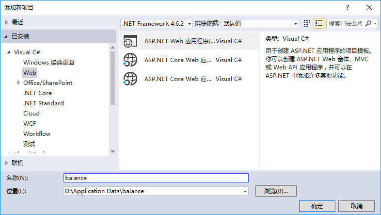
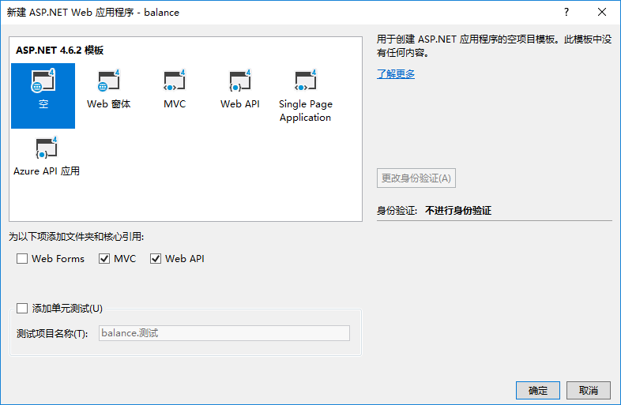

# Balance

## 建立主项目

### 新建解决方案和Balance项目

项目名称：Balance

项目类型：ASP.NET Web应用程序

确定



选择模板：Web API 4空模板

核心引用：MVC,Web API

身份验证：不进行身份验证

确定



可选地，在项目根目录添加项目图标文件favicon.ico。

设为启动项目

添加对balance.WebApi项目的引用

可选地，删除App\_Data文件夹

	Update-package

安装NuGet包：

	Install-Package EntityFramework

添加连接字符串到项目根目录下面的`Web.config`中：
```xml
  <connectionStrings>
    <add name="azurestorage"
         connectionString="data source=.;initial catalog=azurestorage;integrated security=True;MultipleActiveResultSets=True;App=EntityFramework"
         providerName="System.Data.SqlClient" />
  </connectionStrings>
</configuration>
```

### 安装Autofac与AutoMapper

	install-package autofac.mvc5
	install-package autofac.webapi2
	install-package automapper

/App\_Start/AutofacConfig.cs:

```C#
using Autofac;
using Autofac.Integration.Mvc;
using Autofac.Integration.WebApi;
using System.Linq;
using System.Reflection;
using System.Web.Compilation;

namespace balance
{
    public static class AutofacConfig
    {
        public static IContainer GetContainer()
        {
            var assemblies = BuildManager.GetReferencedAssemblies().Cast<Assembly>().ToArray();

            var builder = new ContainerBuilder();
            builder.RegisterControllers(assemblies);
            builder.RegisterApiControllers(assemblies);
            builder.RegisterAssemblyModules(assemblies);

            var container = builder.Build();
            return container;

        }
    }
}
```

双击项目根目录下的Global.asax，修改如下：

```C#
using Autofac.Integration.Mvc;
using Autofac.Integration.WebApi;
using System;
using System.Web;
using System.Web.Http;
using System.Web.Mvc;
using System.Web.Routing;

namespace balance
{
    public class Global : HttpApplication
    {
        void Application_Start(object sender, EventArgs e)
        {
            var container = AutofacConfig.GetContainer();
            DependencyResolver.SetResolver(new AutofacDependencyResolver(container));
            GlobalConfiguration.Configuration.DependencyResolver = new AutofacWebApiDependencyResolver(container);

            GlobalConfiguration.Configure(WebApiConfig.Register);
            RouteConfig.RegisterRoutes(RouteTable.Routes);            
        }
    }
}
```

在项目根部添加两个文件夹：AutofacModules，AutoMapperProfiles

Autofac配置模块为 AutofacModules/AutoMapperModule.cs：
```C#
using Autofac;
using AutoMapper;
using System;
using System.Linq;

namespace balance.AutofacModules
{

    public class AutoMapperModule : Autofac.Module
    {
        protected override void Load(ContainerBuilder builder)
        {
            var profiles =
                from t in this.GetType().Assembly.GetTypes()
                where typeof(Profile).IsAssignableFrom(t)
                select (Profile)Activator.CreateInstance(t);

            var config = new MapperConfiguration(cfg =>
            {
                foreach (var profile in profiles)
                {
                    cfg.AddProfile(profile);
                }
            });
            config.AssertConfigurationIsValid();
            builder.RegisterInstance(config).As<MapperConfiguration>();
            builder.Register(ctx => ctx.Resolve<MapperConfiguration>().CreateMapper()).As<IMapper>();
        }
    }
}
```
/balance/AutoMapperProfiles/LocalProfile.cs（可以需要的时候再添加）
```C#
using AutoMapper;

namespace balance.AutoMapperProfiles
{
    public class LocalProfile : Profile
    {
        public LocalProfile()
        {
            //CreateMap<Product, Product>()
            //    .ForMember(opt => opt.ProductID, x => x.Ignore());
        }
    }
}
```
### 修改路由配置

在App\_Start文件夹下，WebApiConfig.cs中，修改路由配置为：
```C#
using System.Net.Http;
using System.Web.Http;
using System.Web.Http.Controllers;

namespace balance
{
    public static class WebApiConfig
    {
        public static void Register(HttpConfiguration config)
        {
            // Web API 配置和服务

            // Web API 路由
            config.MapHttpAttributeRoutes();

            //config.Routes.MapHttpRoute(
            //    name: "DefaultApi",
            //    routeTemplate: "api/{controller}/{id}",
            //    defaults: new { id = RouteParameter.Optional }
            //);

            config.Routes.MapHttpRoute(
                name: "action",
                routeTemplate: "api/{controller}/{action}"
                );

            config.ParameterBindingRules.Insert(0, x =>
            {
                //非get方法，且只有一个参数
                if (!x.ActionDescriptor.SupportedHttpMethods.Contains(HttpMethod.Get)
                && x.ActionDescriptor.GetParameters().Count == 1)
                {
                    return x.BindWithAttribute(new FromBodyAttribute());
                }
                else
                {
                    return x.BindWithAttribute(new FromUriAttribute());
                }

            });

        }
    }
}

```
代码的后半部分增加了一个参数绑定规则，参数指操作方法的输入参数。为修改操作参数获取数据的位置。当非GET方法有一个参数时，默认为从Body中获取参数。Get方法从Url中获取数据，当非GET方法有多个参数时，这时默认也是从URL中获取数据。

### 配置视图

修改Views/Shared/\_Layout.cshtml布局文件：
```html
<!DOCTYPE html>
<html lang="zh-cn">
<head>
    <meta charset="utf-8" />
    <meta name="viewport" content="width=device-width" />
    <meta name="description" content="计算程序" />

    <link href="~/Content/Site.css" rel="stylesheet"/>
    <link href="https://cdn.bootcss.com/bootstrap/4.0.0-alpha.6/css/bootstrap.min.css" rel="stylesheet">
    <script src="https://cdn.bootcss.com/jquery/3.2.1/jquery.js"></script>
    <script src="https://cdn.bootcss.com/tether/1.4.0/js/tether.js"></script>
    <script src="https://cdn.bootcss.com/bootstrap/4.0.0-alpha.6/js/bootstrap.js"></script>
    <script src="https://cdn.bootcss.com/knockout/3.4.2/knockout-debug.js"></script>

    <title>@ViewBag.Title</title>

    @RenderSection("scripts", required: false)
</head>

<body>
    @RenderBody()
</body>
</html>
```

启动文件指定视图所用模板，\Views\\_ViewStart.cshtml：
```C#
@{
    Layout = "~/Views/Shared/_Layout.cshtml";
}
```
编译并运行项目，确保正确配置程序。

## 新建Balance.webApi项目

本项目主要用于定义ApiController。和其他非视图类的功能。

项目名称：Balance.webApi

项目类型：Visual F\#-&gt;Windows-&gt;库

确定

{width="7.5057272528433945in" height="4.015748031496063in"}

删除两个示例文件:Library1.fs、Script.fsx

为本项目balance.webApi安装程序包：
	install-package fsharp.core
	Install-package Microsoft.Aspnet.webApi

为本项目Balance.Api添加项目引用：程序集&gt;&gt;框架&gt;&gt;System.Web

最后，从Balance项目添加对本项目Balance.webApi的引用。

好了，这就是配置一个框架的基本内容！

## 新建balance.Functions

本项目实现具体的计算功能。

解决方案、添加新建项目：

项目名称：Balance.Functions

项目类型：Visual F\#&gt;&gt;Windows&gt;&gt;库

确定

{width="6.181102362204724in" height="3.9477471566054243in"}

删除两个示例文件:Library1.fs、Script.fsx

应用项目到解决方案。

在Balance.webApi项目中添加对balance.Functions类库的引用。

[[]{#OLE_LINK2 .anchor}]{#OLE_LINK1 .anchor}打开Balance/Web.config，在configuration根目录下添加连接字符串：

&lt;/appSettings&gt;

&lt;connectionStrings&gt;

&lt;add name="StorageConnectionString"

connectionString="DefaultEndpointsProtocol=https;AccountName=abacus;AccountKey=3559gPby4SRwHSBxbcTd4bURTPJuEUmo5Q9OrkoBJpt8bvyI2HtzIiDDwJxFUJELiFP0MKctcy5tUHPAkfXd7A==;EndpointSuffix=core.Chinacloudapi.cn" /&gt;

&lt;/connectionStrings&gt;

本项目balance.Functions添加引用：

D:\\Application Data\\Azure\\StorageAccess\\bin\\StorageAccess.dll

本项目balance. Functions安装程序包：
	Install-package MathNet.Numerics.FSharp

## 常用代码段：

反射某类型的所有自动属性：
```F#
let props =
	let flags = BindingFlags.Public ||| BindingFlags.Instance
	tp.GetProperties(flags)
	|> Array.filter (fun pi -> pi.CanWrite && pi.CanRead)
```
显示计算的结果：
```html
<pre data-bind="text: JSON.stringify(ko.mapping.toJS(results),null,2)"></pre>
```
将js对象转化为键值对：
```javascript
function kvp(obj) {
	return Object.keys(obj).map(function (p) {
	return {key:p,value:obj\[p\]}
	})
}
```