# Chapter 3 Lexical Analysis

In this chapter we show how to construct a lexical analyzer. To implement a lexical analyzer by hand, it helps to start with a diagram or other description for the lexemes of each token. We can then write code to identify each occurrence of each lexeme on the input and to return information about the token identified. 

We can also produce a lexical analyzer automatically by specifying the lexeme patterns to a lexical-analyzer generator and compiling those patterns into code that functions as a lexical analyzer. This approach makes it easier to modify a lexical analyzer, since we have only to rewrite the affected patterns, not the entire program. It also speeds up the process of implementing the lexical analyzer, since the programmer specifies the software at the very high level of patterns and relies on the generator to produce the detailed code. We shall introduce in Section 3.5 a lexical-analyzer generator called Lex (or Flex in a more recent embodiment).

We begin the study of lexical-analyzer generators by introducing regular expressions, a convenient notation for specifying lexeme patterns. We show how this notation can be transformed, first into nondeterministic automata and then into deterministic automata. The latter two notations can be used as input to a "driver," that is, code which simulates these automata and uses them as a guide to determining the next token. This driver and the specification of the automaton form the nucleus of the lexical analyzer.

## 3.3 Specification of Tokens

Regular expressions are an important notation for specifying lexeme patterns. While they cannot express all possible patterns, they are very effective in specifying those types of patterns that we actually need for tokens. In this section we shall study the formal notation for regular expressions, and in Section 3.5 we shall see how these expressions are used in a lexical-analyzer generator. Then, Section 3.7 shows how to build the lexical analyzer by converting regular expressions to automata that perform the recognition of the specified tokens.

### 3.3.1 Strings and Languages

An *alphabet* is any finite set of symbols. Typical examples of symbols are letters, digits, and punctuation. The set {0, 1} is the *binary alphabet*. ASCII is an important example of an alphabet; it is used in many software systems. Unicode, which includes approximately 100,000 characters from alphabets around the world, is another important example of an alphabet. 

A *string* over an alphabet is a finite sequence of symbols drawn from that alphabet. In language theory, the terms "sentence" and "word" are often used as synonyms for "string." The length of a string s, usually written $|s|$ is the number of occurrences of symbols in s. For example, `banana` is a string of length six. The empty string, denoted €, is the string of length zero.

A language is any countable set of strings over some fixed alphabet. This definition is very broad. Abstract languages like Ø, the *empty set*, or {€}, the set containing only the empty string, are languages under this definition. So too are the set of all syntactically well-formed C programs and the set of all grammatically correct English sentences, although the latter two languages are difficult to specify exactly. Note that the definition of "language" does not require that any meaning be ascribed to the strings in the language. Methods for defining the "meaning" of strings are discussed in Chapter 5. 

---

##### Terms for Parts of Strings

The following string-related terms are commonly used:

1. A *prefix* of string s is any string obtained by removing zero or more symbols from the end of s. For example, ban, banana, and € are prefixes of banana.

2. A *suffix* of string s is any string obtained by removing zero or more symbols from the beginning of s. For example, nana, banana, and € are suffixes of banana.

3. A *substring* of s is obtained by deleting any prefix and any suffix from s. For instance, banana, nan, and € are substrings of banana. 

4. The *proper* prefixes, suffixes, and substrings of a string s are those, prefixes, suffixes, and substrings, respectively, of s that are not € or not equal to s itself.

5. A *subsequence* of s is any string formed by deleting zero or more not necessarily consecutive positions of s. For example, `baan` is a subsequence of `banana`. 

---

If x and y are strings, then the *concatenation* of x and y, denoted xy, is the string formed by appending y to x. For example, if x = dog and y = house, then xy = doghouse. The empty string is the identity under concatenation; that is, for any string s, $\epsilon s = s\epsilon = s$.

If we think of concatenation as a product, we can define the "exponentiation" of strings as follows. Define s^0^ to be €, and for all i > 0, define s^i^ to be s^i-1^s. Since $\epsilon s = s$, it follows that s^1^ = s. Then s^2^ = ss, s^3^ = sss, and so on.

### 3.3.2 Operations on Languages

In lexical analysis, the most important operations on languages are union, concatenation, and closure, which are defined formally in Fig. 3.6. Union is the familiar operation on sets. The concatenation of languages is all strings formed by taking a string from the first language and a string from the second language, in all possible ways, and concatenating them. The (Kleene) closure of a language L, denoted L*, is the set of strings you get by concatenating L zero or more times. Note that L^0^, the "concatenation of L zero times," is defined to be {€}, and inductively, L^i^ is L^i-1^L. Finally, the positive closure, denoted L^+^, is the same as the Kleene closure, but without the term L^0^. That is, € will not be in L^+^ unless it is in L itself. 

| OPERATION                | DEFINITION  AND  NOTATION               |
| ------------------------ | --------------------------------------- |
| Union of L and M         | L ∪ M = \{ s : s is in L or s is in M \} |
| Concatenation of L and M | L M = \{st : s is in L and t is in M \}  |
| Kleene closure of L      | L* = $\cup_{i=0}^\infty L^i$            |
| Positive closure of L    | L+ = $\cup_{i=1}^\infty L^i$            |

Figure 3.6: Definitions of operations on languages

**Example 3.3:** Let L be the set of letters {A, B, ... , Z, a, b, ... , z} and let D be the set of digits {0, 1, ... 9}. We may think of L and D in two, essentially equivalent, ways. One way is that L and D are, respectively, the alphabets of uppercase and lowercase letters and of digits. The second way is that L and D are languages, all of whose strings happen to be of length one. Here are some other languages that can be constructed from languages L and D, using the operators of Fig. 3.6:

1. L ∪ D is the set of letters and digits strictly speaking the language with 62 strings of length one, each of which strings is either one letter or one digit.

2. LD is the set of 520 strings of length two, each consisting of one letter followed by one digit.

3. L^4^ is the set of all 4-letter strings.

4. L^*^ is the set of ail strings of letters, including €, the empty string.

5. L(L ∪ D)^*^ is the set of all strings of letters and digits beginning with a letter.

6. D^+^ is the set of all strings of one or more digits.

□

### 3.3.3 Regular Expressions

Suppose we wanted to describe the set of valid C identifiers. It is almost exactly the language described in item (5) above; the only difference is that the underscore is included among the letters.

In Example 3.3, we were able to describe identifiers by giving names to sets of letters and digits and using the language operators union, concatenation, and closure. This process is so useful that a notation called *regular expressions* has come into common use for describing all the languages that can be built from these operators applied to the symbols of some alphabet. In this notation, if `letter_` is established to stand for any letter or the underscore, and `digit` is established to stand for any digit, then we could describe the language of C identifiers by:

```
letter_ ( letter_ | digit ) *
```

The vertical bar above means union, the parentheses are used to group subexpressions, the star means "zero or more occurrences of," and the juxtaposition of `letter_` with the remainder of the expression signifies concatenation.

The regular expressions are built recursively out of smaller regular expressions, using the rules described below. Each regular expression r denotes a language L(r), which is also defined recursively from the languages denoted by r's subexpressions. Here are the rules that define the regular expressions over some alphabet ∑ and the languages that those expressions denote.

**BASIS:** There are two rules that form the basis:

1. € is a regular expression, and L(€) is {€}, that is, the language whose sole member is the empty string.

2. If *a* is a symbol in ∑, then **a** is a regular expression, and L(**a**) = {*a*}, that is, the language with one string, of length one, with a in its one position. Note that by convention, we use italics for symbols, and boldface for their corresponding regular expression. [^1]

[^1]: However, when talking about specific characters from the ASCII character set, we shall generally use teletype font for both the character and its regular expression.

**INDUCTION:** There are four parts to the induction whereby larger regular expressions are built from smaller ones. Suppose r and s are regular expressions denoting languages L(r) and L(s), respectively.

1. (r)|(s) is a regular expression denoting the language L(r) ∪ L(s).

2. (r)(s) is a regular expression denoting the language L(r)L(s).

3. (r)* is a regular expression denoting (L (r) ) * .

4. (r) is a regular expression denoting L(r) . This last rule says that we can add additional pairs of parentheses around expressions without changing the language they denote.

As defined, regular expressions often contain unnecessary pairs of parentheses. We may drop certain pairs of parentheses if we adopt the conventions that:

a) The unary operator `*` has highest precedence and is left associative.

b) Concatenation has second highest precedence and is left associative.

c) `|` has lowest precedence and is left associative. 

Under these conventions, for example, we may replace the regular expression `(a)|((b)*(c))` by `a|b*c`. Both expressions denote the set of strings that are either a single `a` or are zero or more `b`'s followed by one `c`.

**Example 3.4:** Let ∑ = {a, b}.

1. The regular expression `a|b` denotes the language {a, b}.

2. `(a|b)(a|b)` denotes {aa, ab, ba, bb}, the language of all strings of length two over the alphabet ∑ . Another regular expression for the same language is `aa|ab|ba|bb`.

3. `a*` denotes the language consisting of all strings of zero or more a's, that is, {€, a, aa, aaa, ... }.

4. `(a|b)*` denotes the set of all strings consisting of zero or more instances of a or b, that is, all strings of a's and b's: {€, a, b, aa, ab, ba, bb, aaa, ... }. Another regular expression for the same language is `(a*b*)*`.

5. `a|a*b` denotes the language {a, b, ab, aab, aaab, ... }, that is, the string a and all strings consisting of zero or more a's and ending in b.

□

A language that can be defined by a regular expression is called a *regular set*. If two regular expressions r and s denote the same regular set, we say they are equivalent and write r = s. For instance, (a|b) = (b|a). There are a number of algebraic laws for regular expressions; each law asserts that expressions of two different forms are equivalent. Figure 3.7 shows some of the algebraic laws that hold for arbitrary regular expressions r, s, and t.

| LAW                              | DESCRIPTION                         |
| -------------------------------- | ----------------------------------- |
| $r|s = s|r$                      | \| is commutative                   |
| $r|(s|t) = (r|s)|t$              | \| is associative                   |
| $r(st) = (rs)t$                  | Concatenation is associative        |
| $r(s|t) = rs|rt; (s|t)r = sr|tr$ | Concatenation distributes over \|   |
| $\epsilon r = r\epsilon = r$     | € is the identity for concatenation |
| $r* = (r|\epsilon)*$             | € is guaranteed in a closure        |
| $r** = r*$                       | * is idempotent                     |

Figure 3.7: Algebraic laws for regular expressions 

### 3.3.4 Regular Definitions

For notational convenience, we may wish to give names to certain regular expressions and use those names in subsequent expressions, as if the names were themselves symbols. If ∑ is an alphabet of basic symbols, then a *regular definition* is a sequence of definitions of the form: 

```
d1 -> r1 
d2 -> r2 
  ...
dn -> rn
```

where:

1. Each d~i~ is a new symbol, not in ∑ and not the same as any other of the d's, and

2. Each r~i~ is a regular expression over the alphabet ∑ ∪ {d1, d2, ... , d~i-1~}·

By restricting r~i~ to ∑ and the previously defined d's, we avoid recursive definitions, and we can construct a regular expression over ∑ alone, for each r~i~. We do so by first replacing uses of d1 in r2 (which cannot use any of the d's except for d1, then replacing uses of d1 and d2 in r3 by r1 and (the substituted) r2, and so on. Finally, in r_n we replace each d_i, for i = 1, 2, ... , n-1, by the substituted version of r_i, each of which has only symbols of ∑.

**Example 3.5:** C identifiers are strings of letters, digits, and underscores. Here is a regular definition for the language of C identifiers. We shall conventionally use italics for the symbols defined in regular definitions. 

```F#
letter_ -> A | B | ... | Z | a | b | ... | z | _
digit -> 0 | 1 | ... | 9
id -> letter_ ( letter_ | digit ) * 
```

□

**Example 3.6:** Unsigned numbers (integer or floating point) are strings such as 5280, 0.01234, 6.336E4, or 1.89E-4. The regular definition 

```
digit -> 0 | 1 | ... | 9  
digits -> digit digit*
optionalFraction -> . digits | €
optionalExponent -> ( E ( + | - | € ) digits ) | €
number -> digits optionalFraction optionalExponent 
```

is a precise specification for this set of strings. That is, an `optionalFraction` is either a decimal point (dot) followed by one or more digits, or it is missing (the empty string) . An `optionalExponent`, if not missing, is the letter E followed by an optional + or - sign, followed by one or more digits. Note that at least one digit must follow the dot, so number does not match 1. , but does match 1.0.  

□

### 3.3.5 Extensions of Regular Expressions

Since Kleene introduced regular expressions with the basic operators for union, concatenation, and Kleene closure in the 1950s, many extensions have been added to regular expressions to enhance their ability to specify string patterns. Here we mention a few notational extensions that were first incorporated into Unix utilities such as Lex that are particularly useful in the specification lexical analyzers. The references to this chapter contain a discussion of some regular expression variants in use today.

1. One or more instances. The unary, postfix operator `+` represents the positive closure of a regular expression and its language. That is, if r is a regular expression, then (r)+ denotes the language (L(r))+. The operator + has the same precedence and associativity as the operator \*. Two useful algebraic laws, `r* = r+|€` and `r+ = rr* = r*r` relate the Kleene closure and positive closure.

2. Zero or one instance. The unary postfix operator `?` means "zero or one occurrence." That is, r? is equivalent to `r | €`, or put another way, `L(r?) = L(r) U {€}`. The ? operator has the same precedence and associativity as * and +.

3. Character classes. A regular expression `a1 | a2 | ... | an`, where the a_i's are each symbols of the alphabet, can be replaced by the shorthand [a1 a2 ... an]. More importantly, when a1 , a2, ... , an form a logical sequence, e.g., consecutive uppercase letters, lowercase letters, or digits, we can replace them by a1-an, that is, just the first and last separated by a hyphen. Thus, `[abc]` is shorthand for `a|b|c`, and `[a-z]` is shorthand for `a|b| ... |z`.

**Example 3.7:** Using these shorthands, we can rewrite the regular definition of Example 3.5 as: 

```F#
letter_ -> [A-Za-z_]
digit -> [0-9]
id -> letter_ ( letter_ | digit ) * 
```

The regular definition of Example 3.6 can also be simplified: 

```F#
digit -> [0-9]
digits -> digit+
number -> digits ( . digits)? ( E [+-]? digits )? 
```
□

## 3.5 The Lexical-Analyzer Generator Lex

In this section, we introduce a tool called **Lex**, or in a more recent implementation **Flex**, that allows one to specify a lexical analyzer by specifying regular expressions to describe patterns for tokens. The input notation for the Lex tool is referred to as the *Lex language* and the tool itself is the *Lex compiler*. Behind the scenes, the Lex compiler transforms the input patterns into a transition diagram and generates code, in a file called `lex.yy.c`, that simulates this transition diagram. The mechanics of how this translation from regular expressions to transition diagrams occurs is the subject of the next sections; here we only learn the Lex language.

### 3.5.1 Use of Lex

Figure 3.22 suggests how Lex is used. An input file, which we call `lex.l`, is written in the Lex language and describes the lexical analyzer to be generated. The Lex compiler transforms `lex.l` to a C program, in a file that is always named `lex.yy.c`. The latter file is compiled by the C compiler into a file called `a.out`, as always. The C-compiler output is a working lexical analyzer that can take a stream of input characters and produce a stream of tokens.


Figure 3.22: Creating a lexical analyzer with Lex

The normal use of the compiled C program, referred to as `a.out` in Fig. 3.22, is as a subroutine of the parser. It is a C function that returns an integer, which is a code for one of the possible token names. The attribute value, whether it be another numeric code, a pointer to the symbol table, or nothing, is placed in a global variable **yylval**[^2], which is shared between the lexical analyzer and parser, thereby making it simple to return both the name and an attribute value of a token.

[^2]: Incidentally, the `yy` that appears in `yylval` and `lex.yy.c` refers to the Yacc parser generator, which we shall describe in Section 4.9, and which is commonly used in conjunction with Lex. 

### 3.5.2 Structure of Lex Programs

A Lex program has the following form:

```lex
declarations
%%
translation rules
%%
auxiliary functions
```

The declarations section includes declarations of variables, *manifest constants* (identifiers declared to stand for a constant, e.g., the name of a token), and regular definitions, in the style of Section 3.3.4.

The translation rules each have the form

```
Pattern { Action }
```

Each pattern is a regular expression, which may use the regular definitions of the declaration section. The actions are fragments of code, typically written in C, although many variants of Lex using other languages have been created.

The third section holds whatever additional functions are used in the actions. Alternatively, these functions can be compiled separately and loaded with the lexical analyzer.

The lexical analyzer created by Lex behaves in concert with the parser as follows. When called by the parser, the lexical analyzer begins reading its remaining input, one character at a time, until it finds the longest prefix of the input that matches one of the patterns P~i~. It then executes the associated action A~i~. Typically, A~i~ will return to the parser, but if it does not (e.g., because P~i~ describes whitespace or comments), then the lexical analyzer proceeds to find additional lexemes, until one of the corresponding actions causes a return to the parser. The lexical analyzer returns a single value, the token name, to the parser, but uses the shared, integer variable `yylval` to pass additional information about the lexeme found, if needed.

**Example 3.11:** Figure 3.23 is a Lex program that recognizes the tokens of Fig. 3.12 and returns the token found. A few observations about this code will introduce us to many of the important features of Lex.

```C++
%{

/* definitions of manifest constants
LT, LE, EQ, NE, GT, GE,
IF, THEN, ELSE, ID, NUMBER, RELOP */

%}

/* regular definitions */
delim  [ \t\n]
ws     {delim}+
letter [A-Za-z]
digit  [0-9]
id     {letter}({letter}|{digit})*
number {digit}+ (\.{digit}+)?(E[+-]?{digit}+)?

%%

{ws}     {/* no action and no return */}
if       {return(IF) ; }
then     {return(THEN) ; }
else     {return(ELSE) ; }
{id}     {yylval = (int) installID(); return(ID); }
{number} {yylval = (int) installNum(); return(NUMBER); }
"<"      {yylval = LT; return(RELOP); }
"<="     {yylval = LE; return(RELOP); }
"="      {yylval = EQ; return(RELOP); }
"<>"     {yylval = NE; return(RELOP); }
">"      {yylval = GT; return(RELOP); }
">="     {yylval = GE; return(RELOP); }

%%

int installID () {
    /* function to install the lexeme, whose
    first character is pointed to by yytext,
    and whose length is yyleng, into the
    symbol table and return a pointer thereto */
}

int installNum() {
    /* similar to installID, but puts numerical
    constants into a separate table */
}
```

Figure 3.23: Lex program for the tokens of Fig. 3.12

In the declarations section we see a pair of special brackets, `%{` and `%}`. Anything within these brackets is copied directly to the file `lex.yy.c`, and is not treated as a regular definition. It is common to place there the definitions of the manifest constants, using C `#define` statements to associate unique integer codes with each of the manifest constants. In our example, we have listed in a comment the names of the manifest constants, LT, IF, and so on, but have not shown them defined to be particular integers.[^3]

[^3]: If Lex is used along with Yacc, then it would be normal to define the manifest constants in the Yacc program and use them without definition in the Lex program. Since `lex.yy.c` is compiled with the Yacc output, the constants thus will be available to the actions in the Lex program. 

Also in the declarations section is a sequence of regular definitions. These use the extended notation for regular expressions described in Section 3.3.5. Regular definitions that are used in later definitions or in the patterns of the translation rules are surrounded by curly braces. Thus, for instance, `delim` is defined to be a shorthand for the character class consisting of the blank, the tab, and the newline; the latter two are represented, as in all UNIX commands, by backslash followed by t or n, respectively. Then, `ws` is defined to be one or more delimiters, by the regular expression `{delim}+`.

Notice that in the definition of id and number, parentheses are used as grouping metasymbols and do not stand for themselves. In contrast, E in the definition of number stands for itself. If we wish to use one of the Lex meta- symbols, such as any of the parentheses, +, \*, or ?, to stand for themselves, we may precede them with a backslash. For instance, we see `\.` in the definition of number, to represent the dot, since that character is a metasymbol representing "any character," as usual in UNIX regular expressions.

In the auxiliary-function section, we see two such functions, `installID()` and `installNum()`. Like the portion of the declaration section that appears between `%{ ... %}`, everything in the auxiliary section is copied directly to file `lex.yy.c`, but may be used in the actions.

Finally, let us examine some of the patterns and rules in the middle section of Fig. 3.23. First, `ws`, an identifier declared in the first section, has an associated empty action. If we find whitespace, we do not return to the parser, but look for another lexeme. The second token has the simple regular expression pattern `if`. Should we see the two letters `if` on the input, and they are not followed by another letter or digit ( which would cause the lexical analyzer to find a longer prefix of the input matching the pattern for id), then the lexical analyzer consumes these two letters from the input and returns the token name IF, that is, the integer for which the manifest constant IF stands. Keywords `then` and `else` are treated similarly.

The fifth token has the pattern defined by id. Note that, although keywords like if match this pattern as well as an earlier pattern, Lex chooses whichever pattern is listed first in situations where the longest matching prefix matches two or more patterns. The action taken when id is matched is threefold:

1. Function `installID()` is called to place the lexeme found in the symbol table.

2. This function returns a pointer to the symbol table, which is placed in global variable `yylval`, where it can be used by the parser or a later component of the compiler. Note that `installID()` has available to it two variables that are set automatically by the lexical analyzer that Lex generates:

   a) `yytext` is a pointer to the beginning of the lexeme, analogous to `lexemeBegin` in Fig. 3.3.

   b) `yyleng` is the length of the lexeme found.

3. The token name ID is returned to the parser.

The action taken when a lexeme matching the pattern *number* is similar, using the auxiliary function `installNum()`. □

### 3.5.3 Conflict Resolution in Lex

We have alluded to the two rules that Lex uses to decide on the proper lexeme to select, when several prefixes of the input match one or more patterns:

1. Always prefer a longer prefix to a shorter prefix.

2. If the longest possible prefix matches two or more patterns, prefer the pattern listed first in the Lex program.

Example 3.12: The first rule tells us to continue reading letters and digits to find the longest prefix of these characters to group as an identifier. It also tells us to treat <= as a single lexeme, rather than selecting < as one lexeme and = as the next lexeme. The second rule makes keywords reserved, if we list the keywords before id in the program. For instance, if then is determined to be the longest prefix of the input that matches any pattern, and the pattern then precedes {id}, as it does in Fig. 3.23, then the token THEN is returned, rather than ID. □

### 3.5.4 The Lookahead Operator

Lex automatically reads one character ahead of the last character that forms the selected lexeme, and then retracts the input so only the lexeme itself is consumed from the input. However, sometimes, we want a certain pattern to be matched to the input only when it is followed by a certain other characters. If so, we may use the slash in a pattern to indicate the end of the part of the pattern that matches the lexeme. What follows `/` is additional pattern that must be matched before we can decide that the token in question was seen, but what matches this second pattern is not part of the lexeme.

**Example 3.13:** In Fortran and some other languages, keywords are not reserved. That situation creates problems, such as a statement

```fortran
IF(I, J) = 3
```

where IF is the name of an array, not a keyword. This statement contrasts with statements of the form

```fortran
IF ( condition ) THEN ...
```

where IF is a keyword. Fortunately, we can be sure that the keyword IF is always followed by a left parenthesis, some text — the condition — that may contain parentheses, a right parenthesis and a letter. Thus, we could write a Lex rule for the keyword IF like:

```lex
IF / \( .* \) {letter}
```

This rule says that the pattern the lexeme matches is just the two letters IF. The slash says that additional pattern follows but does not match the lexeme. In this pattern, the first character is the left parentheses. Since that character is a Lex meta symbol, it must be preceded by a backslash to indicate that it has its literal meaning. The dot and star match "any string without a newline." Note that the dot is a Lex meta symbol meaning "any character except newline." It is followed by a right parenthesis, again with a backslash to give that character its literal meaning. The additional pattern is followed by the symbol *letter*, which is a regular definition representing the character class of all letters.

Note that in order for this pattern to be fool proof, we must preprocess the input to delete whitespace. We have in the pattern neither provision for whitespace, nor can we deal with the possibility that the condition extends over lines, since the dot will not match a newline character.

For instance, suppose this pattern is asked to match a prefix of input:

```fortran
IF(A<(B+C)*D)THEN ...
```

the first two characters match `IF`, the next character matches `\(` , the next nine characters match `.*`, and the next two match `\)` and letter. Note the fact that the first right parenthesis (after C) is not followed by a letter is irrelevant; we only need to find some way of matching the input to the pattern. We conclude that the letters IF constitute the lexeme, and they are an instance of token **if**. 

□

## 3.6 Finite Automata

We shall now discover how Lex turns its input program into a lexical analyzer. At the heart of the transition is the formalism known as *finite automata*. These are essentially graphs, like transition diagrams, with a few differences:

1. Finite automata are *recognizers*; they simply say "yes" or "no" about each possible input string.

2. Finite automata come in two flavors:

   (a) *Nondeterministic finite automata* (NFA) have no restrictions on the labels of their edges. A symbol can label several edges out of the same state, and €, the empty string, is a possible label.

   (b) *Deterministic finite automata* (DFA) have, for each state, and for each symbol of its input alphabet exactly one edge with that symbol leaving that state.

Both deterministic and nondeterministic finite automata are capable of recognizing the same languages. In fact these languages are exactly the same languages, called the *regular languages*, that regular expressions can describe .[^4]

[^4]: There is a small lacuna: as we defined them, regular expressions cannot describe the empty language, since we would never want to use this pattern in practice. However, finite automata can define the empty language. In the theory, Ø is treated as an additional regular expression for the sole purpose of defining the empty language.

### 3.6.1 Nondeterministic Finite Automata

A *nondeterministic finite automaton* (NFA) consists of:

1. A finite set of states S.

2. A set of input symbols ∑, the *input alphabet*. We assume that €, which stands for the empty string, is never a member of ∑.

3. A *transition function* that gives, for each state, and for each symbol in ∑ ∪ {€} a set of *next states*.

4. A state s~0~ from S that is distinguished as the *start state* (or *initial state*).

5. A set of states F, a subset of S, that is distinguished as the *accepting states* (or *final states*).

We can represent either an NFA or DFA by a *transition graph*, where the nodes are states and the labeled edges represent the transition function. There is an edge labeled a from state s to state t if and only if t is one of the next states for state s and input a. This graph is very much like a transition diagram, except:

a) The same symbol can label edges from one state to several different states, and

b) An edge may be labeled by €, the empty string, instead of, or in addition to, symbols from the input alphabet.

**Example 3.14:** The transition graph for an NFA recognizing the language of regular expression `(a|b)*abb` is shown in Fig. 3.24. This abstract example, describing all strings of a's and b's ending in the particular string abb, will be used throughout this section. It is similar to regular expressions that describe languages of real interest, however. For instance, an expression describing all files whose name ends in `.o` is `any*.o` , where **any** stands for any printable character.

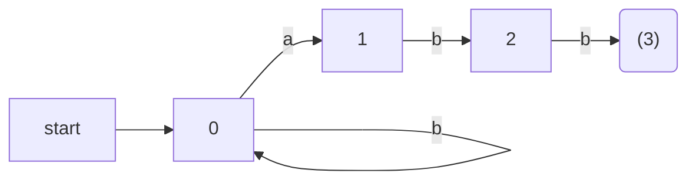

Figure 3.24: A nondeterministic finite automaton

Following our convention for transition diagrams, the double circle around state 3 indicates that this state is accepting. Notice that the only ways to get from the start state 0 to the accepting state is to follow some path that stays in state 0 for a while, then goes to states 1, 2, and 3 by reading abb from the input. Thus, the only strings getting to the accepting state are those that end in abb. □

### 3.6.2 Transition Tables

We can also represent an NFA by a *transition table*, whose rows correspond to states, and whose columns correspond to the input symbols and €. The entry for a given state and input is the value of the transition function applied to those arguments. If the transition function has no information about that state-input pair, we put Ø in the table for the pair.

**Example 3.15:** The transition table for the NFA of Fig. 3.24 is shown in Fig. 3.25. □

The transition table has the advantage that we can easily find the transitions on a given state and input. Its disadvantage is that it takes a lot of space, when the input alphabet is large, yet most states do not have any moves on most of the input symbols.

|STATE | a      | b   | €   |
|---    | ---      | ---  | ---   |
|0     | {0, 1} | {0} | Ø   |
|1     | Ø      | {2} | Ø   |
|2     | Ø      | {3} | Ø   |
|3     | Ø      | Ø   | Ø   |

Figure 3.25: Transition table for the NFA of Fig. 3.24

用F#語言表示NFA轉換表：

```F#
let nfaTransitionTable = Map.ofList [
    (0,Some 'a'),[0;1]
    (0,Some 'b'),[0]
    (0,None)    ,[]
    (1,Some 'a'),[]
    (1,Some 'b'),[2]
    (1,None)    ,[]
    (2,Some 'a'),[]
    (2,Some 'b'),[3]
    (2,None)    ,[]
    (3,Some 'a'),[]
    (3,Some 'b'),[]
    (3,None)    ,[]
]
```

用列表表示集合，注意其中的狀態從小到大排列，不能重複。目標狀態集合為空，可以省略，不列出。

### 3.6.3 Acceptance of Input Strings by Automata

An NFA *accepts* input string x if and only if there is some path in the transition graph from the start state to one of the accepting states, such that the symbols along the path spell out x. Note that € labels along the path are effectively ignored, since the empty string does not contribute to the string constructed along the path.

**Example 3.16:** The string `aabb` is accepted by the NFA of Fig. 3.24. The path labeled by `aabb` from state 0 to state 3 demonstrating this fact is:

```
0--a-->0--a-->1--b-->2--b-->3
```

Note that several paths labeled by the same string may lead to different states. For instance, path

```
0--a-->0--a-->0--b-->0--b-->0
```

is another path from state 0 labeled by the string `aabb`. This path leads to state 0, which is not accepting. However, remember that an NFA accepts a string as long as some path labeled by that string leads from the start state to an accepting state. The existence of other paths leading to a nonaccepting state is irrelevant. □

The *language defined* ( or *accepted*) by an NFA is the set of strings labeling some path from the start to an accepting state. As was mentioned, the NFA of Fig. 3.24 defines the same language as does the regular expression `(a|b)*abb`, that is, all strings from the alphabet {a , b} that end in `abb`. We may use *L(A)* to stand for the language accepted by automaton A.

**Example 3.17:** Figure 3.26 is an NFA accepting L(`aa*|bb*`). String aaa is accepted because of the path

```
0--€-->1--a-->2--a-->2--a-->2
```

Note that €'s "disappear" in a concatenation, so the label of the path is `aaa`. 

□

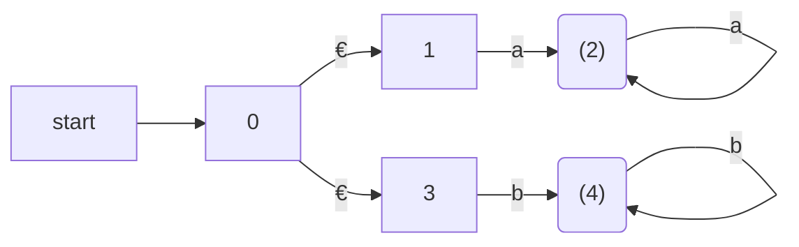

Figure 3.26: NFA accepting `aa*|bb*`

### 3.6.4 Deterministic Finite Automata

A *deterministic finite automaton* ( DFA ) is a special case of an NFA where:

1. There are no moves on input €, and

2. For each state s and input symbol a, there is exactly one edge out of s labeled a.

If we are using a transition table to represent a DFA, then each entry is a single state. we may therefore represent this state without the curly braces that we use to form sets.

While the NFA is an abstract representation of an algorithm to recognize the strings of a certain language, the DFA is a simple, concrete algorithm for recognizing strings. It is fortunate indeed that every regular expression and every NFA can be converted to a DFA accepting the same language, because it is the DFA that we really implement or simulate when building lexical analyzers. The following algorithm shows how to apply a DFA to a string.

**Algorithm 3.18:** Simulating a DFA.

**INPUT:** An input string x terminated by an end-of-file character **eof**. A DFA D with start state s~0~, accepting states F, and transition function `move`.

**OUTPUT:** Answer "yes" if D accepts x; "no" otherwise.

**METHOD:** Apply the algorithm in Fig. 3.27 to the input string x. The function `move(s, c)` gives the state to which there is an edge from state s on input c. The function `nextChar` returns the next character of the input string x. □

```c
    s  =  s.[0]; 
    c  =  nextChar(); 
    while ( c  !=  eof )  { 
        s  =  move(s, c ); 
        c  =  nextChar(); 
    } 
    if ( s is in F ) return "yes"; 
    else return "no"; 
```

Figure 3.27: Simulating a DFA

F#代碼：

```F#
let move s c = transitionTable.[s,c]

let simulate (inp:string) =
    let iterator = (inp.ToCharArray():>seq<Char>).GetEnumerator()
    let nextChar() =
        if iterator.MoveNext() then
            Some(iterator.Current)
        else
            None

    let rec loop s =
        Console.WriteLine(sprintf "%A" s)

        match nextChar() with
        | Some c ->
            let s = move s c
            loop s
        | _ ->     
            Console.WriteLine(if finals.Contains s then "yes" else "no")

    loop 0
```

**Example 3.19:** In Fig. 3.28 we see the transition graph of a DFA accepting the language `(a|b)*abb`, the same as that accepted by the NFA of Fig. 3.24. Given the input string `ababb`, this DFA enters the sequence of states 0, 1, 2, 1, 2, 3 and returns "yes." □

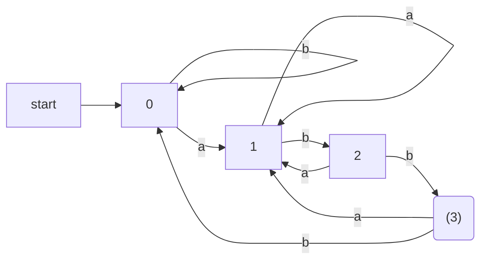

Figure 3.28: DFA accepting `(a|b)*abb` 

DFA的轉換表，上圖的代碼表示：

```F#
let dfaTransitionTable = Map.ofList[
    (0,'a'),1
    (0,'b'),0
    (1,'a'),1
    (1,'b'),2
    (2,'a'),1
    (2,'b'),3
    (3,'a'),1
    (3,'b'),0
]

let finals = set [3]
```

## 3.7 From Regular Expressions to Automata

The regular expression is the notation of choice for describing lexical analyzers and other pattern-processing software, as was reflected in Section 3.5. However, implementation of that software requires the simulation of a DFA, as in Algorithm 3.18, or,perhaps simulation of an NFA. Because an NFA often has a choice of move on an input symbol ( as Fig. 3.24 does on input a from state 0) or on € ( as Fig. 3.26 does from state 0), or even a choice of making a transition on € or on a real input symbol, its simulation is less straightforward than for a DFA. Thus often it is important to convert an NFA to a DFA that accepts the same language.

In this section we shall first show how to convert NFA's to DFA's. Then, we use this technique, known as "the subset construction," to give a useful algorithm for simulating NFA's directly, in situations ( other than lexical analysis ) where the NFA-to-DFA conversion takes more time than the direct simulation. Next, we show how to convert regular expressions to NFA's, from which a DFA can be constructed if desired. We conclude with a discussion of the time-space tradeoffs inherent in the various methods for implementing regular expressions, and see how to choose the appropriate method for your application.

### 3.7.1 Conversion of an NFA to a DFA

The general idea behind the subset construction is that each state of the constructed DFA corresponds to a set of NFA states. After reading input a1 a2 ... an, the DFA is in that state which corresponds to the set of states that the NFA can reach, from its start state, following paths labeled a1 a2 ... an.

It is possible that the number of DFA states is exponential in the number of NFA states, which could lead to difficulties when we try to implement this DFA. However, part of the power of the automaton-based approach to lexical analysis is that for real languages, the NFA and DFA have approximately the same number of states, and the exponential behavior is not seen.

**Algorithm 3.20:** The *subset construction* of a DFA from an NFA.

**INPUT:** An NFA N.

**OUTPUT:** A DFA D accepting the same language as N.

**METHOD:** Our algorithm constructs a transition table `Dtran` for D. Each state of D is a set of NFA states, and we construct `Dtran` so D will simulate "in parallel" all possible moves N can make on a given input string. Our first problem is to deal with €-transitions of N properly. In Fig. 3.31 we see the definitions of several functions that describe basic computations on the states of N that are needed in the algorithm. Note that s is a single state of N, while T is a set of states of N. 

+ €-closure( s ) ：
  Set of NFA states reachable from NFA state `s` on €-transitions alone. 
  
+ €-closure( T ) ：
  Set of NFA states reachable from some NFA state s in set `T` on €-transitions alone; =`∪s in T €-closure(s)`. 
  
+ move( T, a ) ：
  Set of NFA states to which there is a transition on input symbol `a` from some state s in T. 

Figure 3.31: Operations on NFA states

We must explore those sets of states that N can be in after seeing some input string. As a basis, before reading the first input symbol, N can be in any of the states of €-closure(s~0~), where s~0~ is its start state. For the induction, suppose that N can be in set of states `T` after reading input string `x`. If it next reads input `a`, then N can immediately go to any of the states in `move(T, a)` . However, after reading `a`, it may also make several €-transitions; thus N could be in any state of `€-closure(move(T, a))` after reading input `xa`. Following these ideas, the construction of the set of D's states, `Dstates`, and its transition function `Dtran`, is shown in Fig. 3.32.

```C
initially, €-closure( s0 ) is the only state in `Dstates`, and it is unmarked;
while ( there is an unmarked state T in Dstates ) {
    mark T;
    for ( each input symbol a ) {
        U  = €-closure(move(T, a)) ;
        if ( U is not in Dstates )
            add U as an unmarked state to Dstates;
        Dtran[T, a] =  U;
    }
}
```

Figure 3.32: The subset construction

The start state of D is €-closure( s~0~ ), and the accepting states of D are all those sets of N's states that include at least one accepting state of N. To complete our description of the subset construction, we need only to show how `€-closure(T)` is computed for any set of NFA states `T`. This process, shown in Fig. 3.33, is a straightforward search in a graph from a set of states. In this case, imagine that only the €-labeled edges are available in the graph. □

```C
push all states of T onto stack;
initialize €-closure(T) to T;
while ( stack is not empty ) {
    pop t, the top element, off stack;
    for ( each state u with an edge from t to u labeled € )
    if ( u is not in €-closure(T) ) {
        add u to €-closure(T);
        push u onto stack;
    }
}
```

Figure 3.33: Computing €-closure(T)

**Example 3.21:** Figure 3.34 shows another NFA accepting `(a|b)*abb`; it happens to be the one we shall construct directly from this regular expression in Section 3.9. Let us apply Algorithm 3.20 to Fig. 3.34.

| STATE | a    | b    | €     |
| ----- | ---- | ---- | ----- |
| 0     |      |      | {1,7} |
| 1     |      |      | {2,4} |
| 2     | {3}  |      |       |
| 3     |      |      | {6}   |
| 4     |      | {5}  |       |
| 5     |      |      | {6}   |
| 6     |      |      | {1,7} |
| 7     | {8}  |      |       |
| 8     |      | {9}  |       |
| 9     |      | {10} |       |
| 10    |      |      |       |

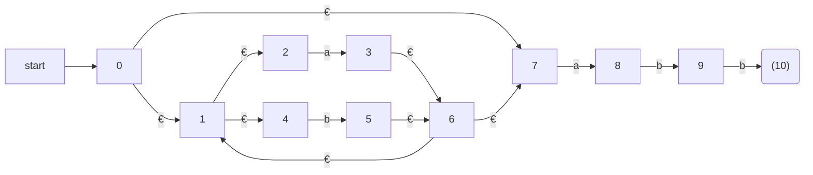

Figure 3.34: NFA N for `(a|b)*abb` 

```F#
let nfaTransitionTable = [
    (0, None, 1);
    (0, None, 7);
    (1, None, 2);
    (1, None, 4);
    (2, Some 'a', 3);
    (4, Some 'b', 5);
    (3, None, 6);
    (5, None, 6);
    (6, None, 1);
    (6, None, 7);
    (7, Some 'a', 8);
    (8, Some 'b', 9);
    (9, Some 'b', 10)
]
```

The start state A of the equivalent DFA is €-closure(0), or A = {0, 1, 2, 4, 7}, since these are exactly the states reachable from state 0 via a path all of whose edges have label €. Note that a path can have zero edges, so state 0 is reachable from itself by an €-labeled path.

The input alphabet is {a, b}. Thus, our first step is to mark A and compute Dtran[A, a] = €-closure(move(A, a)) and Dtran[A, b] = €-closure(move(A, b)) . Among the states 0, 1, 2, 4, and 7, only 2 and 7 have transitions on a, to 3 and 8, respectively. Thus, move(A, a) = {3, 8}. Also, €-closure( {3, 8}) = {1, 2, 3, 4, 6, 7, 8 } , so we conclude 

```
Dtran[A, a] = €-closure( move(A, a)) = €-closure( {3, 8}) = {1, 2, 3, 4, 6, 7, 8} 
```

Let us call this set B, so Dtran[A, a] = B.

Now, we must compute Dtran[A, b]. Among the states in A, only 4 has a transition on b, and it goes to 5. Thus,

```
Dtran[A, b] = €-closure( {5}) = {1, 2, 4, 5, 6, 7}
```

Let us call the above set C, so Dtran[A, b] = C. 

| NFA STATE              | DFA STATE | a    | b    |
| ---------------------- | --------- | ---- | ---- |
| {0, 1, 2, 4, 7}        | A         | B    | C    |
| {1, 2, 3, 4, 6, 7, 8}  | B         | B    | D    |
| {1, 2, 4, 5, 6, 7}     | C         | B    | C    |
| {1, 2, 4, 5, 6, 7, 9}  | D         | B    | E    |
| {1, 2, 3, 5, 6, 7, 10} | E         | B    | C    |

Figure 3.35: Transition table Dtran for DFA D

If we continue this process with the unmarked sets B and C, we eventually reach a point where all the states of the DFA are marked. This conclusion is guaranteed, since there are "only" 2^11^ different subsets of a set of eleven NFA states. The five different DFA states we actually construct, their corresponding sets of NFA states, and the transition table for the DFA D are shown in Fig. 3.35, and the transition graph for D is in Fig. 3.36. State A is the start state, and state E, which contains state 10 of the NFA, is the only accepting state.

Note that D has one more state than the DFA of Fig. 3.28 for the same language. States A and C have the same move function, and so can be merged. We discuss the matter of minimizing the number of states of a DFA in Section 3.9.6. □

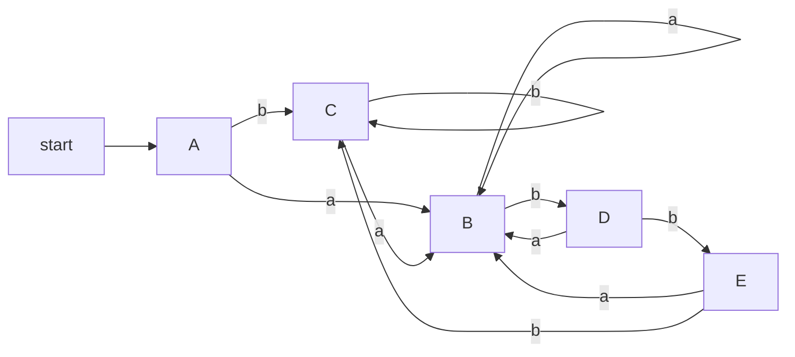

Figure 3.36: Result of applying the subset construction to Fig. 3.34

### ~~3.7.2 Simulation of an NFA~~


### ~~3.7.3 Efficiency of NFA Simulation~~


### 3.7.4 Construction of an NFA from a Regular Expression 

We now give an algorithm for converting any regular expression to an NFA that defines the same language. The algorithm is syntax-directed, in the sense that it works recursively up the parse tree for the regular expression. For each subexpression the algorithm constructs an NFA with a single accepting state.

**Algorithm 3.23:** The McNaughton-Yamada-Thompson algorithm to convert a regular expression to an NFA.

**INPUT:** A regular expression r over alphabet ∑.

**OUTPUT:** An NFA N accepting L(r).

**METHOD:** Begin by parsing r into its constituent subexpressions. The rules for constructing an NFA consist of basis rules for handling subexpressions with no operators, and inductive rules for constructing larger NFA's from the NFA's for the immediate subexpressions of a given expression.

**BASIS:** For expression € construct the NFA

```
start->(i)--€-->((ƒ))
```

Here, i is a new state, the start state of this NFA, and ƒ is another new state, the accepting state for the NFA.

For any subexpressiop a in ∑, construct the NFA

```
start->(i)--a-->((ƒ))
```

where again i and ƒ are new states,  the start and accepting states, respectively. Note that in both of the basis constructions, we construct a distinct NFA, with new states, for every occurrence of € or some a as a subexpression of r.

**INDUCTION:** Suppose N(s) and N(t) are NFA's for regular expressions s and t, respectively.

1. Suppose `r = s|t`. Then N(r), the NFA for r, is constructed as in Fig. 3.40. Here, i and f are new states, the start and accepting states of N(r), respectively. There are €-transitions from i to the start states of N (s) and N (t), and each of their accepting states have €-transitions to the accepting state f. Note that the accepting states of N (s) and N (t) are not accepting in N (r) . Since any path from i to f must pass through either N(s) or N(t) exclusively, and since the label of that path is not changed by the €'s leaving i or entering f, we conclude that N(r) accepts `L(s) ∪ L(t)`, which is the same as L(r). That is, Fig. 3.40 is a correct construction for the union operator.

   ```mermaid
   graph LR
   s0(start)
   1["/"]
   2["/"]
   3["/"]
   4["/"]
   f(f)
   s0 -->i
   i --€-->1
   subgraph Ns
   1-.-3
   end
   i--€-->2
   3--€-->f
   4--€-->f
   subgraph Nt
   2-.-4
   end
   ```

   Figure 3.40: NFA for the union of two regular expressions

2. Suppose `r = st`. Then construct N(r) as in Fig. 3.41. The start state of N(s) becomes the start state of N(r), and the accepting state of N(t) is the only accepting state of N(r). The accepting state of N(s) and the start state of N(t) are merged into a single state, with all the transitions in or out of either state. A path from i to f in Fig. 3.41 must go first through N(s), and therefore its label will begin with some string in L(s). The path then continues through N(t), so the path's label finishes with a string in L(t). As we shall soon argue, accepting states never have edges out and start states never have edges in, so it is not possible for a path to re-enter N(s) after leaving it. Thus, N(r) accepts exactly `L(s)L(t)`, and is a correct NFA for r = st.

   ```mermaid
   graph LR
   s0(start)-->i
   i-.-|"N(s)"|j
   j-.-|"N(t)"|f
   
   ```
   
   Figure 3.41: NFA for the concatenation of two regular expressions
   
3. Suppose `r = s*` . Then for r we construct the NFA N(r) shown in Fig. 3.42. Here, i and f are new states, the start state and lone accepting state of N(r). To get from i to f, we can either follow the introduced path labeled €, which takes care of the one string in L(s)^0^, or we can go to the start state of N(s), through that NFA, then from its accepting state back to its start state zero or more times. These options allow N(r) to accept all the strings in L(s)^1^, L(s)^2^, and so on, so the entire set of strings accepted by N(r) is L(s*) :

   ```mermaid
   graph LR
   f(f)
   0(start) -->i
   i--€-->j
   i--€-->f
   subgraph Ns
   j-.-k
   k--€-->j
   end
   k--€-->f
   ```
   
   Figure 3.42: NFA for the closure of a regular expression

4. Finally, suppose r = (s). Then L(r) = L(s), and we can use the NFA N(s) as N(r).

□

The method description in Algorithm 3.23 contains hints as to why the inductive construction works as it should. We shall not give a formal correctness proof, but we shall list several properties of the constructed NFA's, in addition to the all-important fact that N(r) accepts language L(r). These properties are interesting in their own right, and helpful in making a formal proof.

1. N(r) has at most twice as many states as there are operators and operands in r. This bound follows from the fact that each step of the algorithm creates at most two new states.

2. N(r) has one start state and one accepting state. The accepting state has no outgoing transitions, and the start state has no incoming transitions.

3. Each state of N(r) other than the accepting state has either one outgoing transition on a symbol in ∑ or two outgoing transitions, both on €.

**Example 3.24:** Let us use Algorithm 3.23 to construct an NFA for `r = (a|b)*abb`. Figure 3.43 shows a parse tree for r that is analogous to the parse trees constructed for arithmetic expressions in Section 2.2.3. For subexpression r~1~, the first a, we construct the NFA:

```F#
let r1 = Leaf 'a'
let r2 = Leaf 'b'
let r6 = Leaf 'a'
let r8 = Leaf 'b'
let r10 = Leaf 'b'
let r3 = Union(r1,r2)
let r5 = Star r3
let r7 = Cat(r5,r6)
let r9 = Cat(r7,r8)
let r11 = Cat(r9,r10)
```

Figure 3.43: Parse tree for `(a|b)*abb` 

```
start->(2)-a->((3))
```

State numbers have been chosen for consistency with what follows. For r~2~ we construct:

```
start->(4)-b->((5))
```

We can now combine N(r~1~) and N(r~2~), using the construction of Fig. 3.40 to obtain the NFA for r~3~ = r~1~ | r~2~ ; this NFA is shown in Fig. 3.44.

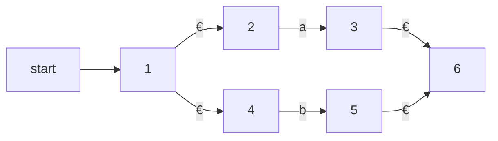

Figure 3.44: NFA for r~3~

The NFA for r~4~ = (r~3~) is the same as that for r~3~ . The NFA for r~5~ = (r~3~ )* is then as shown in Fig. 3.45. We have used the construction in Fig. 3.42 to build this NFA from the NFA in Fig. 3.44. 

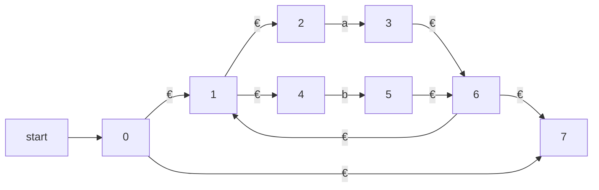

Figure 3.45: NFA for r~5~ 

Now, consider subexpression r~6~ , which is another a. We use the basis construction for a again, but we must use new states. It is not permissible to reuse the NFA we constructed for r~1~ , even though r~1~ and r~6~ are the same expression. The NFA for r~6~ is:

```
start->(7')-a->((8))
```

To obtain the NFA for r~7~ = r~5~ r~6~ , we apply the construction of Fig. 3.41. We merge states 7 and 7', yielding the NFA of Fig. 3.46. Continuing in this fashion with new NFA's for the two subexpressions b called r~8~ and r_10 , we eventually construct the NFA for (a|b)*abb that we first met in Fig. 3.34. □

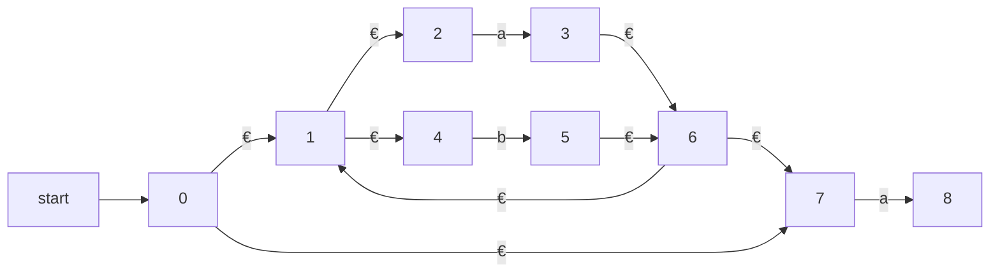

Figure 3.46: NFA for r~7~

### 3.7.5 Efficiency of String-Processing Algorithms

We observed that Algorithm 3.18 processes a string x in time O(|x|) , while in Section 3.7.3 we concluded that we could simulate an NFA in time proportional to the product of |x| and the size of the NFA's transition graph. Obviously, it is faster to have a DFA to simulate than an NFA, so we might wonder whether it ever makes sense to simulate an NFA.

One issue that may favor an NFA is that the subset construction can, in the worst case, exponentiate the number of states. While in principle, the number of DFA states does not influence the running time of Algorithm 3.18, should the number of states become so large that the transition table does not fit in main memory, then the true running time would have to include disk I/O and therefore rise noticeably. 

**Example 3.25:** Consider the family of languages described by regular expressions of the form `Ln = (a|b)*a(a|b){n-1}`, that is, each language Ln consists of strings of a's and b's such that the nth character to the left of the right end holds a. An n + 1-state NFA is easy to construct. It stays in its initial state under any input, but also has the option, on input a, of going to state 1. From state 1, it goes to state 2 on any input, and so on, until in state n it accepts. Figure 3.47 suggests this NFA. 

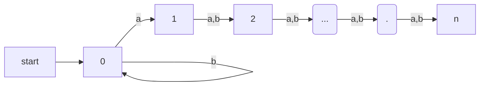

Figure 3.47: An NFA that has many fewer states than the smallest equivalent DFA

However, any DFA for the language Ln must have at least 2^n^ states. We shall not prove this fact, but the idea is that if two strings of length n can get the DFA to the same state, then we can exploit the last position where the strings differ ( and therefore one must have a, the other b) to continue the strings identically, until they are the same in the last n - 1 positions. The DFA will then be in a state where it must both accept and not accept. Fortunately, as we mentioned, it is rare for lexical analysis to involve patterns of this type, and we do not expect to encounter DFA's with outlandish numbers of states in practice. □

However, lexical-analyzer generators and other string-processing systems often start with a regular expression. We are faced with a choice of converting the regular expression to an NFA or DFA. The additional cost of going to a DFA is thus the cost of executing Algorithm 3.23 on the NFA ( one could go directly from a regular expression to a DFA, but the work is essentially the same) . If the string-processor is one that will be executed many times, as is the case for lexical analysis, then any cost of converting to a DFA is worthwhile. However, in other string-processing applications, such as grep, where the user specifies one regular expression and one or several files to be searched for the pattern of that expression, it may be more efficient to skip the step of constructing a DFA, and simulate the NFA directly.

Let us consider the cost of converting a regular expression r to an NFA by Algorithm 3.23. A key step is constructing the parse tree for r. In Chapter 4 we shall see several methods that are capable of constructing this parse tree in linear time, that is, in time O(|r|), where |r| stands for the size of r the sum of the number of operators and operands in r. It is also easy to check that each of the basis and inductive constructions of Algorithm 3.23 takes constant time, so the entire time spent by the conversion to an NFA is O(|r|) .

Moreover, as we observed in Section 3.7.4, the NFA we construct has at most 2|r| states and at most 4|r| transitions. That is, in terms of the analysis in Section 3.7.3, we have n ≤ 2|r| and m ≤ 4|r|. Thus, simulating this NFA on an input string x takes time O(|r| × |x|). This time dominates the time taken by the NFA construction, which is O(|r|), and therefore, we conclude that it is possible to take a regular expression r and string x, and tell whether x is in L(r) in time O(|r| × |x|).

The time taken by the subset construction is highly dependent on the number of states the resulting DFA has. To begin, notice that in the subset construction of Fig. 3.32, the key step, the construction of a set of states U from a set of states T and an input symbol a, is very much like the construction of a new set of states from the old set of states in the NFA simulation of Algorithm 3.22. We already concluded that, properly implemented, this step takes time at most proportional to the number of states and transitions of the NFA.

Suppose we start with a regular expression r and convert it to an NFA. This NFA has at most 2|r| states and at most 4|r| transitions. Moreover, there are at most |r| input symbols. Thus, for every DFA state constructed, we must construct at most |r| new states, and each one takes at most O(|r|) time. The time to construct a DFA of s states is thus O(|r|^2^ s).

In the common case where s is about |r|, the subset construction takes time O(|r|^3^). However, in the worst case, as in Example 3.25, this time is O(|r|^2^ 2^|r|^). Figure 3.48 summarizes the options when one is given a regular expression r and wants to produce a recognizer that will tell whether one or more strings x are in L(r). 

```
| AUTOMATON        | INITIAL            | PER STRING   |
| ---------------- | ------------------ | -------------|
| NFA              | O(|r|)             | O(|r| × |x|) |
| DFA typical case | O(|r|^3)           | O(|x|)       |
| DFA worst case   | O(|r|^2 2^|r|)     | O(|x|)       |
```

Figure 3.48: Initial cost and per-string-cost of various methods of recognizing the language of a regular expression

If the per-string cost dominates, as it does when we build a lexical analyzer, we clearly prefer the DFA. However, in commands like grep, where we run the automaton on only one string, we generally prefer the NFA. It is not until |x| approaches |r|^3^ that we would even think about converting to a DFA.

There is, however, a mixed strategy that is about as good as the better of the NFA and the DFA strategy for each expression r and string x. Start off simulating the NFA, but remember the sets of NFA states ( i.e., the DFA states ) and their transitions, as we compute them. Before processing the current set of NFA states and the current input symbol, check to see whether we have already computed this transition, and use the information if so. 

## 3.8 Design of a Lexical-Analyzer Generator

In this section we shall apply the techniques presented in Section 3.7 to see how a lexical-analyzer generator such as Lex is architected. We discuss two approaches, based on NFA's and DFA's; the latter is essentially the implementation of Lex.

### 3.8.1 The Structure of the Generated Analyzer

Figure 3.49 overviews the architecture of a lexical analyzer generated by Lex. The program that serves as the lexical analyzer includes a fixed program that simulates an automaton; at this point we leave open whether that automaton is deterministic or nondeterministic. The rest of the lexical analyzer consists of components that are created from the Lex program by Lex itself.

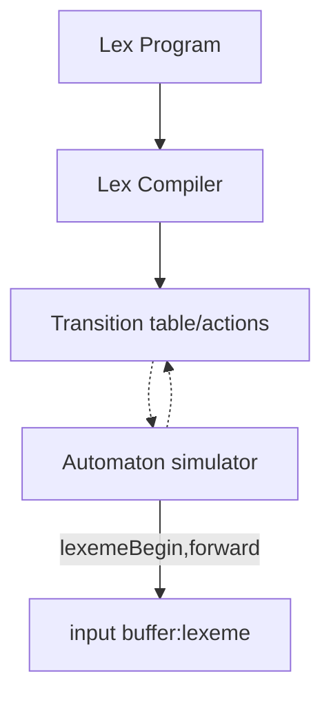

Figure 3.49: A Lex program is turned into a transition table and actions, which are used by a finite-automaton simulator

These components are:

1. A transition table for the automaton.

2. Those functions that are passed directly through Lex to the output ( see Section 3.5.2).

3. The actions from the input program, which appear as fragments of code to be invoked at the appropriate time by the automaton simulator.

To construct the automaton, we begin by taking each regular-expression pattern in the Lex program and converting it, using Algorithm 3.23, to an NFA. We need a single automaton that will recognize lexemes matching any of the patterns in the program, so we combine all the NFA's into one by introducing a new start state with €-transitions to each of the start states of the NFA's N~i~ for pattern p~i~. This construction is shown in Fig. 3.50.

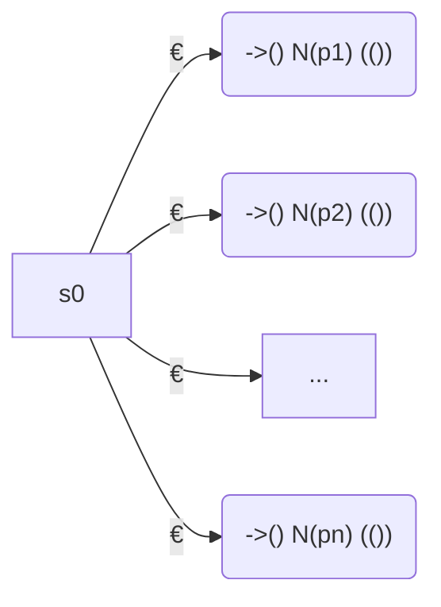

Figure 3.50: An NFA constructed from a Lex program

**Example 3.26:** We shall illustrate the ideas of this section with the following simple, abstract example: 

```
a    { action A1  for pattern P1  } 
abb  { action A2  for pattern P2  } 
a*b+ { action A3  for pattern P3  } 
```

Note that these three patterns present some conflicts of the type discussed in Section 3.5.3. In particular, string `abb` matches both the second and third patterns, but we shall consider it a lexeme for pattern p~2~ , since that pattern is listed first in the above Lex program. Then, input strings such as `aabbb...` have many prefixes that match the third pattern. The Lex rule is to take the longest, so we continue reading b's, until another a is met, whereupon we report the lexeme to be the initial a's followed by as many b's as there are.

Figure 3.51 shows three NFA's that recognize the three patterns. The third is a simplification of what would come out of Algorithm 3.23. Then, Fig. 3.52 shows these three NFA's combined into a single NFA by the addition of start state 0 and three €-transitions. □

```
start->(1)-a->((2))

start->(3)-a->(4)-b->(5)-b->((6))

start->(7)-b->((8))
        U       U
```

Figure 3.51: NFA's for `a`, `abb`, and `a*b+`

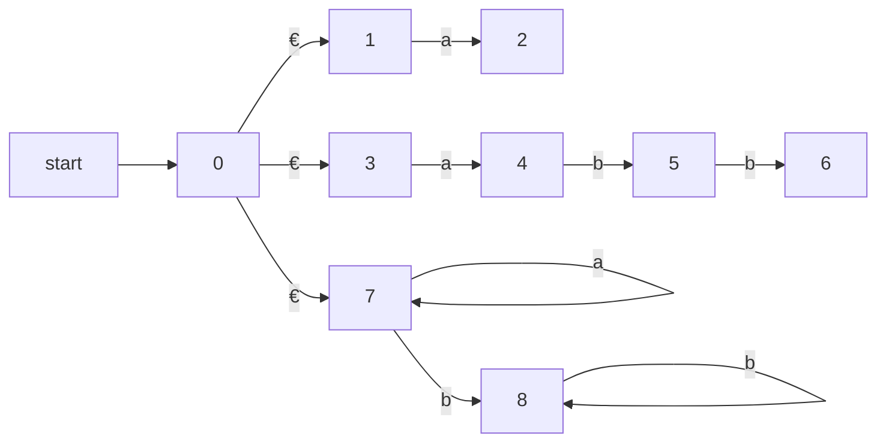

Figure 3.52: Combined NFA 


### 3.8.2 Pattern Matching Based on NFA's

If the lexical analyzer simulates an NFA such as that of Fig. 3.52, then it must read input beginning at the point on its input which we have referred to as `lexemeBegin`. As it moves the pointer called `forward` ahead in the input, it calculates the set of states it is in at each point, following Algorithm 3.22.

Eventually, the NFA simulation reaches a point on the input where there are no next states. At that point, there is no hope that any longer prefix of the input would ever get the NFA to an accepting state; rather, the set of states will always be empty. Thus, we are ready to decide on the longest prefix that is a lexeme matching some pattern. 

We look backwards in the sequence of sets of states, until we find a set that includes one or more accepting states. If there are several accepting states in that set, pick the one associated with the earliest pattern p~i~ in the list from the Lex program. Move the `forward` pointer back to the end of the lexeme, and perform the action Ai associated with pattern p~i~.

**Example 3.27:** Suppose we have the patterns of Example 3.26 and the input begins `aaba`. Figure 3.53 shows the sets of states of the NFA of Fig. 3.52 that we enter, starting with €-closure of the initial state 0, which is {0, 1, 3, 7}, and proceeding from there. After reading the fourth input symbol, we are in an empty set of states, since in Fig. 3.52, there are no transitions out of state 8 on input a.

```
{0,1,3,7} -a-> {2,4,7} -a-> {7} -b-> {8} -a-> none
                 /a/                /a*b+/
```

Figure 3.53: Sequence of sets of states entered when processing input `aaba` 

Thus, we need to back up, looking for a set of states that includes an accepting state. Notice that, as indicated in Fig. 3.53, after reading a we are in a set that includes state 2 and therefore indicates that the pattern a has been matched. However, after reading aab, we are in state 8, which indicates that `a*b+` has been matched; prefix aab is the longest prefix that gets us to an accepting state. We therefore select aab as the lexeme, and execute action A3, which should include a return to the parser indicating that the token whose pattern is `p3 = a*b+` has been found. □

### 3.8.3 DFA's for Lexical Analyzers

Another architecture, resembling the output of Lex, is to convert the NFA for all the patterns into an equivalent DFA, using the subset construction of Algorithm 3.20. Within each DFA state, if there are one or more accepting NFA states, determine the first pattern whose accepting state is represented, and make that pattern the output of the DFA state.

**Example 3.28:** Figure 3.54 shows a transition diagram based on the DFA that is constructed by the subset construction from the NFA in Fig. 3.52. The accepting states are labeled by the pattern that is identified by that state. For instance, the state {6, 8} has two accepting states, corresponding to patterns `abb` and `a*b+`. Since the former is listed first , that is the pattern associated with state {6, 8}. □

We use the DFA in a lexical analyzer much as we did the NFA. We simulate the DFA until at some point there is no next state ( or strictly speaking, the next state is Ø, the dead state corresponding to the empty set of NFA states ) . At that point, we back up through the sequence of states we entered and, as soon as we meet an accepting DFA state, we perform the action associated with the pattern for that state.

**Example 3.29:** Suppose the DFA of Fig. 3.54 is given input abba. The sequence of states entered is 0137, 247, 58, 68, and at the final a there is no transition out of state 68. Thus, we consider the sequence from the end, and in this case, 68 itself is an accepting state that reports pattern p2 = abb. □

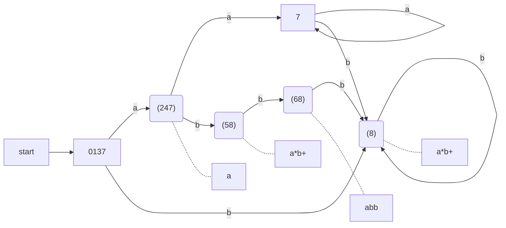

Figure 3.54: Transition graph for DFA handling the patterns a, abb, and a*b+

### 3.8.4 Implementing the Lookahead Operator

Recall from Section 3.5.4 that the Lex lookahead operator `/` in a Lex pattern `r1 / r2` is sometimes necessary, because the pattern `r1` for a particular token may need to describe some trailing context `r2` in order to correctly identify the actual lexeme. When converting the pattern `r1 / r2` to an NFA, we treat the `/` as if it were €, so we do not actually look for a `/` on the input. However, if the NFA recognizes a prefix `xy` of the input buffer as matching this regular expression, the end of the lexeme is not where the NFA entered its accepting state. Rather the end occurs when the NFA enters a state `s` such that

1. `s` has an €-transition on the ( imaginary ) `/`,

2. There is a path from the start state of the NFA to state `s` that spells out x.

3. There is a path from state `s` to the accepting state that spells out y .

4. x is as long as possible for any xy satisfying conditions 1-3.

If there is only one €-transition state on the imaginary `/` in the NFA, then the end of the lexeme occurs when this state is entered for the last time as the following example illustrates. If the NFA has more than one €-transition state on the imaginary `/`, then the general problem of finding the correct state s is much more difficult.

**Example 3.30:** An NFA for the pattern for the Fortran IF with lookahead, from Example 3.13, is shown in Fig. 3.55. Notice that the €-transition from state 2 to state 3 represents the lookahead operator. State 6 indicates the presence of the keyword IF. However, we find the lexeme IF by scanning backwards to the last occurrence of state 2, whenever state 6 is entered. □

```
                                    +->(4)
                        (/)         | any
start->(0)-I->(1)-F->(2)-€->(3)-(->(4)-)->(5)-letter->((6))
```

Figure 3.55: NFA recognizing the keyword IF 

---

##### Dead States in DFA's

Technically, the automaton in Fig. 3.54 is not quite a DFA. The reason is that a DFA has a transition from every state on every input symbol in its input alphabet. Here, we have omitted transitions to the dead state Ø, and we have therefore omitted the transitions from the dead state to itself on every input. Previous NFA-to-DFA examples did not have a way to get from the start state to Ø, but the NFA of Fig. 3.52 does.

However, when we construct a DFA for use in a lexical analyzer, it is important that we treat the dead state differently, since we must know when there is no longer any possibility of recognizing a longer lexeme. Thus, we suggest always omitting transitions to the dead state and eliminating the dead state itself. In fact, the problem is harder than it appears, since an NFA-to-DFA construction may yield several states that cannot reach any accepting state, and we must know when any of these states have been reached. Section 3.9.6 discusses how to combine all these states into one dead state, so their identification becomes easy. It is also interesting to note that if we construct a DFA from a regular expression using Algorithms 3.20 and 3.23, then the DFA will not have any states besides Ø that cannot lead to an accepting state. 

---

## 3.9 Optimization of DFA-Based Pattern Matchers

In this section we present three algorithms that have been used to implement and optimize pattern matchers constructed from regular expressions.

1.

2. The second algorithm minimizes the number of states of any DFA, by combining states that have the same future behavior. The algorithm itself is quite efficient, running in time O( n log n ) , where n is the number of states of the DFA.

3.

### 3.9.1 Important States of an NFA

### 3.9.2 Functions Computed From the Syntax Tree

### 3.9.3 Computing nullable, firstpos, and lastpos

### 3.9.4 Computing followpos

### 3.9.5 Converting a Regular Expression Directly to a DFA

### 3.9.6 Minimizing the Number of States of a DFA

There can be many DFA's that recognize the same language. For instance, note that the DFA's of Figs. 3.36 and 3.63 both recognize language L (`(a|b)*abb`) . Not only do these automata have states with different names, but they don't even have the same number of states. If we implement a lexical analyzer as a DFA, we would generally prefer a DFA with as few states as possible, since each state requires entries in the table that describes the lexical analyzer.

The matter of the names of states is minor. We shall say that two automata are **the same up to state names** if one can be transformed into the other by doing nothing more than changing the names of states. Figures 3.36 and 3.63 are not the same up to state names. However, there is a close relationship between the states of each. States A and C of Fig. 3.36 are actually equivalent, in the sense that neither is an accepting state, and on any input they transfer to the same state to B on input `a` and to C on input `b`. Moreover, both states A and C behave like state 123 of Fig. 3.63. Likewise, state B of Fig. 3.36 behaves like state 1234 of Fig. 3.63, state D behaves like state 1235, and state E behaves like state 1236.

It turns out that there is always a unique (up to state names) minimum state DFA for any regular language. Moreover, this minimum-state DFA can be constructed from any DFA for the same language by grouping sets of equivalent states. In the case of L(`(a|b)*abb`) , Fig. 3.63 is the minimum-state DFA, and it can be constructed by partitioning the states of Fig. 3.36 as {A, C}{B}{D}{E}.

In order to understand the algorithm for creating the partition of states that converts any DFA into its minimum-state equivalent DFA, we need to see how input strings distinguish states from one another. We say that string `x` *distinguishes* state s from state t if exactly one of the states reached from s and t by following the path with label `x` is an accepting state. State s is *distinguishable* from state t if there is some string that distinguishes them.

---

##### Why the State-Minimization Algorithm Works

We need to prove two things: that states remaining in the same group in ∏~final~ are indistinguishable by any string, and that states winding up in different groups are distinguishable. The first is an induction on i that if after the ith iteration of step (2) of Algorithm 3.39, s and t are in the same group, then there is no string of length i or less that distinguishes them. We shall leave the details of the induction to you.

The second is an induction on i that if states s and t are placed in different groups at the ith iteration of step (2), then there is a string that distinguishes them. The basis, when s and t are placed in different groups of the initial partition, is easy: one must be accepting and the other not, so € distinguishes them. For the induction, there must be an input a and states p and q such that s and t go to states p and q, respectively, on input a. Moreover, p and q must already have been placed in different groups. Then by the inductive hypothesis, there is some string x that distinguishes p from q. Therefore, ax distinguishes s from t. 

---

**Example 3.38:** The empty string distinguishes any accepting state from any nonaccepting state. In Fig. 3.36, the string `bb` distinguishes state `A` from state `B`, since `bb` takes `A` to a non accepting state `C`, but takes `B` to accepting state `E`. □

The state-minimization algorithm works by partitioning the states of a DFA into groups of states that cannot be distinguished. Each group of states is then merged into a single state of the minimum-state DFA. The algorithm works by maintaining a partition, whose groups are sets of states that have not yet been distinguished, while any two states from different groups are known to be distinguishable. When the partition cannot be refined further by breaking any group into smaller groups, we have the minimum-state DFA.

Initially, the partition consists of two groups: the accepting states and the nonaccepting states. The fundamental step is to take some group of the current partition, say A = {s1 , s2 , ... , s~k~ }, and some input symbol `a`, and see whether `a` can be used to distinguish between any states in group `A`. We examine the transitions from each of s1 , s2 , ... , s~k~ on input `a`, and if the states reached fall into two or more groups of the current partition, we split `A` into a collection of groups, so that s~i~ and s~j~ are in the same group if and only if they go to the same group on input `a`. We repeat this process of splitting groups, until for no group, and for no input symbol, can the group be split further. The idea is formalized in the next algorithm.

**Algorithm 3.39:** Minimizing the number of states of a DFA.

**INPUT:** A DFA D with set of states S, input alphabet ∑ , state state s_0 , and set of accepting states F.

**OUTPUT:** A DFA D' accepting the same language as D and having as few states as possible. 

**METHOD:**

1. Start with an initial partition ∏ with two groups, F and S - F, the accepting and nonaccepting states of D.

2. Apply the procedure of Fig. 3.64 to construct a new partition ∏~new~.

   ```C
   initially, let ∏new =  ∏ ;
   for ( each group G of ∏  ) {
       partition G into subgroups such that two states s and t are in the same subgroup if and only if
       for all input symbols `a`, states s and t have transitions on `a` to states in the same group of ∏ ;
       /* at worst, a state will be in a subgroup by itself */
       replace G in ∏new by the set of all subgroups formed;
   }
   ```
   Figure 3.64: Construction of ∏~new~
   
3. If ∏~new~ = ∏ , let ∏~final~ = ∏ and continue with step (4). Otherwise, repeat step (2) with ∏~new~ in place of ∏ .

4. Choose one state in each group of ∏final as the representative for that group. The representatives will be the states of the minimum-state DFA D'. The other components of D' are constructed as follows: 

   (a) The start state of D' is the representative of the group containing the start state of D.

   (b) The accepting states of D' are the representatives of those groups that contain an accepting state of D. Note that each group contains either only accepting states, or only nonaccepting states, because we started by separating those two classes of states, and the procedure of Fig. 3.64 always forms new groups that are subgroups of previously constructed groups.

   (c) Let `s` be the representative of some group `G` of ∏final, and let the transition of `D` from `s` on input `a` be to state `t`. Let `r` be the representative of `t`'s group `H`. Then in D', there is a transition from `s` to `r` on input `a`. Note that in D, every state in group `G` must go to some state of group `H` on input `a`, or else, group `G` would have been split according to Fig. 3.64. 

□

**Example 3.40:** Let us reconsider the DFA of Fig. 3.36. The initial partition consists of the two groups {A, B, C, D}{E}, which are respectively the nonaccepting states and the accepting states. To construct ∏~new~, the procedure of Fig. 3.64 considers both groups and inputs `a` and `b`. The group {E} cannot be split, because it has only one state, so {E} will remain intact in ∏~new~.

The other group {A, B, C, D} can be split, so we must consider the effect of each input symbol. On input `a`, each of these states goes to state B, so there is no way to distinguish these states using strings that begin with `a`. On input `b`, states A, B, and C go to members of group {A, B, C, D}, while state D goes to E, a member of another group. Thus, in ∏~new~, group {A, B, C, D} is split into {A, B, C}{D}, and ∏~new~ for this round is {A, B, C}{D}{E}.

In the next round, we can split {A, B, C} into {A, C}{B}, since A and C each go to a member of {A, B, C} on input `b`, while B goes to a member of another group, {D}. Thus, after the second round, ∏~new~ = {A, C}{B}{D}{E}. For the third round, we cannot split the one remaining group with more than one state, since A and C each go to the same state (and therefore to the same group) on each input. We conclude that ∏~final~ = {A, C}{B}{D}{E}.

Now, we shall construct the minimum-state DFA. It has four states, corresponding to the four groups of ∏~final~, and let us pick A, B, D, and E as the representatives of these groups. The initial state is A, and the only accepting state is E. Figure 3.65 shows the transition function for the DFA. For instance, the transition from state E on input `b` is to A, since in the original DFA, E goes to C on input `b`, and A is the representative of C's group. For the same reason, the transition on `b` from state A is to A itself, while all other transitions are as in Fig. 3.36. □

| STATE | a    | b    |
| ----- | ---- | ---- |
| A     | B    | A    |
| B     | B    | D    |
| D     | B    | E    |
| E     | B    | A    |

Figure 3.65: Transition table of minimum-state DFA

---

##### Eliminating the Dead State

The minimization algorithm sometimes produces a DFA with one dead state — one that is not accepting and transfers to itself on each input symbol. This state is technically needed, because a DFA must have a transition from every state on every symbol. However, as discussed in Section 3.8.3, we often want to know when there is no longer any possibility of acceptance, so we can establish that the proper lexeme has already been seen. Thus, we may wish to eliminate the dead state and use an automaton that is missing some transitions. This automaton has one fewer state than the minimum-state DFA, but is strictly speaking not a DFA, because of the missing transitions to the dead state.

---


### 3.9.7 State Minimization in Lexical Analyzers

To apply the state minimization procedure to the DFA's generated in Section 3.8.3, we must begin Algorithm 3.39 with the partition that groups together all states that recognize a particular token, and also places in one group all those states that do not indicate any token. An example should make the extension clear.

**Example 3.41:** For the DFA of Fig. 3.54, the initial partition is

```C#
{0137,7}{247}{8,58}{7}{68}{Ø}
```

That is, states 0137 and 7 belong together because neither announces any token. States 8 and 58 belong together because they both announce token `a*b+` . Note that we have added a dead state Ø, which we suppose has transitions to itself on inputs `a` and `b`. The dead state is also the target of missing transitions on a from states 8, 58, and 68.

We must split 0137 from 7, because they go to different groups on input `a`. We also split 8 from 58, because they go to different groups on `b`. Thus, all states are in groups by themselves, and Fig. 3.54 is the minimum-state DFA recognizing its three tokens. Recall that a DFA serving as a lexical analyzer will normally drop the dead state, while we treat missing transitions as a signal to end token recognition. □

### 3.9.8 Trading Time for Space in DFA Simulation


## 3.10 Summary of Chapter 3

+ Tokens. The lexical analyzer scans the source program and produces as output a sequence of tokens, which are normally passed, one at a time to the parser. Some tokens may consist only of a token name while others may also have an associated lexical value that gives information about the particular instance of the token that has been found on the input.

+ Lexemes. Each time the lexical analyzer returns a token to the parser, it has an associated lexeme the sequence of input characters that the token represents.

+ 

+ Patterns. Each token has a pattern that describes which sequences of characters can form the lexemes corresponding to that token. The set of words, or strings of characters, that match a given pattern is called a language.

+ Regular Expressions. These expressions are commonly used to describe patterns. Regular expressions are built from single characters, using union, concatenation, and the Kleene closure, or any-number-of, operator.

+ Regular Definitions. Complex collections of languages, such as the patterns that describe the tokens of a programming language, are often defined by a regular definition, which is a sequence of statements that each define one variable to stand for some regular expression. The regular expression for one variable can use previously defined variables in its regular expression.

+ Extended Regular-Expression Notation. A number of additional operators may appear as shorthands in regular expressions, to make it easier to express patterns. Examples include the + operator ( one-or-more-of ) , ? ( zero-or-one-of ) , and character classes ( the union of the strings each consisting of one of the characters ) .

+ Transition Diagrams. The behavior of a lexical analyzer can often be described by a transition diagram. These diagrams have states, each of which represents something about the history of the characters seen during the current search for a lexeme that matches one of the possible patterns. There are arrows, or transitions, from one state to another, each of which indicates the possible next input characters that cause the lexical analyzer to make that change of state.

+ Finite Automata. These are a formalization of transition diagrams that include a designation of a start state and one or more accepting states, as well as the set of states, input characters, and transitions among states. Accepting states indicate that the lexeme for some token has been found. Unlike transition diagrams, finite automata can make transitions on empty input as well as on input characters .

+ Deterministic Finite Automata. A DFA is a special kind of finite automaton that has exactly one transition out of each state for each input symbol. Also, transitions on empty input are disallowed. The DFA is easily simulated and makes a good implementation of a lexical analyzer, similar to a transition diagram .

+ Nondeterministic Finite Automata. Automata that are not DFA's are called nondeterministic. NFA's often are easier to design than are DFA's. Another possible architecture for a lexical analyzer is to tabulate all the states that NFA's for each of the possible patterns can be in, as we scan the input characters .

+ Conversion Among Pattern Representations. It is possible to convert any regular expression into an NFA of about the same size, recognizing the same language as the regular expression defines. Further, any NFA can be converted to a DFA for the same pattern, although in the worst case ( never encountered in common programming languages ) the size of the automaton can grow exponentially. It is also possible to convert any nondeterministic or deterministic finite automaton into a regular expression that defines the same language recognized by the finite automaton .

+ Lex. There is a family of software systems, including Lex and Flex, that are lexical-analyzer generators. The user specifies the patterns for tokens using an extended regular-expression notation. Lex converts these expressions into a lexical analyzer that is essentially a deterministic finite automaton that recognizes any of the patterns.

+ Minimization of Finite Automata. For every DFA there is a minimum-state DFA accepting the same language. Moreover, the minimum-state DFA for a given language is unique except for the names given to the various states. 
