# Chapter 4 Syntax Analysis

This chapter is devoted to parsing methods that are typically used in compilers.

We first present the basic concepts, then techniques suitable for hand implementation, and finally algorithms that have been used in automated tools. Since programs may contain syntactic errors, we discuss extensions of the parsing methods for recovery from common errors.

By design, every programming language has precise rules that prescribe the syntactic structure of well-formed programs. In C, for example, a program is made up of functions, a function out of declarations and statements, a statement out of expressions, and so on. The syntax of programming language constructs can be specified by context-free grammars or BNF (Backus-Naur Form) notation, introduced in Section 2.2. Grammars order significant benefits for both language designers and compiler writers.

-   A grammar gives a precise, yet easy-to-understand, syntactic specification of a programming language.

-   From certain classes of grammars, we can construct automatically an efficient parser that determines the syntactic structure of a source program. As a side benefit, the parser-construction process can reveal syntactic ambiguities and trouble spots that might have slipped through the initial design phase of a language.

-   The structure imparted to a language by a properly designed grammar is useful for translating source programs into correct object code and for detecting errors.

-   A grammar allows a language to be evolved or developed iteratively, by adding new constructs to perform new tasks. These new constructs can be integrated more easily into an implementation that follows the grammatical structure of the language.

## 4.1 Introduction

In this section, we examine the way the parser fits into a typical compiler. We then look at typical grammars for arithmetic expressions. Grammars for expressions suffice for illustrating the essence of parsing, since parsing techniques for expressions carry over to most programming constructs. This section ends with a discussion of error handling, since the parser must respond gracefully to finding that its input cannot be generated by its grammar.

### 4.1.1 The Role of the Parser

In our compiler model, the parser obtains a string of tokens from the lexical analyzer, as shown in Fig. 4.1, and verifies that the string of token names can be generated by the grammar for the source language. We expect the parser to report any syntax errors in an intelligible fashion and to recover from commonly occurring errors to continue processing the remainder of the program. Conceptually, for well-formed programs, the parser constructs a parse tree and passes it to the rest of the compiler for further processing. In fact, the parse tree need not be constructed explicitly, since checking and translation actions can be interspersed with parsing, as we shall see. Thus, the parser and the rest of the front end could well be implemented by a single module.

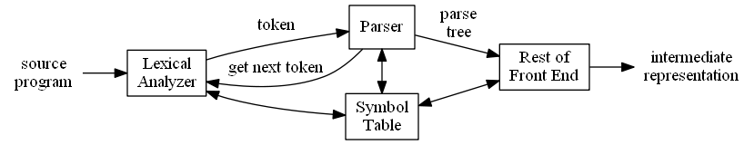

Figure 4.1: Position of parser in compiler model

There are three general types of parsers for grammars: universal, top-down, and bottom-up. Universal parsing methods such as the Cocke-Younger-Kasami algorithm and Earley’s algorithm can parse any grammar (see the bibliographic notes). These general methods are, however, to off inefficient to use in production compilers.

The methods commonly used in compilers can be classified as being either top-down or bottom-up. As implied by their names, top-down methods build parse trees from the top (root) to the bottom (leaves), while bottom-up methods start from the leaves and work their way up to the root. In either case, the input to the parser is scanned from left to right, one symbol at a time.

The most efficient top-down and bottom-up methods work only for subclasses of grammars, but several of these classes, particularly, LL and LR grammars, are expressive enough to describe most of the syntactic constructs in modern programming languages. Parsers implemented by hand often use LL grammars; for example, the predictive-parsing approach of Section 2.4.2 works for LL grammars. Parsers for the larger class of LR grammars are usually constructed using automated tools.

In this chapter, we assume that the output of the parser is some representation of the parse tree for the stream of tokens that comes from the lexical analyzer. In practice, there are a number of tasks that might be conducted during parsing, such as collecting information about various tokens into the symbol table, performing type checking and other kinds of semantic analysis, and generating intermediate code. We have lumped all of these activities into the “rest of the front end” box in Fig. 4.1. These activities will be covered in detail in subsequent chapters.

### 4.1.2 Representative Grammars

Some of the grammars that will be examined in this chapter are presented here for ease of reference. Constructs that begin with keywords like **while** or **int**, are relatively easy to parse, because the keyword guides the choice of the grammar production that must be applied to match the input. We therefore concentrate on expressions, which present more of challenge, because of the associativity and precedence of operators.

Associativity and precedence are captured in the following grammar, which is similar to ones used in Chapter 2 for describing expressions, terms, and factors. $E$ represents expressions consisting of terms separated by $+$ signs, $T$ represents terms consisting of factors separated by $ * $ signs, and $F$ represents factors that can be either parenthesized expressions or identifiers:

$$
\begin{array}{ll}
E & \to & E + T | T\\
T & \to & T * F | F\\ \tag{4.1}
F & \to & ( E ) | \textbf{id}
\end{array}
$$

Expression grammar (4.1) belongs to the class of LR grammars that are suitable for bottom-up parsing. This grammar can be adapted to handle additional operators and additional levels of precedence. However, it cannot be used for top-down parsing because it is left recursive.

The following non-left-recursive variant of the expression grammar (4.1) will be used for top-down parsing:

$$
\begin{array}{ll}
E & \to & T E'\\ \tag{4.2}
E' & \to & + T E' | \epsilon \\
T & \to & F T'\\
T' & \to & * F T' | \epsilon \\
F & \to & ( E ) | \textbf{id} \\
\end{array}
$$

The following grammar treats $+$ and $ * $ alike, so it is useful for illustrating techniques for handling ambiguities during parsing:

$$
E \to E + E | E * E | ( E ) |\textbf{id}   \tag{4.3}
$$

Here, E represents expressions of all types. Grammar (4.3) permits more than one parse tree for expressions like $a + b * c$.

### 4.1.3 Syntax Error Handling

The remainder of this section considers the nature of syntactic errors and general strategies for error recovery. Two of these strategies, called panic-mode and phrase-level recovery, are discussed in more detail in connection with specific parsing methods.

If a compiler had to process only correct programs, its design and implementation would be simplified greatly. However, a compiler is expected to assist the programmer in locating and tracking down errors that inevitably creep into programs, despite the programmer’s best efforts. Strikingly, few languages have been designed with error handling in mind, even though errors are so common-place. Our civilization would be radically different if spoken languages had the same requirements for syntactic accuracy as computer languages. Most programming language specifications do not describe how a compiler should respond to errors; error handling is left to the compiler designer. Planning the error handling right from the start can both simplify the structure of a compiler and improve its handling of errors.

Common programming errors can occur at many different levels.

-   *Lexical* errors include misspellings of identifiers, keywords, or operators—e.g., the use of an identifier elipseSize instead of ellipseSize—and missing quotes around text intended as a string.

-   *Syntactic* errors include misplaced semicolons or extra or missing braces; that is, “{“ or “}.” As another example, in C or Java, the appearance of a case statement without an enclosing switch is a syntactic error (however, this situation is usually allowed by the parser and caught later in the processing, as the compiler attempts to generate code).

-   *Semantic* errors include type mismatches between operators and operands, e.g., the return of a value in a Java method with result type void.

-   *Logical* errors can be anything from incorrect reasoning on the part of the programmer to the use in a C program of the assignment operator = instead of the comparison operator ==. The program containing = may be well formed; however, it may not reflect the programmer’s intent.

The precision of parsing methods allows syntactic errors to be detected very efficiently. Several parsing methods, such as the LL and LR methods, detect an error as soon as possible; that is, when the stream of tokens from the lexical analyzer cannot be parsed further according to the grammar for the language. More precisely, they have the *viable-prefix property*, meaning that they detect that an error has occurred as soon as they see a prefix of the input that cannot be completed to form a string in the language.

Another reason for emphasizing error recovery during parsing is that many errors appear syntactic, whatever their cause, and are exposed when parsing cannot continue. A few semantic errors, such as type mismatches, can also be detected efficiently; however, accurate detection of semantic and logical errors at compile time is in general a difficult task.

The error handler in a parser has goals that are simple to state but challenging to realize:

-   Report the presence of errors clearly and accurately.

-   Recover from each error quickly enough to detect subsequent errors.

-   Add minimal overhead to the processing of correct programs.

Fortunately, common errors are simple ones, and a relatively straightforward error-handling mechanism often suffices.

How should an error handler report the presence of an error? At the very least, it must report the place in the source program where an error is detected, because there is a good chance that the actual error occurred within the previous few tokens. A common strategy is to print the offending line with a pointer to the position at which an error is detected.

### 4.1.4 Error-Recovery Strategies

Once an error is detected, how should the parser recover? Although no strategy has proven itself universally acceptable, a few methods have broad applicability. The simplest approach is for the parser to quit with an informative error message when it detects the first error. Additional errors are often uncovered if the parser can restore itself to a state where processing of the input can continue with reasonable hopes that the further processing will provide meaningful diagnostic information. If errors pile up, it is better for the compiler to give up after exceeding some error limit than to produce an annoying avalanche of “spurious” errors.

The balance of this section is devoted to the following recovery strategies: panic-mode, phrase-level, error-productions, and global-correction.

#### Panic-Mode Recovery

With this method, on discovering an error, the parser discards input symbols one at a time until one of a designated set of *synchronizing tokens* is found. The synchronizing tokens are usually delimiters, such as semicolon or }, whose role in the source program is clear and unambiguous. The compiler designer must select the synchronizing tokens appropriate for the source language. While panic-mode correction often skips a considerable amount of input without checking it for additional errors, it has the advantage of simplicity, and, unlike some methods to be considered later, is guaranteed not to go into an infinite loop.

#### Phrase-Level Recovery

On discovering an error, a parser may perform local correction on the remaining input; that is, it may replace a prefix of the remaining input by some string that allows the parser to continue. A typical local correction is to replace a comma by a semicolon, delete an extraneous semicolon, or insert a missing semicolon. The choice of the local correction is left to the compiler designer. Of course, we must be careful to choose replacements that do not lead to infinite loops, as would be the case, for example, if we always inserted something on the input ahead of the current input symbol.

Phrase-level replacement has been used in several error-repairing compilers, as it can correct any input string. Its major drawback is the difficulty it has in coping with situations in which the actual error has occurred before the point of detection.

#### Error Productions

By anticipating common errors that might be encountered, we can augment the grammar for the language at hand with productions that generate the erroneous constructs. A parser constructed from a grammar augmented by these error productions detects the anticipated errors when an error production is used during parsing. The parser can then generate appropriate error diagnostics about the erroneous construct that has been recognized in the input.

#### Global Correction

Ideally, we would like a compiler to make as few changes as possible in processing an incorrect input string. There are algorithms for choosing a minimal sequence of changes to obtain a globally least-cost correction. Given an incorrect input string x and grammar G, these algorithms will find a parse tree for a related string y, such that the number of insertions, deletions, and changes of tokens required to transform x into y is as small as possible. Unfortunately, these methods are in general too costly to implement in terms of time and space, so these techniques are currently only of theoretical interest.

Do note that a closest correct program may not be what the programmer had in mind. Nevertheless, the notion of least-cost correction provides a yardstick for evaluating error-recovery techniques, and has been used for finding optimal replacement strings for phrase-level recovery.


## 4.2 Context-Free Grammars

Grammars were introduced in Section 2.2 to systematically describe the syntax of programming language constructs like expressions and statements. Using a syntactic variable stmt to denote statements and variable expr to denote expressions, the production
$$
stmt \to \textbf{if } ( expr )\ stmt\ \textbf{else}\ stmt \tag{4.4}
$$
specifies the structure of this form of conditional statement. Other productions then define precisely what an expr is and what else a $stmt$ can be.

This section reviews the definition of a context-free grammar and introduces terminology for talking about parsing. In particular, the notion of derivations is very helpful for discussing the order in which productions are applied during parsing.

### 4.2.1 The Formal Definition of a Context-Free Grammar

From Section 2.2, a context-free grammar (grammar for short) consists of terminals, nonterminals, a start symbol, and productions.

**Terminals** are the basic symbols from which strings are formed. The term “token name” is a synonym for “terminal” and frequently we will use the word “token” for terminal when it is clear that we are talking about just the token name. We assume that the terminals are the first components of the tokens output by the lexical analyzer. In (4.4), the terminals are the keywords if and else and the symbols `(` and `)`.

**Nonterminals** are syntactic variables that denote sets of strings. In (4.4), stmt and expr are nonterminals. The sets of strings denoted by nonterminals help define the language generated by the grammar. Nonterminals impose a hierarchical structure on the language that is key to syntax analysis and translation.

In a grammar, one nonterminal is distinguished as the *start symbol*, and the set of strings it denotes is the language generated by the grammar. Conventionally, the productions for the start symbol are listed first.

The productions of a grammar specify the manner in which the terminals and nonterminals can be combined to form strings. Each production consists of:

a)  A nonterminal called the *head* or *left side* of the production; this production defines some of the strings denoted by the head.

b)  The symbol $\to$. Sometimes `::=` has been used in place of the arrow.

c)  A *body* or *right side* consisting of zero or more terminals and nonterminals. The components of the body describe one way in which strings of the nonterminal at the head can be constructed.

**Example 4.5:** The grammar in Fig. 4.2 defines simple arithmetic expressions. In this grammar, the terminal symbols are

$$
\textbf{id}+-*/()
$$

The nonterminal symbols are $expression$, $term$ and $factor$, and $expression$ is the start symbol. $\Box$

$$
\begin{array}{rrl}
expression & \to & expression + term &\\
expression & \to & expression - term &\\
expression & \to & term &	\\
term       & \to & term * factor&	 \\
term       & \to & term / factor	& \\
term       & \to & factor	& \\
factor     & \to & ( expression )	&\\
factor     & \to & \textbf{id} &
\end{array}
$$

Figure 4.2: Grammar for simple arithmetic expressions

### 4.2.2 Notational Conventions

To avoid always having to state that “these are the terminals,” “these are the nonterminals,” and so on, the following notational conventions for grammars will be used throughout the remainder of this book.

1. These symbols are terminals:

   (a) Lowercase letters early in the alphabet, such as $a, b, c$.

   (b) Operator symbols such as $+$, $ * $, and so on.

   (c) Punctuation symbols such as parentheses, comma, and so on.

   (d) The digits $0, 1, \dots , 9$.

   (e) Boldface strings such as **id** or **if**, each of which represents a single terminal symbol.

2. These symbols are nonterminals:

   (a) Uppercase letters early in the alphabet, such as $A, B, C$.

   (b) The letter $S$, which, when it appears, is usually the start symbol.

   (c) Lowercase, italic names such as *expr* or *stmt*.

   (d) When discussing programming constructs, uppercase letters may be used to represent nonterminals for the constructs. For example, nonterminals for expressions, terms, and factors are often represented by $E$, $T$, and $F$, respectively.

3. Uppercase letters late in the alphabet, such as $X$, $Y$, $Z$, represent grammar symbols; that is, either nonterminals or terminals.

4. Lowercase letters late in the alphabet, chiefly $u, v, \dots , z$, represent (possibly empty) strings of terminals.

5. Lowercase Greek letters, $\alpha$, $\beta$, $\gamma$  for example, represent (possibly empty) strings of grammar symbols. Thus, a generic production can be written as $A \to \alpha$, where $A$ is the head and $\alpha$ the body.

6. A set of productions $A \to \alpha_1$, $A \to \alpha_2$, $\dots$, $A \to \alpha_k$ with a common head $A$ (call them A-productions), may be written $A \to \alpha_1 | \alpha_2 | \dots | \alpha_k$. Call $\alpha_1, \alpha_2, \dots, \alpha_k$ the *alternatives* for $A$.

7. Unless stated otherwise, the head of the first production is the start symbol.

**Example 4.6:** Using these conventions, the grammar of Example 4.5 can be rewritten concisely as

$$
\begin{array}{ll}
E & \to & E + T | E - T | T \\
T & \to & T * F | T / F | F \\
F & \to & ( E ) | \textbf{id}
\end{array}
$$

The notational conventions tell us that $E$, $T$, and $F$ are nonterminals, with $E$ the start symbol. The remaining symbols are terminals. $\Box$

### 4.2.3 Derivations

The construction of a parse tree can be made precise by taking a derivational view, in which productions are treated as rewriting rules. Beginning with the start symbol, each rewriting step replaces a nonterminal by the body of one of its productions. This derivational view corresponds to the top-down construction of a parse tree, but the precision a order by derivations will be especially helpful when bottom-up parsing is discussed. As we shall see, bottom-up parsing is related to a class of derivations known as “rightmost” derivations, in which the rightmost nonterminal is rewritten at each step.

For example, consider the following grammar, with a single nonterminal $E$, which adds a production $E \to - E$ to the grammar (4.3):

$$
E \to E + E | E * E | - E | ( E ) |\textbf{id} \tag{4.7}
$$

The production $E \to - E$ signifies that if $E$ denotes an expression, then $- E$ must also denote an expression. The replacement of a single $E$ by $- E$ will be described by writing

$$
E \implies - E
$$

which is read, “$E$ derives $- E$.” The production $E \to ( E )$ can be applied to replace any instance of $E$ in any string of grammar symbols by $( E )$, e.g., $E * E \implies  (E ) * E$ or $E * E \implies  E * ( E )$. We can take a single $E$ and repeatedly apply productions in any order to get a sequence of replacements. For example,

$$
E \implies - E \implies - ( E ) \implies - (\textbf{id})
$$

We call such a sequence of replacements a *derivation* of $- (\textbf{id})$ from $E$. This derivation provides a proof that the string $- (\textbf{id})$ is one particular instance of an expression.

For a general definition of derivation, consider a nonterminal $A$ in the middle of a sequence of grammar symbols, as in $\alpha A\beta$, where $\alpha$ and $\beta$ are arbitrary strings of grammar symbols. Suppose $A \to \gamma$ is a production. Then, we write $\alpha A\beta\implies \alpha \gamma\beta$. The symbol $\implies$  means, “derives in one step.” When a sequence of derivation steps $\alpha_1 \implies  \alpha_2 \implies  \dots  \implies  \alpha_n$ rewrites $\alpha_1$ to $\alpha_n$, we say $\alpha_1$ derives $\alpha_n$. Often, we wish to say, “derives in zero or more steps.” For this purpose, we can use the symbol $\overset*\implies$. Thus,

1. $\alpha \overset*\implies  \alpha$, for any string $\alpha$, and

2. If $\alpha \overset*\implies  \beta$ and $\beta \implies \gamma$, then $\alpha \overset*\implies \gamma$.

Likewise, $\overset+\implies$  means, “derives in one or more steps.”

If $S \overset*\implies \alpha$, where $S$ is the start symbol of a grammar *G*, we say that is a *sentential form* of *G*. Note that a sentential form may contain both terminals and nonterminals, and may be empty. A *sentence* of *G* is a sentential form with no nonterminals. The *language* generated by a grammar is its set of sentences. Thus, a string of terminals $w$  is in $L(G)$, the language generated by *G*, if and only if $w$  is a sentence of *G* (or $S \overset*\implies w$). A language that can be generated by a grammar is said to be a *context-free language*. If two grammars generate the same language, the grammars are said to be *equivalent*.

The string $- (\textbf{id} + \textbf{id})$ is a sentence of grammar (4.7) because there is a derivation

$$
E \implies - E \implies - (E) \implies - (E + E) \implies - (id + E) \implies  - (\textbf{id} + \textbf{id}) \tag{4.8}
$$

The strings $E, - E, - (E), \dots  , - (\textbf{id} + \textbf{id})$ are all sentential forms of this grammar. We write $E \overset*\implies  - (\textbf{id} + \textbf{id})$ to indicate that $- (\textbf{id} + \textbf{id})$ can be derived from $E$.

At each step in a derivation, there are two choices to be made. We need to choose which nonterminal to replace, and having made this choice, we must pick a production with that nonterminal as head. For example, the following alternative derivation of $- (\textbf{id} + \textbf{id})$ differs from derivation (4.8) in the last two steps:

$$
E \implies - E \implies - (E) \implies - (E + E) \implies - (E + \textbf{id}) \implies - (\textbf{id} + \textbf{id}) \tag{4.9}
$$

Each nonterminal is replaced by the same body in the two derivations, but the order of replacements is different.

To understand how parsers work, we shall consider derivations in which the nonterminal to be replaced at each step is chosen as follows:

1. In leftmost derivations, the leftmost nonterminal in each sentential is always chosen. If $\alpha\implies \beta$ is a step in which the leftmost nonterminal in $\alpha$ is replaced, we write $\alpha \underset{lm}\implies \beta$.

2. In rightmost derivations, the rightmost nonterminal is always chosen; we write $\alpha \underset{rm}\implies  \beta$ in this case.

Derivation (4.8) is leftmost, so it can be rewritten as

$$
E \underset{lm}\implies  - E \underset{lm}\implies  - (E) \underset{lm}\implies  - (E + E) \underset{lm}\implies  - (\textbf{id} + E) \underset{lm}\implies  - (\textbf{id} + \textbf{id})
$$

Note that (4.9) is a rightmost derivation.

Using our notational conventions, every leftmost step can be written as $w A\gamma \underset{lm}\implies  w\delta\gamma$, where $w$  consists of terminals only, $A \to \delta$ is the production applied, and $\gamma$ is a string of grammar symbols. To emphasize that $\alpha$ derives $\beta$ by a leftmost derivation, we write $\alpha \underset{lm}{\overset * \implies}  \beta$. If $S \underset{lm}{\overset * \implies} \alpha$, then we say that $\alpha$ is a *left-sentential form* of the grammar at hand.

Analogous definitions hold for rightmost derivations. Rightmost derivations are sometimes called *canonical* derivations.

### 4.2.4 Parse Trees and Derivations

A parse tree is a graphical representation of a derivation that alters out the order in which productions are applied to replace nonterminals. Each interior node of a parse tree represents the application of a production. The interior node is labeled with the nonterminal $A$ in the head of the production; the children of the node are labeled, from left to right, by the symbols in the body of the production by which this A was replaced during the derivation.

For example, the parse tree for $- (\textbf{id} + \textbf{id})$ in Fig. 4.3, results from the derivation (4.8) as well as derivation (4.9).

The leaves of a parse tree are labeled by nonterminals or terminals and, read from left to right, constitute a sentential form, called the *yield* or *frontier* of the tree.

To see the relationship between derivations and parse trees, consider any derivation $\alpha_1 \implies  \alpha_2 \implies  \dots  \implies  \alpha_n$, where $\alpha_1$ is a single nonterminal $A$. For each sentential form $\alpha_i$ in the derivation, we can construct a parse tree whose yield is $\alpha_i$. The process is an induction on $i$.

**BASIS:** The tree for $\alpha_1 = A$ is a single node labeled $A$.

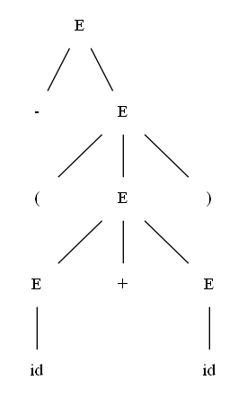
Figure 4.3: Parse tree for $- (\textbf{id} + \textbf{id})$

**INDUCTION:** Suppose we already have constructed a parse tree with yield $\alpha_{i-1} = X_1 X_2 \dots  X_k$ (note that according to our notational conventions, each grammar symbol $X_i$ is either a nonterminal or a terminal). Suppose $\alpha_i$ is derived from $\alpha_{i-1}$ by replacing $X_j$, a nonterminal, by $\beta = Y_1 Y_2 \dots  Y_m$. That is, at the ith step of the derivation, production $X_j \to \beta$ is applied to $\alpha_{i-1}$ to derive $\alpha_i = X_1 X_2 \dots  X _ {j-1} \beta X _ {j+1} \dots  X_k$.

To model this step of the derivation, find the $j$th non-$\epsilon$ leaf from the left in the current parse tree. This leaf is labeled $X_j$. Give this leaf $m$ children, labeled $Y_1, Y_2, \dots , Y_m$, from the left. As a special case, if $m = 0$, then $\beta = \epsilon$, and we give the $j$th leaf one child labeled $\epsilon$.

**Example 4.10:** The sequence of parse trees constructed from the derivation (4.8) is shown in Fig. 4.4. In the first step of the derivation, $E \implies  - E$. To model this step, add two children, labeled $-$ and $E$, to the root $E$ of the initial tree. The result is the second tree.

In the second step of the derivation $- E \implies  - ( E )$. Consequently, add three children, labeled $($, $E$, and $)$, to the leaf labeled $E$ of the second tree, to obtain the third tree with yield $- (E)$. Continuing in this fashion we obtain the complete parse tree as the sixth tree. $\Box$


Figure 4.4: Sequence of parse trees for derivation (4.8)

Since a parse tree ignores variations in the order in which symbols in sentential forms are replaced, there is a many-to-one relationship between derivations and parse trees. For example, both derivations (4.8) and (4.9), are associated with the same final parse tree of Fig. 4.4.

In what follows, we shall frequently parse by producing a leftmost or a rightmost derivation, since there is a one-to-one relationship between parse trees and either leftmost or rightmost derivations. Both leftmost and rightmost derivations pick a particular order for replacing symbols in sentential forms, so they too alter out variations in the order. It is not hard to show that every parse tree has associated with it a unique leftmost and a unique rightmost derivation.

### 4.2.5 Ambiguity

From Section 2.2.4, a grammar that produces more than one parse tree for some sentence is said to be ambiguous. Put another way, an ambiguous grammar is one that produces more than one leftmost derivation or more than one rightmost derivation for the same sentence.

**Example 4.11:** The arithmetic expression grammar (4.3) permits two distinct leftmost derivations for the sentence $\textbf{id} + \textbf{id} * \textbf{id}$:

$$
\begin{array}{ll}
&E &\implies & E + E        & E & \implies & E * E       \\
&  &\implies & \textbf{id} + E       &   & \implies & E + E * E   \\
&  &\implies & \textbf{id} + E * E   &   & \implies & \textbf{id} + E * E  \\
&  &\implies & \textbf{id} + \textbf{id} * E  &   & \implies & \textbf{id} + \textbf{id} * E \\
&  &\implies & \textbf{id} + \textbf{id} * \textbf{id} &   & \implies & \textbf{id} + \textbf{id} * \textbf{id} \\
\end{array}
$$

The corresponding parse trees appear in Fig. 4.5.

Note that the parse tree of Fig. 4.5(a) reflects the commonly assumed precedence of $+$ and $ * $, while the tree of Fig. 4.5(b) does not. That is, it is customary to treat operator $ * $ as having higher precedence than $+$, corresponding to the fact that we would normally evaluate an expression like $a + b * c$ as $a + (b * c)$, rather than as $(a + b) * c$. $\Box$

  

Figure 4.5: Two parse trees for $\textbf{id} + \textbf{id} * \textbf{id}$

For most parsers, it is desirable that the grammar be made unambiguous, for if it is not, we cannot uniquely determine which parse tree to select for a sentence. In other cases, it is convenient to use carefully chosen ambiguous grammars, together with disambiguating rules that “throw away” undesirable parse trees, leaving only one tree for each sentence.

### 4.2.6 Verifying the Language Generated by a Grammar

Although compiler designers rarely do so for a complete programming-language grammar, it is useful to be able to reason that a given set of productions generates a particular language. Troublesome constructs can be studied by writing a concise, abstract grammar and studying the language that it generates. We shall construct such a grammar for conditional statements below.

A proof that a grammar G generates a language $L$ has two parts: show that every string generated by *G* is in $L$, and conversely that every string in $L$ can indeed be generated by *G*.

**Example 4.12:** Consider the following grammar:

$$
S \to ( S ) S |\epsilon \tag{4.13}
$$

It may not be initially apparent, but this simple grammar generates all strings of balanced parentheses, and only such strings. To see why, we shall show first that every sentence derivable from $S$ is balanced, and then that every balanced string is derivable from $S$. To show that every sentence derivable from $S$ is balanced, we use an inductive proof on the number of steps $n$ in a derivation.

**BASIS:** The basis is $n = 1$. The only string of terminals derivable from $S$ in one step is the empty string, which surely is balanced.

**INDUCTION:** Now assume that all derivations of fewer than $n$ steps produce balanced sentences, and consider a leftmost derivation of exactly $n$ steps. Such a derivation must be of the form
$$
S \underset{lm}\implies (S)S \underset{lm}{\overset*\implies} (x)S \underset{lm}{\overset*\implies} (x)y
$$
The derivations of $x$ and $y$ from $S$ take fewer than $n$ steps, so by the inductive hypothesis $x$ and $y$ are balanced. Therefore, the string $(x)y$ must be balanced. That is, it has an equal number of left and right parentheses, and every prefix has at least as many left parentheses as right.

Having thus shown that any string derivable from $S$ is balanced, we must next show that every balanced string is derivable from $S$. To do so, use induction on the length of a string.

**BASIS:** If the string is of length 0, it must be $\epsilon$, which is balanced.

**INDUCTION:** First, observe that every balanced string has even length. Assume that every balanced string of length less than $2n$ is derivable from $S$, and consider a balanced string $w$  of length $2n, n\ge 1$. Surely $w$  begins with a left parenthesis. Let $(x)$ be the shortest nonempty prefix of $w$ having an equal number of left and right parentheses. Then $w$  can be written as $w  = (x)y$ where both $x$ and $y$ are balanced. Since $x$ and $y$ are of length less than $2n$, they are derivable from $S$ by the inductive hypothesis. Thus, we can find a derivation of the form
$$
S \implies (S)S \overset*\implies (x)S \overset*\implies (x)y
$$
proving that $w = (x)y$ is also derivable from $S$. $\Box$

### 4.2.7 Context-Free Grammars Versus Regular Expressions

Before leaving this section on grammars and their properties, we establish that grammars are a more powerful notation than regular expressions. Every construct that can be described by a regular expression can be described by a grammar, but not vice-versa. Alternatively, every regular language is a context-free language, but not vice-versa.

For example, the regular expression $(a|b) * abb$ and the grammar
$$
\begin{array}{ll}
A_0 &\to &a A_0 | b A_0 | a A_1 \\
A_1 &\to &b A_2 \\
A_2 &\to &b A_3 \\
A_3 &\to &\epsilon
\end{array}
$$
describe the same language, the set of strings of $a$’s and $b$’s ending in $a b b$.

We can construct mechanically a grammar to recognize the same language as a nondeterministic finite automaton (NFA). The grammar above was constructed from the NFA in Fig. 3.24 using the following construction:

1.  For each state $i$ of the NFA, create a nonterminal $A_i$.

2.  If state $i$ has a transition to state $j$ on input $a$, add the production $A_i \to aA_j$. If state $i$ goes to state $j$ on input $\epsilon$, add the production $A_i \to A_j$.

3.  If i is an accepting state, add $A_i \to \epsilon$.

4.  If i is the start state, make $A_i$ be the start symbol of the grammar.

On the other hand, the language $L = \{a^n b^n | n\ge 1\}$ with an equal number of $a$’s and $b$’s is a prototypical example of a language that can be described by a grammar but not by a regular expression. To see why, Suppose $L$ were the language defined by some regular expression. We could construct a DFA $D$ with a finite number of states, say $k$, to accept $L$. Since $D$ has only $k$ states, for an input beginning with more than $k$ $a$’s, $D$ must enter some state twice, say $s_i$, as in Fig. 4.6. Suppose that the path from $s_i$ back to itself is labeled with a sequence $a^{j-i}$. Since $a^i b^i$ is in the language, there must be a path labeled $b^i$ from $s_i$ to an accepting state $f$. But, then there is also a path from the initial state $s_0$ through $s_i$ to $f$ labeled $a^j b^i$, as shown in Fig. 4.6. Thus, $D$ also accepts $a^j b^i$, which is not in the language, contradicting the assumption that $L$ is the language accepted by $D$.

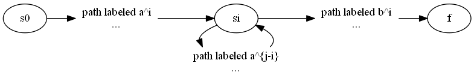

Figure 4.6: DFA $D$ accepting both $a^i b^i$ and $a^j b^i$.

Colloquially, we say that “finite automaton cannot count,” meaning that a finite automaton cannot accept a language like $\{a^n b^n | n\ge 1\}$ that would require it to keep count of the number of $a$’s before it sees the $b$’s. Likewise, “a grammar can count two items but not three,” as we shall see when we consider non-context-free language constructs in Section 4.3.5.


## 4.3 Writing a Grammar

Grammars are capable of describing most, but not all, of the syntax of programming languages. For instance, the requirement that identifiers be declared before they are used, cannot be described by a context-free grammar. Therefore, the sequences of tokens accepted by a parser form a superset of the programming language; subsequent phases of the compiler must analyze the output of the parser to ensure compliance with rules that are not checked by the parser.

This section begins with a discussion of how to divide work between a lexical analyzer and a parser. We then consider several transformations that could be applied to get a grammar more suitable for parsing. One technique can eliminate ambiguity in the grammar, and other techniques—left-recursion elimination and left factoring—are useful for rewriting grammars so they become suitable for top-down parsing. We conclude this section by considering some programming language constructs that cannot be described by any grammar.

### 4.3.1 Lexical Versus Syntactic Analysis

As we observed in Section 4.2.7, everything that can be described by a regular expression can also be described by a grammar. We may therefore reasonably ask: “Why use regular expressions to define the lexical syntax of a language?” There are several reasons.

1.  Separating the syntactic structure of a language into lexical and non-lexical parts provides a convenient way of modularizing the front end of a compiler into two manageable-sized components.

2.  The lexical rules of a language are frequently quite simple, and to describe them we do not need a notation as powerful as grammars.

3.  Regular expressions generally provide a more concise and easier-to-understand notation for tokens than grammars.

4.  More efficient lexical analyzers can be constructed automatically from regular expressions than from arbitrary grammars.

There are no firm guidelines as to what to put into the lexical rules, as opposed to the syntactic rules. Regular expressions are most useful for describing the structure of constructs such as identifiers, constants, keywords, and white space. Grammars, on the other hand, are most useful for describing nested structures such as balanced parentheses, matching begin-end’s, corresponding if-then-else’s, and soon. These nested structures cannot be described by regular expressions.

### 4.3.2 Eliminating Ambiguity

Sometimes an ambiguous grammar can be rewritten to eliminate the ambiguity. As an example, we shall eliminate the ambiguity from the following “dangling-else” grammar:
$$
\begin{array}{lrl}
stmt   &\to &\textbf{if } expr \textbf{ then } stmt \\ \tag{4.14}
& | &\textbf{if } expr \textbf{ then } stmt \textbf{ else } stmt \\
& | & other
\end{array}
$$
Here "$ other $" stands for any other statement. According to this grammar, the compound conditional statement

$$
\textbf{if } E_1 \textbf{ then } S_1 \textbf{ else if } E_2 \textbf{ then } S_2 \textbf{ else } S_3 
$$

has the parse tree shown in Fig. 4.8. [^1] 

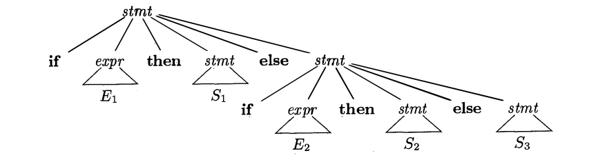

Figure 4.8: Parse tree for a conditional statement


Grammar (4.14) is ambiguous since the string
$$
\textbf{if } E_1\textbf{ then if } E_2 \textbf{ then } S_1 \textbf{ else } S_2 \tag{4.15}
$$

has the two parse trees shown in Fig. 4.9.

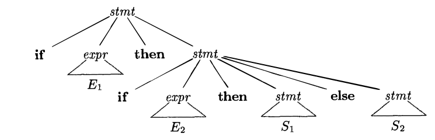
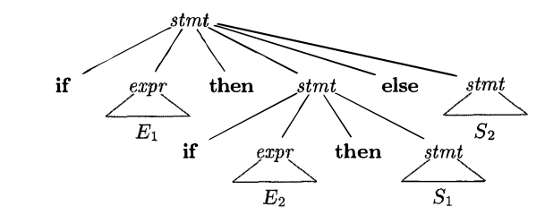

Figure 4.9: Two parse trees for an ambiguous sentence

In all programming languages with conditional statements of this form, the first parse tree is preferred. The general rule is, “Match each else with the closest unmatched then.”[^2] This disambiguating rule can theoretically be incorporated directly into a grammar, but in practice it is rarely built into the productions.

[^1]: The subscripts on $E$ and $S$ are just to distinguish different occurrences of the same nonterminal, and do not imply distinct nonterminals.
[^2]: We should note that C and its derivatives are included in this class. Even though the C family of languages do not use the keyword **then**, its role is played by the closing parenthesis for the condition that follows **if**.

**Example 4.16:** We can rewrite the dangling-else grammar (4.14) as the following unambiguous grammar. The idea is that a statement appearing between a **then** and an **else** must be “matched”; that is, the interior statement must not end with an unmatched or open **then**. A matched statement is either an if-then-else statement containing no open statements or it is any other kind of unconditional statement. Thus, we may use the grammar in Fig. 4.10. This grammar generates the same strings as the dangling-else grammar (4.14), but it allows only one parsing for string (4.15); namely, the one that associates each **else** with the closest previous unmatched **then**. $\Box$
$$
\begin{array}{rrl}
stmt &\to &matched\_stmt \\
&|&open\_stmt\\
matched\_stmt &\to &\textbf{if }expr\ \textbf{then}\ matched\_stmt\ \textbf{else}\ matched\_stmt \\
&|&other\\
open\_stmt &\to &\textbf{if }expr\ \textbf{then}\ stmt \\
&| &\textbf{if }expr\ \textbf{then}\ matched\_stmt\ \textbf{else}\ open\_stmt
\end{array}
$$
Figure 4.10: Unambiguous grammar for if-then-else statements

### 4.3.3 Elimination of Left Recursion

A grammar is *left recursive* if it has a nonterminal $A$ such that there is a derivation $A\overset+\implies A\alpha$ for some string $\alpha$. Top-down parsing methods cannot handle left-recursive grammars, so a transformation is needed to eliminate left recursion. In Section 2.4.5, we discussed *immediate left recursion*, where there is a production of the form $A \to A\alpha$. Here, we study the general case. In Section 2.4.5, we showed how the left-recursive pair of productions $A \to A\alpha\ |\ \beta$  could be replaced by the non-left-recursive productions:
$$
\begin{array}{lll}
A &\to& \beta A'\\
A'&\to& \alpha A'\ |\ \epsilon
\end{array}
$$
without changing the strings derivable from $A$. This rule by itself suffices for many grammars.

**Example 4.17:** The non-left-recursive expression grammar (4.2), repeated here,
$$
\begin{array}{lll}
E  & \to&  T E'     \\
E' & \to&  + T E'\ |\ \epsilon \\
T  & \to&  F T'     \\     
T' & \to&  * F T'\ |\ \epsilon \\ 
F  & \to&  ( E )\ |\ id
\end{array}
$$
is obtained by eliminating immediate left recursion from the expression grammar (4.1). The left-recursive pair of productions $E \to E + T | T$ are replaced by $E \to T E'$ and $E' \to + T E' | \epsilon$. The new productions for $T$ and $T'$ are obtained similarly by eliminating immediate left recursion. $\Box$

Immediate left recursion can be eliminated by the following technique, which works for any number of A-productions. First, group the productions as
$$
A \to A \alpha_1\ |\ A \alpha_2\ |\ \dots\ |\ A \alpha_m\ |\ \beta_1\ |\ \beta_2\ |\ \dots\  |\ \beta_n
$$
where no $\beta_i$ begins with an $A$. Then, replace the A-productions by

$$
\begin{array}{ll}
A&\to&  \beta_1 A'\ |\ \beta_2 A'\ |\ \dots\ |\ \beta_n A' \\
A'&\to&  \alpha_1 A'\ |\ \alpha_2 A'\ |\ \dots\ |\ \alpha_m A'\ |\ \epsilon
\end{array}
$$

The nonterminal $A$ generates the same strings as before but is no longer left recursive. This procedure eliminates all left recursion from the $A$ and $A'$ productions (provided no $\alpha_i$ is $\epsilon$), but it does not eliminate left recursion involving derivations of two or more steps. For example, consider the grammar

$$
\begin{array}{ll}
S \to A\ a\ |\ b \\       \tag{4.18}
A \to A\ c\ |\ S\ d\ |\ \epsilon
\end{array}
$$

The nonterminal $S$ is left recursive because $S \implies  A\ a \implies  S\ d\ a $, but it is not immediately left recursive.

Algorithm 4.19, below, systematically eliminates left recursion from a grammar. It is guaranteed to work if the grammar has no cycles (derivations of the form $A \overset+\implies A$) or $\epsilon$-productions (productions of the form $A \to \epsilon$). Cycles can be eliminated systematically from a grammar, as can $\epsilon$-productions (see Exercises 4.4.6 and 4.4.7).

**Algorithm 4.19:** Eliminating left recursion.

**INPUT:** Grammar *G* with no cycles or $\epsilon$-productions.

**OUTPUT:** An equivalent grammar with no left recursion.

**METHOD:** Apply the algorithm in Fig. 4.11 to *G*. Note that the resulting non-left-recursive grammar may have $\epsilon$-productions.  $\Box$

  1)   arrange the nonterminals in some order $A_1, A_2, \dots ,A_n$.

  2)   for ( each i from 1 to n ) {

  3)   for ( each j from 1 to i-1 ) {

  4)   replace each production of the form $A_i \to A_j\gamma$  by the productions $A_i \to \delta_1\gamma |\delta_2\gamma | \dots  |\delta_k\gamma$ , where $A_j \to \delta_1 |\delta_2 | \dots  |\delta_k$ are all current $A_j$-productions

  5)   }

  6)   eliminate the immediate left recursion among the $A_i$-productions

  7)   }
Figure 4.11: Algorithm to eliminate left recursion from a grammar

The procedure in Fig. 4.11 works as follows. In the first iteration for $i = 1$, the outer for-loop of lines (2) through (7) eliminates any immediate left recursion among $A_1$-productions. Any remaining $A_1$ productions of the form $A_1 \to A_l\alpha$ must therefore have $l > 1$. After the $i-1$st iteration of the outer for-loop, all nonterminals $A_k$, where $k < i$, are “cleaned”; that is, any production $A_k \to A_l\alpha$, must have $l > k$. As a result, on the $i$th iteration, the inner loop of lines (3) through (5) progressively raises the lower limit in any production $A_i \to A_m\alpha$, until we have $m \ge i$. Then, eliminating immediate left recursion for the $A_i$ productions at line (6) forces $m$ to be greater than $i$.

**Example 4.20:** Let us apply Algorithm 4.19 to the grammar (4.18). Technically, the algorithm is not guaranteed to work, because of the $\epsilon$-production, but in this case, the production $A \to \epsilon$ turns out to be harmless.

We order the nonterminals $S$, $A$. There is no immediate left recursion among the $S$-productions, so nothing happens during the outer loop for $i = 1$. For $i = 2$, we substitute for $S$ in $A \to S d$ to obtain the following $A$-productions.

$$
A \to A\ c\ |\ A\ a\ d\ |\ b\ d\ |\ \epsilon
$$

Eliminating the immediate left recursion among these $A$-productions yields the following grammar.

$$
\begin{array}{ll}
S  & \to & A\ a\ |\ b           \\          
A  & \to & b\ d\ A'\ |\ A'\       \\ 
A' & \to & c\ A'\ |\ a\ d\ A'\ |\ \epsilon \\
\end{array}
$$

$\Box$

### 4.3.4 Left Factoring

Left factoring is a grammar transformation that is useful for producing a grammar suitable for predictive, or top-down, parsing. When the choice between two alternative $A$-productions is not clear, we may be able to rewrite the productions to defer the decision until enough of the input has been seen that we can make the right choice.

For example, if we have the two productions

$$
\begin{array}{lrl}
stmt &\to &\textbf{if }expr\ \textbf{then}\ stmt\ \textbf{else}\ stmt \\
     & | &\textbf{if }expr\ \textbf{then}\ stmt
\end{array}
$$

on seeing the input **if**, we cannot immediately tell which production to choose to expand $stmt$. In general, if $A \to \alpha\beta_1\ |\ \alpha\beta_2$ are two $A$-productions, and the input begins with a nonempty string derived from $\alpha$, we do not know whether to expand $A$ to $\alpha\beta_1$ or $\alpha\beta_2$. However, we may defer the decision by expanding $A$ to $A'$. Then, after seeing the input derived from $\alpha$, we expand $A'$ to $\beta_1$ or to $\beta_2$. That is, left-factored, the original productions become
$$
\begin{array}{ll}
A  &\to &\alpha A' \\
A' &\to &\beta_1\ |\ \beta_2
\end{array}
$$

**Algorithm 4.21:** Left factoring a grammar.

**INPUT:** Grammar *G*.

**OUTPUT:** An equivalent left-factored grammar.

**METHOD:** For each nonterminal $A$, find the longest prefix $\alpha$ common to two or more of its alternatives. If $\alpha \not= \epsilon$ i.e., there is a nontrivial common prefix — replace all of the $A$-productions $A \to \alpha\beta_1 |\alpha\beta_2 | \dots  |\alpha\beta_n | \gamma$, where represents all alternatives that do not begin with $\alpha$, by
$$
\begin{array}{ll}
A &\to &\alpha A' | \gamma \\
A' &\to &\beta_1 |\beta_2 | \dots  |\beta_n
\end{array}
$$
Here $A'$ is a new nonterminal. Repeatedly apply this transformation until no two alternatives for a nonterminal have a common prefix. $\Box$

**Example 4.22:** The following grammar abstracts the **dangling-else** problem:
$$
\begin{array}{lll}
S &\to&  i\ E\ t\ S\ |\ i\ E\ t\ S\ e\ S\ |\ a \\ \tag{4.23}
E &\to&  b
\end{array}
$$

Here, $i$, $t$, and $e$ stand for `if`, `then`, and `else`; $E$ and $S$ stand for “conditional expression” and “statement.” Left-factored, this grammar becomes:

$$
\begin{array}{lll}
S  &\to&  i\ E\ t\ S\ S'\ |\ a \\ \tag{4.24}
S' &\to&  e\ S\ |\ \epsilon \\
E  &\to&  b
\end{array}
$$

Thus, we may expand $S$ to $iEtSS’$ on input $i$, and wait until $iEtS$ has been seen to decide whether to expand $S'$ to $eS$ or to $\epsilon$. Of course, these grammars are both ambiguous, and on input $e$, it will not be clear which alternative for $S'$ should be chosen. Example 4.33 discusses a way out of this dilemma. $\Box$

### 4.3.5 Non-Context-Free Language Constructs

A few syntactic constructs found in typical programming languages cannot be specified using grammars alone. Here, we consider two of these constructs, using simple abstract languages to illustrate the difficulties.

**Example 4.25:** The language in this example abstracts the problem of checking that identifiers are declared before they are used in a program. The language consists of strings of the form $w c w$, where the first $w$ represents the declaration of an identifier $w$, $c$ represents an intervening program fragment, and the second $w$ represents the use of the identifier.

The abstract language is $L_1 = \{w c w  | w \text{  is in }(a|b) * \}$. $L_1$ consists of all words composed of a repeated string of $a$’s and $b$’s separated by $c$, such as $aabcaab$. While it is beyond the scope of this book to prove it, the non-context-freedom of $L_1$ directly implies the non-context-freedom of programming languages like C and Java, which require declaration of identifiers before their use and which allow identifiers of arbitrary length.

For this reason, a grammar for C or Java does not distinguish among identifiers that are different character strings. Instead, all identifiers are represented by a token such as **id** in the grammar. In a compiler for such a language, the semantic-analysis phase checks that identifiers are declared before they are used. $\Box$

**Example 4.26:** The non-context-free language in this example abstracts the problem of checking that the number of formal parameters in the declaration of a function agrees with the number of actual parameters in a use of the function. The language consists of strings of the form $a^nb^mc^nd^m$. (Recall $a^n$ means a written n times.) Here $a^n$ and $b^m$ could represent the formal-parameter lists of two functions declared to have $n$ and $m$ arguments, respectively, while $c^n$ and $d^m$ represent the actual-parameter lists in calls to these two functions.

The abstract language is $L_2 = \{ a^n b^m c^n d^m | n \ge 1 \text{ and } m \ge 1\}$. That is, $L_2$ consists of strings in the language generated by the regular expression `a*b*c*d*` ​ such that the number of $a$’s and $c$’s are equal and the number of $b$’s and $d$’s are equal. This language is not context free.

Again, the typical syntax of function declarations and uses does not concern itself with counting the number of parameters. For example, a function call in C-like language might be specified by
$$
\begin{array}{rrl}
stmt         &\to& \textbf{id}\ ( expr\_list ) \\
expr\_list   &\to& expr\_list , expr \\
             &|& expr
\end{array}
$$
with suitable productions for $expr$. Checking that the number of parameters in a call is correct is usually done during the semantic-analysis phase. $\Box$


## 4.4 Top-Down Parsing

Top-down parsing can be viewed as the problem of constructing a parse tree for the input string, starting from the root and creating the nodes of the parse tree in preorder (depth-first, as discussed in Section 2.3.4). Equivalently, top-down parsing can be viewed as finding a leftmost derivation for an input string.

**Example 4.27:** The sequence of parse trees in Fig. 4.12 for the input $\textbf{id} + \textbf{id}*\textbf{id}$ is a top-down parse according to grammar (4.2), repeated here:

$$
\begin{array}{lll}
E  &\to&  T E'           \\ \tag{4.28}
E' &\to&  + T E' | \epsilon \\ 
T  &\to&  F T'           \\
T' &\to&  * F T' | \epsilon \\   
F  &\to&  ( E ) | \textbf{id}
\end{array}
$$

This sequence of trees corresponds to a leftmost derivation of the input. $\Box$

At each step of a top-down parse, the key problem is that of determining the production to be applied for a nonterminal, say $A$. Once an $A$-production is chosen, the rest of the parsing process consists of “matching” the terminal symbols in the production body with the input string.

The section begins with a general form of top-down parsing, called recursive-descent parsing, which may require **backtracking** to find the correct A-production to be applied. Section 2.4.2 introduced predictive parsing, a special case of recursive-descent parsing, where no backtracking is required. Predictive parsing chooses the correct A-production by looking ahead at the input a fixed number of symbols, typically we may look only at one (that is, the next input symbol).

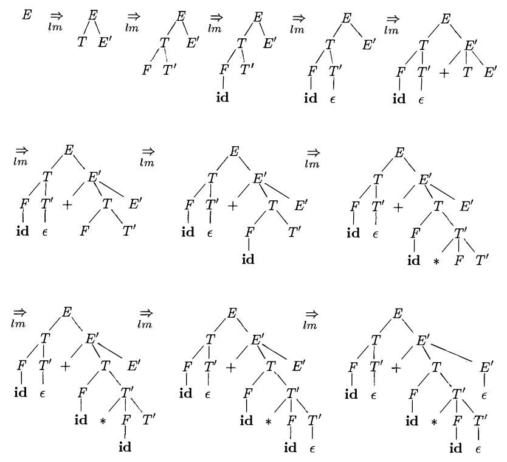

Figure 4.12: Top-down parse for $\textbf{id} + \textbf{id} * \textbf{id}$

For example, consider the top-down parse in Fig. 4.12, which constructs a tree with two nodes labeled $E'$. At the first $E'$ node (in preorder), the production $E' \to +T E'$ is chosen; at the second $E'$ node, the production $E' \to \epsilon$ is chosen. A predictive parser can choose between $E'$-productions by looking at the next input symbol.

The class of grammars for which we can construct predictive parsers looking $k$ symbols ahead in the input is sometimes called the *LL(k)*​ class. We discuss the *LL(1)*​ class in Section 4.4.3, but introduce certain computations, called FIRST and FOLLOW, in a preliminary Section 4.4.2. From the FIRST and FOLLOW sets for a grammar, we shall construct “predictive parsing tables,” which make explicit the choice of production during top-down parsing. These sets are also useful during bottom-up parsing, as we shall see.

In Section 4.4.4 we give a non-recursive parsing algorithm that maintains a stack explicitly, rather than implicitly via recursive calls. Finally, in Section 4.4.5 we discuss error recovery during top-down parsing.

### 4.4.1 Recursive-Descent Parsing

A recursive-descent parsing program consists of a set of procedures, one for each nonterminal. Execution begins with the procedure for the start symbol, which halts and announces success if its procedure body scans the entire input string. Pseudo-code for a typical nonterminal appears in Fig. 4.13. Note that this pseudo-code is nondeterministic, since it begins by choosing the A-production to apply in a manner that is not specified.

void A() {
1. Choose an $A$-production, $A \to X_1 X_2 \dots  X_k$;
2. for ( i = 1 to k ) {
3. if ($ X_i$ is a nonterminal )
4. call procedure $ X_i$();
5. else if ( $ X_i$ equals the current input symbol $a$ )
6. advance the input to the next symbol;
7. else /\* an error has occurred \*/;
    }
    }

Figure 4.13: A typical procedure for a nonterminal in a top-down parser

General recursive-descent may require backtracking; that is, it may require repeated scans over the input. However, backtracking is rarely needed to parse programming language constructs, so backtracking parsers are not seen frequently. Even for situations like natural language parsing, backtracking is not very efficient, and tabular methods such as the dynamic programming algorithm of Exercise 4.4.9 or the method of Earley (see the bibliographic notes) are preferred.

To allow backtracking, the code of Fig. 4.13 needs to be modified. First, we cannot choose a unique A-production at line (1), so we must try each of several productions in some order. Then, failure at line (7) is not ultimate failure, but suggests only that we need to return to line (1) and try another A-production. Only if there are no more A-productions to try do we declare that an input error has been found. In order to try another A-production, we need to be able to reset the input pointer to where it was when we first reached line (1). Thus, a local variable is needed to store this input pointer for future use.

**Example 4.29:** Consider the grammar

$$
\begin{array}{lll}
S &\to&  c\ A\ d     \\
A &\to&  a\ b\ |\ a
\end{array}
$$

To construct a parse tree top-down for the input string $w  = cad$, begin with a tree consisting of a single node labeled $S$, and the input pointer pointing to $c$, the first symbol of $w$. $S$ has only one production, so we use it to expand $S$ and obtain the tree of Fig. 4.14(a). The leftmost leaf, labeled $c$, matches the first symbol of input $w$, so we advance the input pointer to $a$, the second symbol of $w$, and consider the next leaf, labeled $A$.

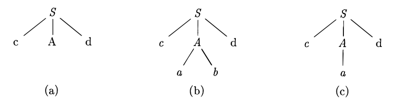

Figure 4.14: Steps in a top-down parse

Now, we expand $A$ using the first alternative $A \to a b$ to obtain the tree of Fig. 4.14(b). We have a match for the second input symbol, $a$, so we advance the input pointer to $d$, the third input symbol, and compare $d$ against the next leaf, labeled $b$. Since $b$ does not match $d$, we report failure and go back to $A$ to see whether there is another alternative for $A$ that has not been tried, but that might produce a match.

In going back to $A$, we must reset the input pointer to position 2, the position it had when we first came to $A$, which means that the procedure for $A$ must store the input pointer in a local variable.

The second alternative for $A$ produces the tree of Fig. 4.14(c). The leaf a matches the second symbol of $w$ and the leaf $d$ matches the third symbol. Since we have produced a parse tree for $w$, we halt and announce successful completion of parsing. $\Box$

A left-recursive grammar can cause a recursive-descent parser, even one with backtracking, to go into an infinite loop. That is, when we try to expand a nonterminal $A$, we may eventually find ourselves again trying to expand $A$ without having consumed any input.

### 4.4.2 FIRST and FOLLOW

The construction of both top-down and bottom-up parsers is aided by two functions, FIRST and FOLLOW, associated with a grammar *G*. During top-down parsing, FIRST and FOLLOW allow us to choose which production to apply, based on the next input symbol. During panic-mode error recovery, sets of tokens produced by FOLLOW can be used as synchronizing tokens.

Define *FIRST($\alpha$)*, where $\alpha$ is any string of grammar symbols, to be the set of terminals that begin strings derived from $\alpha$. If $\alpha\overset*\implies\epsilon$, then $\epsilon$ is also in FIRST($\alpha$). For example, in Fig. 4.15, $A \overset * \implies c \gamma$, so $c$ is in FIRST($A$).

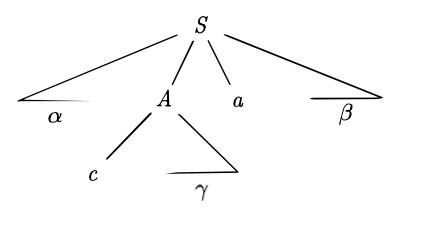

Figure 4.15: Terminal $c$ is in FIRST($A$) and $a$ is in FOLLOW($A$)

For a preview of how FIRST can be used during predictive parsing, consider two $A$-productions $A \to \alpha|\beta$, where FIRST($\alpha$) and FIRST($\beta$) are disjoint sets. We can then choose between these $A$-productions by looking at the next input symbol $a$, since $a$ can be in at most one of FIRST($\alpha$) and FIRST($\beta$), not both. For instance, if $a$ is in FIRST($\beta$) choose the production $A \to \beta$. This idea will be explored when LL(1) grammars are defined in Section 4.4.3.

Define *FOLLOW(A)*, for nonterminal $A$, to be the set of terminals $a$ that can appear immediately to the right of $A$ in some sentential form; that is, the set of terminals $a$ such that there exists a derivation of the form $S \overset*\implies \alpha A a \beta$, for some $\alpha$ and $\beta$, as in Fig. 4.15. Note that there may have been symbols between $A$ and $a$, at some time during the derivation, but if so, they derived $\epsilon$ and disappeared. In addition, if $A$ can be the rightmost symbol in some sentential form, then \$ is in FOLLOW($A$); recall that \$ is a special "endmarker" symbol that is assumed not to be a symbol of any grammar.

To compute FIRST($X$) for all grammar symbols $X$, apply the following rules until no more terminals or can be added to any FIRST set.

1. If $X$ is a terminal, then $FIRST(X) = \{X\}$.
2. If $X$ is a nonterminal and $X \to Y_1 Y_2 \dots  Y_k$ is a production for some $k\ge 1$, then place $a$ in FIRST($X$) if for some $i$, $a$ is in FIRST($Y_i$), and is in all of FIRST($Y_1$), $\dots$, FIRST($Y _ {i-1}$); that is, $Y_1 \dots  Y _ {i-1} \overset*\implies \epsilon$. If $\epsilon$ is in FIRST($Y_j$) for all $j = 1, 2, \dots  k$, then add $\epsilon$ to FIRST($X$). For example, everything in FIRST($Y_1$) is surely in FIRST($X$). If $Y_1$ does not derive $\epsilon$, then we add nothing more to FIRST($X$), but if $Y_1 \overset*\implies \epsilon$, then we add FIRST($Y_2$), and so on.

3. If $X \to \epsilon$ is a production, then add $\epsilon$ to $FIRST(X)$.

Now, we can compute FIRST for any string $X_1 X_2 \dots  X_n$ as follows. Add to FIRST($X_1 X_2 \dots  X_n$) all non-$\epsilon$ symbols of FIRST($X_1$). Also add the non-$\epsilon$ symbols of FIRST($X_2$), if $\epsilon$ is in FIRST($X_1$); the non-$\epsilon$ symbols of FIRST($X_3$), if $\epsilon$ is in FIRST($X_1$) and FIRST($X_2$); and so on. Finally, add $\epsilon$ to FIRST($X_1 X_2 \dots  X_n$) if, for all $i$, $\epsilon$ is in FIRST($X_i$).

To compute FOLLOW($A$) for all nonterminals $A$, apply the following rules until nothing can be added to any FOLLOW set.

1.  Place \$ in FOLLOW($S$), where $S$ is the start symbol, and $ is the input right endmarker.

2.  If there is a production $A \to \alpha B \beta$, then everything in FIRST($\beta$) except $\epsilon$ is in FOLLOW($B$).

3.  If there is a production $A \to \alpha B$, or a production $A \to \alpha B \beta$, where FIRST($\beta$) contains $\epsilon$, then everything in FOLLOW($A$) is in FOLLOW($B$).

**Example 4.30:** Consider again the non-left-recursive grammar (4.28). Then:

1.  FIRST($F$) = FIRST($T$) = FIRST($E$) = {$($, $\textbf{id}$}. To see why, note that the two productions for $F$ have bodies that start with these two terminal symbols, **id** and the left parenthesis. $T$ has only one production, and its body starts with $F$. Since $F$ does not derive $\epsilon$, FIRST($T$) must be the same as FIRST($F$). The same argument covers FIRST($E$).

2.  FIRST($E'$) = {$+$, $\epsilon$}. The reason is that one of the two productions for $E'$ has a body that begins with terminal $+$, and the other's body is $\epsilon$. Whenever a nonterminal derives $\epsilon$, we place in FIRST for that nonterminal.

3.  FIRST($T'$) = {$ * $, $\epsilon$}. The reasoning is analogous to that for FIRST($E'$).

4.  FOLLOW($E$) = FOLLOW($E'$) = $\{), \$\}$. Since $E$ is the start symbol, FOLLOW($E$) must contain $\$$. The production body $(E)$ explains why the right parenthesis is in FOLLOW($E$). For $E'$, note that this nonterminal appears only at the ends of bodies of $E$-productions. Thus, FOLLOW($E'$) must be the same as FOLLOW($E$).

5.  FOLLOW($T$) = FOLLOW($T'$) = {$+$, $)$, \$}. Notice that $T$ appears in bodies only followed by $E'$. Thus, everything except $\epsilon$ that is in FIRST($E'$) must be in FOLLOW($T$); that explains the symbol $+$. However, since FIRST($E'$) contains $\epsilon$ (i.e., $E' \overset*\implies \epsilon$), and $E'$ is the entire string following $T$ in the bodies of the $E$-productions, everything in FOLLOW($E$) must also be in FOLLOW($T$). That explains the symbols \$ and the right parenthesis. As for $T'$, since it appears only at the ends of the $T$-productions, it must be that FOLLOW($T'$) = FOLLOW($T$).

6.  FOLLOW($F$) = {$+$,$ * $, $)$, \$}. The reasoning is analogous to that for $T$ in point (5).

$\Box$

### 4.4.3 LL(1) Grammars

Predictive parsers, that is, recursive-descent parsers needing no backtracking, can be constructed for a class of grammars called LL(1). The first “L” in LL(1) stands for scanning the input from left to right, the second “L” for producing a leftmost derivation, and the “1” for using one input symbol of lookahead at each step to make parsing action decisions.

---

##### Transition Diagrams for Predictive Parsers

Transition diagrams are useful for visualizing predictive parsers. For example, the transition diagrams for nonterminals $E$ and $E'$ of grammar (4.28) appear in Fig. 4.16(a). To construct the transition diagram from a grammar, first eliminate left recursion and then left factor the grammar. Then, for each nonterminal $A$,

1.  Create an initial and final (return) state.

2.  For each production $A \to X_1 X_2 \dots  X_k$, create a path from the initial to the final state, with edges labeled $X_1, X_2, \dots , X_k$. If $A \to \epsilon$, the path is an edge labeled $\epsilon$.

Transition diagrams for predictive parsers differ from those for lexical analyzers. Parsers have one diagram for each nonterminal. The labels of edges can be tokens or nonterminals. A transition on a token (terminal) means that we take that transition if that token is the next input symbol. A transition on a nonterminal $A$ is a call of the procedure for $A$.

With an $LL(1)$ grammar, the ambiguity of whether or not to take an $\epsilon$-edge can be resolved by making $\epsilon$-transitions the default choice.

Transition diagrams can be simplified, provided the sequence of grammar symbols along paths is preserved. We may also substitute the diagram for a nonterminal A in place of an edge labeled $A$. The diagrams in Fig. 4.16(a) and (b) are equivalent: if we trace paths from $E$ to an accepting state and substitute for $E'$, then, in both sets of diagrams, the grammar symbols along the paths make up strings of the form $T + T + \dots  + T$. The diagram in (b) can be obtained from (a) by transformations akin to those in Section 2.5.4, where we used tail-recursion removal and substitution of procedure bodies to optimize the procedure for a nonterminal.

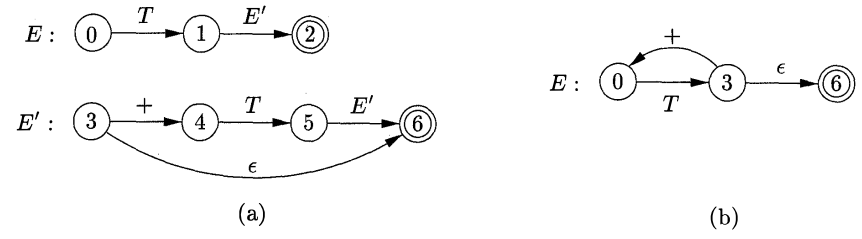 

Figure 4.16: Transition diagrams for nonterminals $E$ and $E'$ of grammar 4.28

---

The class of LL(1) grammars is rich enough to cover most programming constructs, although care is needed in writing a suitable grammar for the source language. For example, no left-recursive or ambiguous grammar can be LL(1).

A grammar *G* is LL(1) if and only if whenever $A \to \alpha\ |\ \beta$  are two distinct productions of *G*, the following conditions hold:

1.  For no terminal $a$ do both $\alpha$ and $\beta$  derive strings beginning with $a$.

2.  At most one of $\alpha$ and $\beta$ can derive the empty string.

3.  If $\beta \overset*\implies \epsilon$, then $\alpha$ does not derive any string beginning with a terminal in FOLLOW($A$). Likewise, if $\alpha \overset*\implies \epsilon$, then $\beta$ does not derive any string beginning with a terminal in FOLLOW($A$).

The first two conditions are equivalent to the statement that FIRST($\alpha$) and FIRST($\beta$) are disjoint sets. The third condition is equivalent to stating that if $\epsilon$ is in FIRST($\beta$), then FIRST($\alpha$) and FOLLOW($A$) are disjoint sets, and likewise if $\epsilon$ is in FIRST($\alpha$).

Predictive parsers can be constructed for $LL(1)$ grammars since the proper production to apply for a nonterminal can be selected by looking only at the current input symbol. Flow-of-control constructs, with their distinguishing keywords, generally satisfy the $LL(1)$ constraints. For instance, if we have the productions

$$
\begin{array}{rrl}
stmt&\to&  \textbf{if } ( expr ) stmt \textbf{ else } stmt \\
    &|& \textbf{while } ( expr ) stmt \\
    &|& \{ stmt\_list \} 
\end{array}
$$

then the keywords **if**, **while**, and the symbol **{** tell us which alternative is the only one that could possibly succeed if we are to find a statement.

The next algorithm collects the information from FIRST and FOLLOW sets into a predictive parsing table $M[A, a]$, a two-dimensional array, where $A$ is a nonterminal, and $a$ is a terminal or the symbol \$, the input endmarker. The algorithm is based on the following idea: the production $A \to \alpha$ is chosen if the next input symbol a is in FIRST($\alpha$). The only complication occurs when $\alpha = \epsilon$ or, more generally, $\alpha \overset*\implies \epsilon$. In this case, we should again choose $A \to \alpha$, if the current input symbol is in FOLLOW($A$), or if the \$ on the input has been reached and \$ is in FOLLOW($A$).

**Algorithm 4.31:** Construction of a predictive parsing table.

**INPUT:** Grammar *G*.

**OUTPUT:** Parsing table $M$.

**METHOD:** For each production $A \to \alpha$ of the grammar, do the following:

1.  For each terminal $a$ in FIRST($\alpha$), add $A \to \alpha$ to $M[A, a]$.

2.  If $\epsilon$ is in FIRST($\alpha$), then for each terminal b in FOLLOW($A$), add $A \to \alpha$ to $M[A, b]$. If $\epsilon$ is in FIRST($\alpha$) and \$ is in FOLLOW($A$), add $A \to \alpha$ to $M[A, \$]$ as well.

If, after performing the above, there is no production at all in $M[A, a]$, then set $M[A, a]$ to error (which we normally represent by an empty entry in the table). $\Box$

**Example 4.32:** For the expression grammar (4.28), Algorithm 4.31 produces the parsing table in Fig. 4.17. Blanks are error entries; non-blanks indicate a production with which to expand a nonterminal.

| NONTERMINAL | id           | +         | *              | (        | )     | $     |
| ---- | ------------ | --------- | -------------- | -------- | ----- | ----- |
| $E$  | $E \to T E'$ |           |                | $E \to T E'$ |       |       |
| $E'$ |              | $E' \to +T E'$ |                |          | $E' \to \epsilon$ | $E' \to \epsilon$ |
| $T$  | $T \to F T'$     |           |                | $T \to F T'$ |       |       |
| $T'$ |              | $T' \to \epsilon$     | $T' \to *F T'$ |          | $T' \to \epsilon$ | $T' \to \epsilon$ |
| $F$  | $F \to \textbf{id}$ |           |                | $F \to (E)$  |       |       |

Figure 4.17: Parsing table M for Example 4.32

Consider production $E \to T E'$. Since

$$
FIRST(T\ E') = FIRST(T) = \{(, \textbf{id}\}
$$

this production is added to $M[E, (]$ and $M[E, \textbf{id}]$. production $E' \to +\ T\ E'$ is added to $M[E', +]$ since $FIRST(+T\ E') = \{+\}$. Since $FOLLOW(E') = \{), \$\}$, production $E' \to \epsilon$ is added to $M[E', )]$ and $M[E', \$]$. $\Box$

Algorithm 4.31 can be applied to any grammar *G* to produce a parsing table $M$. For every LL(1) grammar, each parsing-table entry uniquely identifies a production or signals an error. For some grammars, however, $M$ may have some entries that are multiply defined. For example, if *G* is left-recursive or ambiguous, then $M$ will have at least one multiply defined entry. Although left-recursion elimination and left factoring are easy to do, there are some grammars for which no amount of alteration will produce an LL(1)​ grammar.

The language in the following example has no $LL(1)$ grammar at all.

**Example 4.33:** The following grammar, which abstracts the dangling-else problem, is repeated here from Example 4.22:

$$
\begin{array}{lll}
S &\to& iEtSS’ | a \\
S'&\to& eS | \epsilon \\
E &\to& b
\end{array}
$$

The parsing table for this grammar appears in Fig. 4.18. The entry for $M[S', e]$ contains both $S'\to e S$ and $S'\to \epsilon$.

| NONTERMINAL | a         | b         | e                     | i              | t    | $                |
| ----------- | --------- | --------- | --------------------- | -------------- | ---- | ---------------- |
| $S$         | $S \to a$ |           |                       | $S \to iEtSS’$ |      |                  |
| $S'$        |           |           | $S'\to \epsilon | eS$ |                |      | $S'\to \epsilon$ |
| $E$         |           | $E \to b$ |                       |                |      |                  |

Figure 4.18: Parsing table M for Example 4.33

The grammar is ambiguous and the ambiguity is manifested by a choice in what production to use when an e (**else**) is seen. We can resolve this ambiguity by choosing $S'\to eS$. This choice corresponds to associating an **else** with the closest previous **then**. Note that the choice $S'\to \epsilon$ would prevent $e$ from ever being put on the stack or removed from the input, and is surely wrong. $\Box$

### 4.4.4 Nonrecursive Predictive Parsing

A nonrecursive predictive parser can be built by maintaining a stack explicitly, rather than implicitly via recursive calls. The parser mimics a leftmost derivation. If $w$  is the input that has been matched so far, then the stack holds a sequence of grammar symbols $\alpha$ such that

$$
S \underset{lm}{\overset*\implies} w \alpha
$$

The table-driven parser in Fig. 4.19 has an input buffer, a stack containing a sequence of grammar symbols, a parsing table constructed by Algorithm 4.31, and an output stream. The input buffer contains the string to be parsed, followed by the endmarker $\$$. We reuse the symbol $\$$ to mark the bottom of the stack, which initially contains the start symbol of the grammar on top of $\$$.

The parser is controlled by a program that considers $X$, the symbol on top of the stack, and a, the current input symbol. If $X$ is a nonterminal, the parser chooses an $X$-production by consulting entry $M[X, a]$ of the parsing table $M$. (Additional code could be executed here, for example, code to construct a node in a parse tree.) Otherwise, it checks for a match between the terminal $X$ and current input symbol $a$.

The behavior of the parser can be described in terms of its *configurations*, which give the stack contents and the remaining input. The next algorithm describes how configurations are manipulated.

**Algorithm 4.34:** Table-driven predictive parsing.

**INPUT:** A string $w$ and a parsing table $M$ for grammar *G*.

**OUTPUT:** If $w$ is in $L(G)$, a leftmost derivation of $w$; otherwise, an error indication.

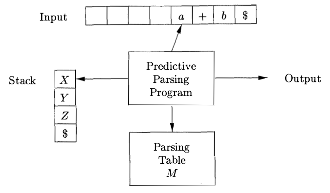

Figure 4.19: Model of a table-driven predictive parser

**METHOD:** Initially, the parser is in a configuration with $w\$$ in the input buffer and the start symbol $S$ of *G* on top of the stack, above \$. The program in Fig. 4.20 uses the predictive parsing table M to produce a predictive parse for the input. $\Box$

let $a$ be the first symbol of $w$ ;
let $X$ be the top stack symbol;
while ( $X\not=\$$ ) { /\* stack is not empty \*/
if ( X = a ) pop the stack and let a be the next symbol of $w$ ;
else if ( X is a terminal ) error();
else if ( M [X, a] is an error entry ) error();
else if ( M [X, a] = $X \to Y_1 Y_2 \dots  Y_k$ ) {
output the production $X \to Y_1 Y_2 \dots  Y_k$;
pop the stack;
push $Y_k, Y _ {k-1}, \dots  Y_1$ onto the stack, with $Y_1$ on top;
}
let $X$ be the top stack symbol;
}

Figure 4.20: Predictive parsing algorithm

**Example 4.35:** Consider grammar (4.28); we have already seen it’s the parsing table in Fig. 4.17. On input $\textbf{id} + \textbf{id}*\textbf{id}$, the nonrecursive predictive parser of Algorithm 4.34 makes the sequence of moves in Fig. 4.21. These moves correspond to a leftmost derivation (see Fig. 4.12 for the full derivation):

$$
E \underset{lm}\implies T E' \underset{lm}\implies F T'E' \underset{lm}\implies \textbf{id} T'E'\underset{lm}\implies \textbf{id} E'\underset{lm}\implies \textbf{id} + T E' \underset{lm}\implies \dots
$$

$$
\begin{array}{lrrl}
\text{MATCHED}      & \text{STACK}    & \text{INPUT}          & \text{ACTION} \\
\hline
             &      E \$& \textbf{id} + \textbf{id} * \textbf{id}\$ & \\
             &    T E'\$& \textbf{id} + \textbf{id} * \textbf{id}\$ & \text{output }E \to T E'\\
             &  F T'E'\$& \textbf{id} + \textbf{id} * \textbf{id}\$ & \text{output }T \to F T'\\
             & \textbf{id} T'E'\$& \textbf{id} + \textbf{id} * \textbf{id}\$ & \text{output }F \to \textbf{id}\\
\textbf{id}           &    T'E'\$&    + \textbf{id} * \textbf{id}\$ & \text{match }\textbf{id}\\
\textbf{id}           &      E'\$&    + \textbf{id} * \textbf{id}\$ & \text{output }T'\to \epsilon\\
\textbf{id}           &  + T E'\$&    + \textbf{id} * \textbf{id}\$ & \text{output }E'\to + T E'\\
\textbf{id} +         &    T E'\$&      \textbf{id} * \textbf{id}\$ & \text{match }+\\
\textbf{id} +         &  F T'E'\$&      \textbf{id} * \textbf{id}\$ & \text{output }T \to F T'\\
\textbf{id} +         & \textbf{id} T'E'\$&      \textbf{id} * \textbf{id}\$ & \text{output }F \to \textbf{id}\\
\textbf{id} + \textbf{id}      &    T'E'\$&         * \textbf{id}\$ & \text{match }\textbf{id}\\
\textbf{id} + \textbf{id}      &* F T'E'\$&         * \textbf{id}\$ & \text{output }T'\to * F T'\\
\textbf{id} + \textbf{id} *    &  F T'E'\$&           \textbf{id}\$ & \text{match }*\\
\textbf{id} + \textbf{id} *    & \textbf{id} T'E'\$&           \textbf{id}\$ & \text{output }F \to \textbf{id}\\
\textbf{id} + \textbf{id} * \textbf{id} &    T'E'\$&             \$ & \text{match }\textbf{id}\\
\textbf{id} + \textbf{id} * \textbf{id} &      E'\$&             \$ & \text{output }T'\to \epsilon\\
\textbf{id} + \textbf{id} * \textbf{id} &        \$&             \$ & \text{output }E'\to \epsilon
\end{array}
$$

Figure 4.21: Moves made by a predictive parser on input $\textbf{id} + \textbf{id} * \textbf{id}$

Note that the sentential forms in this derivation correspond to the input that has already been matched (in column MATCHED) followed by the stack contents. The matched input is shown only to highlight the correspondence. For the same reason, the top of the stack is to the left; when we consider bottom-up parsing, it will be more natural to show the top of the stack to the right. The input pointer points to the leftmost symbol of the string in the INPUT column. $\Box$

### 4.4.5 Error Recovery in Predictive Parsing

This discussion of error recovery refers to the stack of a table-driven predictive parser, since it makes explicit the terminals and nonterminals that the parser hopes to match with the remainder of the input; the techniques can also be used with recursive-descent parsing.

An error is detected during predictive parsing when the terminal on top of the stack does not match the next input symbol or when nonterminal $A$ is on top of the stack, a is the next input symbol, and $M[A, a]$ is error (i.e., the parsing-table entry is empty).

#### Panic Mode

Panic-mode error recovery is based on the idea of skipping over symbols on the input until a token in a selected set of synchronizing tokens appears. Its effectiveness depends on the choice of synchronizing set. The sets should be chosen so that the parser recovers quickly from errors that are likely to occur in practice. Some heuristics are as follows:

1.  As a starting point, place all symbols in FOLLOW($A$) into the synchronizing set for nonterminal A. If we skip tokens until an element of FOLLOW($A$) is seen and pop A from the stack, it is likely that parsing can continue.

2.  It is not enough to use FOLLOW($A$) as the synchronizing set for $A$. For example, if semicolons terminate statements, as in C, then keywords that begin statements may not appear in the FOLLOW set of the nonterminal representing expressions. A missing semicolon after an assignment may therefore result in the keyword beginning the next statement being skipped. Often, there is a hierarchical structure on constructs in a language; for example, expressions appear within statements, which appear within blocks, and so on. We can add to the synchronizing set of a lower-level construct the symbols that begin higher-level constructs. For example, we might add keywords that begin statements to the synchronizing sets for the nonterminals generating expressions.

3.  If we add symbols in FIRST($A$) to the synchronizing set for nonterminal $A$, then it may be possible to resume parsing according to $A$ if a symbol in FIRST($A$) appears in the input.

4.  If a nonterminal can generate the empty string, then the production deriving can be used as a default. Doing so may postpone some error detection, but cannot cause an error to be missed. This approach reduces the number of nonterminals that have to be considered during error recovery.

5.  If a terminal on top of the stack cannot be matched, a simple idea is to pop the terminal, issue a message saying that the terminal was inserted, and continue parsing. In effect, this approach takes the synchronizing set of a token to consist of all other tokens.

**Example 4.36:** Using FIRST and FOLLOW symbols as synchronizing tokens works reasonably well when expressions are parsed according to the usual grammar (4.28). The parsing table for this grammar in Fig. 4.17 is repeated in Fig. 4.22, with “synch” indicating synchronizing tokens obtained from the FOLLOW set of the nonterminal in question. The FOLLOW sets for the nonterminals are obtained from Example 4.30.

The table in Fig. 4.22 is to be used as follows. If the parser looks up entry M [$A$, $a$] and finds that it is blank, then the input symbol a is skipped. If the entry is “synch,” then the nonterminal on top of the stack is popped in an attempt to resume parsing. If a token on top of the stack does not match the input symbol, then we pop the token from the stack, as mentioned above.

| NON-TERMINAL |      id      |         +         |        *        |       (       |         )         |         $         |
| :----------: | :----------: | :---------------: | :-------------: | :-----------: | :---------------: | :---------------: |
|     $E$      | $E \to T E'$ |                   |                 | $E \to T E'$  |       synch       |       synch       |
|     $E'$     |              |  $E \to + T E'$   |                 |               | $E \to \epsilon$  | $E \to \epsilon$  |
|     $T$      | $T \to F T'$ |       synch       |                 | $T \to F T'$  |       synch       |       synch       |
|     $T'$     |              | $T' \to \epsilon$ | $T' \to * F T'$ |               | $T' \to \epsilon$ | $T' \to \epsilon$ |
|     $F$      |  $F \to id$  |       synch       |      synch      | $F \to ( E )$ |       synch       |       synch       |

  Figure 4.22: Synchronizing tokens added to the parsing table of Fig. 4.17

On the erroneous input $) \textbf{id} * + \textbf{id}$, the parser and error recovery mechanism of Fig. 4.22 behave as in Fig. 4.23. $\Box$

$$
\begin{array}{rrl}
\text{STACK}     &    \text{INPUT}     &        \text{REMARK}           \\
\hline
      E \$& ) \textbf{id} * + \textbf{id}\$& \text{error, skip )}    \\
      E \$&   \textbf{id} * + \textbf{id}\$& \textbf{id}\text{ is in FIRST}(E)\\  
    T E'\$&   \textbf{id} * + \textbf{id}\$&                         \\
  F T'E'\$&   \textbf{id} * + \textbf{id}\$&                         \\
 \textbf{id} T'E'\$&   \textbf{id} * + \textbf{id}\$&                         \\
    T'E'\$&      * + \textbf{id}\$&                         \\
* F T'E'\$&      * + \textbf{id}\$&                          \\
  F T'E'\$&        + \textbf{id}\$& \text{error, }M[F, +] = synch\\
    T'E'\$&        + \textbf{id}\$& F\text{ has been popped}\\
      E'\$&        + \textbf{id}\$&                          \\
  + T E'\$&        + \textbf{id}\$&                          \\
    T E'\$&          \textbf{id}\$&                          \\       
  F T'E'\$&          \textbf{id}\$&                          \\       
 \textbf{id} T'E'\$&          \textbf{id}\$&                          \\       
    T'E'\$&            \$&                          \\          
      E'\$&            \$&                          \\          
        \$&            \$&                          \\          
\end{array}
$$

Figure 4.23: Parsing and error recovery moves made by a predictive parser

The above discussion of panic-mode recovery does not address the important issue of error messages. The compiler designer must supply informative error messages that not only describe the error, they must draw attention to where the error was discovered.

#### Phrase-level Recovery

Phrase-level error recovery is implemented by filling in the blank entries in the predictive parsing table with pointers to error routines. These routines may change, insert, or delete symbols on the input and issue appropriate error messages. They may also pop from the stack. Alteration of stack symbols or the pushing of new symbols onto the stack is questionable for several reasons. First, the steps carried out by the parser might then not correspond to the derivation of any word in the language at all. Second, we must ensure that there is no possibility of an infinite loop. Checking that any recovery action eventually results in an input symbol being consumed (or the stack being shortened if the end of the input has been reached) is a good way to protect against such loops.


## 4.5 Bottom-Up Parsing

A bottom-up parse corresponds to the construction of a parse tree for an input string beginning at the leaves (the bottom) and working up towards the root (the top). It is convenient to describe parsing as the process of building parse trees, although a front end may in fact carry out a translation directly without building an explicit tree. The sequence of tree snapshots in Fig. 4.25 illustrates a bottom-up parse of the token stream $\textbf{id} * \textbf{id}$, with respect to the expression grammar (4.1).

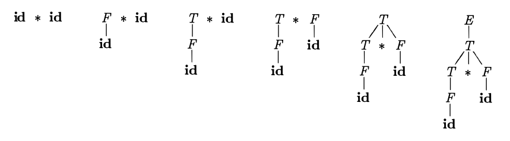

Figure 4.25: A bottom-up parse for $\textbf{id} * \textbf{id}$

This section introduces a general style of bottom-up parsing known as shift reduce parsing. The largest class of grammars for which shift-reduce parsers can be built, the LR grammars, will be discussed in Sections 4.6 and 4.7. Although it is too much work to build an LR parser by hand, tools called automatic parser generators make it easy to construct efficient LR parsers from suitable grammars. The concepts in this section are helpful for writing suitable grammars to make effective use of an LR parser generator. Algorithms for implementing parser generators appear in Section 4.7.

### 4.5.1 Reductions

We can think of bottom-up parsing as the process of "reducing" a string $w$  to the start symbol of the grammar. At each reduction step, a specific substring matching the body of a production is replaced by the nonterminal at the head of that production.

The key decisions during bottom-up parsing are about when to reduce and about what production to apply, as the parse proceeds.

**Example 4.37:** The snapshots in Fig. 4.25 illustrate a sequence of reductions; the grammar is the expression grammar (4.1). The reductions will be discussed in terms of the sequence of strings

$$
\textbf{id} * \textbf{id},\ F * \textbf{id},\ T * \textbf{id},\ T * F,\ T,\ E
$$

The strings in this sequence are formed from the roots of all the subtrees in the snapshots. The sequence starts with the input string $\textbf{id} * \textbf{id}$. The first reduction produces $F * \textbf{id}$ by reducing the leftmost **id** to $F$, using the production $F \to \textbf{id}$. The second reduction produces $T * \textbf{id}$ by reducing $F$ to $T$.

Now, we have a choice between reducing the string $T$, which is the body of $E \to T$, and the string consisting of the second **id**, which is the body of $F \to \textbf{id}$. Rather than reduce $T$ to $E$, the second **id** is reduced to $T$, resulting in the string $T * F$. This string then reduces to $T$. The parse completes with the reduction of $T$ to the start symbol $E$. $\Box$

By definition, a reduction is the reverse of a step in a derivation (recall that in a derivation, a nonterminal in a sentential form is replaced by the body of one of its productions). The goal of bottom-up parsing is therefore to construct a derivation in reverse. The following derivation corresponds to the parse in Fig. 4.25:

$$
E \implies T \implies T * F \implies T * \textbf{id} \implies F * \textbf{id} \implies \textbf{id} * \textbf{id}
$$

This derivation is in fact a rightmost derivation.

### 4.5.2 Handle Pruning

Bottom-up parsing during a left-to-right scan of the input constructs a rightmost derivation in reverse. Informally, a "handle" is a substring that matches the body of a production, and whose reduction represents one step along the reverse of a rightmost derivation.

For example, adding subscripts to the tokens **id** for clarity, the handles during the parse of $\textbf{id}_1 * \textbf{id}_2$ according to the expression grammar (4.1) are as in Fig. 4.26. Although $T$ is the body of the production $E \to T$, the symbol $T$ is not a handle in the sentential form $T * \textbf{id}_2$. If $T$ were indeed replaced by $E$, we would get the string $E * \textbf{id}_2$, which cannot be derived from the start symbol $E$. Thus, the leftmost substring that matches the body of some production need not be a handle.
$$
\begin{array}{rcl}
\text{RIGHT SENTENTIAL FORM}&\text{HANDLE}&\text{REDUCING PRODUCTION}\\
\hline
\textbf{id}_1 * \textbf{id}_2& \textbf{id}_1   &F\to \textbf{id}\\
  F * \textbf{id}_2& F     &T\to F \\
   T* \textbf{id}_2& \textbf{id}_2   &F\to \textbf{id}\\
    T * F& T * F &E\to T * F
\end{array}
$$

Figure 4.26: Handles during a parse of $\textbf{id}_1 * \textbf{id}_2$

Formally, if $S \underset{rm}{\overset * \implies} \alpha Aw  \underset{rm}\implies  \alpha\beta w$, as in Fig. 4.27, then production $A \to \beta$  in the position following $\alpha$ is a handle of $\alpha\beta w$. Alternatively, a handle of a right-sentential form $\gamma$ is a production $A \to \beta$ and a position of $\gamma$ where the string $\beta$  may be found, such that replacing $\beta$ at that position by $A$ produces the previous right-sentential form in a rightmost derivation of $\gamma$.

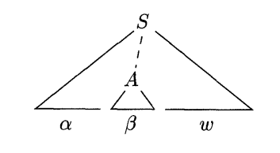

Figure 4.27: A handle $A \to \beta$ in the parse tree for $\alpha\beta w$

Notice that the string $w$ to the right of the handle must contain only terminal symbols. For convenience, we refer to the body $\beta$ rather than $A \to \beta$ as a handle. Note we say "a handle" rather than "the handle", because the grammar could be ambiguous, with more than one rightmost derivation of $\alpha\beta w$. If a grammar is unambiguous, then every right-sentential form of the grammar has exactly one handle.

A rightmost derivation in reverse can be obtained by "handle pruning". That is, we start with a string of terminals $w$ to be parsed. If $w$  is a sentence of the grammar at hand, then let $w  = \gamma_n$, where $\gamma_n$ is the n-th right-sentential form of some as yet unknown rightmost derivation

$$
S = \gamma_0 \underset{rm}\implies \gamma_1 \underset{rm}\implies  \gamma_2 \underset{rm}\implies\dots\underset{rm}\implies \gamma_n = w
$$

To reconstruct this derivation in reverse order, we locate the handle $\beta_n$ in $\gamma_n$ and replace $\beta_n$ by the head of the relevant production $A_n \to \beta_n$ to obtain the previous right-sentential form $\gamma_{n-1}$. Note that we do not yet know how handles are to be found, but we shall see methods of doing so shortly.

We then repeat this process. That is, we locate the handle $\beta_{n-1}$ in $\gamma_{n-1}$ and reduce this handle to obtain the right-sentential form $\gamma_{n-2}$. If by continuing this process we produce a right-sentential form consisting only of the start symbol $S$, then we halt and announce successful completion of parsing. The reverse of the sequence of productions used in the reductions is a rightmost derivation for the input string.

### 4.5.3 Shift-Reduce Parsing

Shift-reduce parsing is a form of bottom-up parsing in which a stack holds grammar symbols and an input buffer holds the rest of the string to be parsed. As we shall see, the handle always appears at the top of the stack just before it is identified as the handle.

We use $\$$ to mark the bottom of the stack and also the right end of the input. Conventionally, when discussing bottom-up parsing, we show the top of the stack on the right, rather than on the left as we did for top-down parsing. Initially, the stack is empty, and the string $w$  is on the input, as follows:

$$
\begin{array}{lr}
\text{STACK}&\text{INPUT}\\
\$&     w \$
\end{array}
$$

During a left-to-right scan of the input string, the parser shifts zero or more input symbols onto the stack, until it is ready to reduce a string $\beta$ of grammar symbols on top of the stack. It then reduces $\beta$ to the head of the appropriate production. The parser repeats this cycle until it has detected an error or until the stack contains the start symbol and the input is empty:

$$
\begin{array}{lr}
\text{STACK}&\text{INPUT}\\
\$S&    \$
\end{array}
$$

Upon entering this configuration, the parser halts and announces successful completion of parsing. Figure 4.28 steps through the actions a shift-reduce parser might take in parsing the input string $\textbf{id}_1 * \textbf{id}_2$ according to the expression grammar (4.1).

$$
\begin{array}{lrl}
\textbf{STACK} & \textbf{INPUT} & \textbf{ACTION}\\
\hline
\$          &\textbf{id}_1 * \textbf{id}_2\$& \text{shift}\\
\$ \textbf{id}_1      &    * \textbf{id}_2\$& \text{reduce by }F \to \textbf{id}\\
\$ F        &    * \textbf{id}_2\$& \text{reduce by }T \to F\\
\$ T        &    * \textbf{id}_2\$& \text{shift}\\
\$ T *      &      \textbf{id}_2\$& \text{shift}\\
\$ T * \textbf{id}_2  &         \$& \text{reduce by }F \to \textbf{id}\\
\$ T * F    &         \$& \text{reduce by }T \to T * F\\
\$ T        &         \$& \text{reduce by }E \to T\\
\$ E        &         \$& \text{accept}
\end{array}
$$

Figure 4.28: Configurations of a shift-reduce parser on input $\textbf{id}_1 * \textbf{id}_2$

While the primary operations are shift and reduce, there are actually four possible actions a shift-reduce parser can make: (1) shift, (2) reduce, (3) accept, and (4) error.

1. *Shift*. Shift the next input symbol onto the top of the stack.

2. *Reduce*. The right end of the string to be reduced must be at the top of the stack. Locate the left end of the string within the stack and decide with what nonterminal to replace the string.

3. *Accept*. Announce successful completion of parsing.

4. *Error*. Discover a syntax error and call an error recovery routine.

The use of a stack in shift-reduce parsing is justified by an important fact: the handle will always eventually appear on top of the stack, never inside. This fact can be shown by considering the possible forms of two successive steps in any rightmost derivation. Figure 4.29 illustrates the two possible cases. In case (1), $A$ is replaced by $\beta B y$, and then the rightmost nonterminal $B$ in the body $\beta B y$ is replaced by $\gamma$. In case (2), $A$ is again expanded first, but this time the body is a string $y$ of terminals only. The next rightmost nonterminal $B$ will be somewhere to the left of $y$.

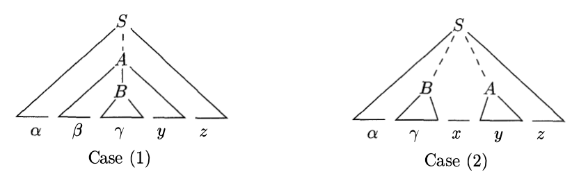

Figure 4.29: Cases for two successive steps of a rightmost derivation

In other words:

$$
\begin{array}{l}
S \underset{rm}{\overset*\implies}\alpha A z \underset{rm}\implies  \alpha\beta B y z \underset{rm}\implies  \alpha\beta\gamma y z \\
S \underset{rm}{\overset*\implies}\alpha B x A z \underset{rm}\implies\alpha B x y z \underset{rm}\implies \alpha\gamma x y z
\end{array}
$$

Consider case (1) in reverse, where a shift-reduce parser has just reached the configuration

$$
\begin{array}{lr}
\text{STACK}&\text{INPUT}\\
\$\alpha\beta\gamma&  y z\$\\
\$\alpha\beta B& y z \$\\
\$\alpha\beta B y& z\$\\
\end{array}
$$

The parser reduces the handle $\gamma$ to $B$ to reach the configuration

The parser can now shift the string $y$ onto the stack by a sequence of zero or more shift moves to reach the configuration

with the handle $\beta B y$ on top of the stack, and it gets reduced to $A$.

Now consider case (2). In configuration

$$
\begin{array}{lr}
\text{STACK}&\text{INPUT}\\
\$\alpha\gamma&   x y z \$\\
\$\alpha B x y& z\$\\
\end{array}
$$

the handle $\gamma$  is on top of the stack. After reducing the handle $\gamma$ to $B$, the parser can shift the string $xy$ to get the next handle $y$ on top of the stack, ready to be reduced to $A$.

In both cases, after making a reduction the parser had to shift zero or more symbols to get the next handle onto the stack. It never had to go into the stack to find the handle.

### 4.5.4 Conflicts During Shift-Reduce Parsing

There are context-free grammars for which shift-reduce parsing cannot be used. Every shift-reduce parser for such a grammar can reach a configuration in which the parser, knowing the entire stack contents and the next input symbol, cannot decide whether to shift or to reduce (a *shift/reduce conflict*), or cannot decide which of several reductions to make (a *reduce/reduce conflict*). We now give some examples of syntactic constructs that give rise to such grammars. Technically, these grammars are not in the LR(k)​ class of grammars defined in Section 4.7; we refer to them as non-LR grammars. The $k$ in LR(k)​ refers to the number of symbols of lookahead on the input. Grammars used in compiling usually fall in the LR(1) class, with one symbol of lookahead at most.

**Example 4.38:** An ambiguous grammar can never be LR. For example, consider the dangling-else grammar (4.14) of Section 4.3:
$$
\begin{array}{lrl}
stmt &\to& \textbf{if } expr \textbf{ then }stmt \\
&|& \textbf{if }expr\textbf{ then }stmt\textbf{ else }stmt \\
&|& other \\
\end{array}
$$

If we have a shift-reduce parser in configuration
$$
\begin{array}{lr}
\text{STACK}&\text{INPUT}\\
\dots\textbf{if}\ expr\ \textbf{then}\ stmt& \textbf{else}\dots \$
\end{array}
$$

we cannot tell whether $\textbf{if } expr \textbf{ then }stmt$ is the handle, no matter what appears below it on the stack. Here there is a shift/reduce conflict. Depending on what follows the **else** on the input, it might be correct to reduce $\textbf{if } expr \textbf{ then }stmt$ to $stmt$, or it might be correct to shift **else** and then to look for another $stmt$ to complete the alternative $\textbf{if }expr\textbf{ then }stmt\textbf{ else }stmt$.

Note that shift-reduce parsing can be adapted to parse certain ambiguous grammars, such as the if-then-else grammar above. If we resolve the shift/reduce conflict on **else** in favor of shifting, the parser will behave as we expect, associating each **else** with the previous unmatched **then**. We discuss parsers for such ambiguous grammars in Section 4.8.$\Box$

Another common setting for conflicts occurs when we know we have a handle, but the stack contents and the next input symbol are insufficient to determine which production should be used in a reduction. The next example illustrates this situation.

**Example 4.39:** Suppose we have a lexical analyzer that returns the token name **id** for all names, regardless of their type. Suppose also that our language invokes procedures by giving their names, with parameters surrounded by parentheses, and that arrays are referenced by the same syntax. Since the translation of indices in array references and parameters in procedure calls are different, we want to use different productions to generate lists of actual parameters and indices. Our grammar might therefore have (among others) productions such as those in Fig. 4.30.
$$
\begin{array}{lrcl}
(1)&   stmt              &\to&   \textbf{id}\ (\ parameter\_list\ ) \\
(2)&   stmt              &\to&   expr\ :=\ expr \\
(3)&   parameter\_list   &\to&   parameter\_list\ ,\ parameter \\
(4)&   parameter\_list   &\to&   parameter \\
(5)&   parameter         &\to&   \textbf{id} \\
(6)&   expr              &\to&   \textbf{id}\ (\ expr\_list\ ) \\
(7)&   expr              &\to&   \textbf{id} \\
(8)&   expr\_list        &\to&   expr\_list\ ,\ expr \\
(9)&   expr\_list        &\to&   expr
\end{array}
$$
Figure 4.30: Productions involving procedure calls and array references

A statement beginning with `p(i, j)`​ would appear as the token stream $\textbf{id}\  (\ \textbf{id}\ , \textbf{id}\ )$ to the parser. After shifting the first three tokens onto the stack, a shift-reduce parser would be in configuration

$$
\begin{array}{lr}
\text{STACK}&\text{INPUT}\\
\dots  \textbf{id}\ (\ \textbf{id}&   ,\ \textbf{id}\ ) \dots
\end{array}
$$

It is evident that the **id** on top of the stack must be reduced, but by which production? The correct choice is production (5) if `p` is a procedure, but production (7) if `p` is an array. The stack does not tell which; information in the symbol table obtained from the declaration of `p` must be used.

One solution is to change the token **id** in production (1) to **procid** and to use a more sophisticated lexical analyzer that returns the token name **procid** when it recognizes a lexeme that is the name of a procedure. Doing so would require the lexical analyzer to consult the symbol table before returning a token.

If we made this modification, then on processing `p(i, j)`​ the parser would be either in the configuration
$$
\begin{array}{lr}
\text{STACK}&\text{INPUT}\\
\dots  \textbf{procid}\ (\ \textbf{id}&   ,\ \textbf{id}\ ) \dots
\end{array}
$$

or in the configuration above. In the former case, we choose reduction by production (5); in the latter case by production (7). Notice how the third symbol from the top of the stack determines the reduction to be made, even though it is not involved in the reduction. Shift-reduce parsing can utilize information far down in the stack to guide the parse.$\Box$


## 4.6 Introduction to LR Parsing: Simple LR

The most prevalent type of bottom-up parser today is based on a concept called LR(k) parsing; the "L" is for left-to-right scanning of the input, the "R" for constructing a rightmost derivation in reverse, and the $k$ for the number of input symbols of lookahead that are used in making parsing decisions. The cases $k = 0$ or $k = 1$ are of practical interest, and we shall only consider LR parsers with $k \le 1$ here. When “(k)” is omitted, $k$ is assumed to be 1.

This section introduces the basic concepts of LR parsing and the easiest method for constructing shift-reduce parsers, called "simple LR" (or SLR, for short). Some familiarity with the basic concepts is helpful even if the LR parser itself is constructed using an automatic parser generator. We begin with "items" and "parser states"; the diagnostic output from an LR parser generator typically includes parser states, which can be used to isolate the sources of parsing conflicts.

Section 4.7 introduces two, more complex methods canonical-LR and LALR that are used in the majority of LR parsers.

### 4.6.1 Why LR Parsers?

LR parsers are table-driven, much like the nonrecursive LL parsers of Section 4.4.4. A grammar for which we can construct a parsing table using one of the methods in this section and the next is said to be an *LR grammar*. Intuitively, for a grammar to be LR it is sufficient that a left-to-right shift-reduce parser be able to recognize handles of right-sentential forms when they appear on top of the stack.

LR parsing is attractive for a variety of reasons:

-   LR parsers can be constructed to recognize virtually all programming language constructs for which context-free grammars can be written. Non-­LR context-free grammars exist, but these can generally be avoided for typical programming-language constructs.

-   The LR-parsing method is the most general nonbacktracking shift-reduce parsing method known, yet it can be implemented as efficiently as other, more primitive shift-reduce methods (see the bibliographic notes).

-   An LR parser can detect a syntactic error as soon as it is possible to do so on a left-to-right scan of the input.

-   The class of grammars that can be parsed using LR methods is a proper superset of the class of grammars that can be parsed with predictive or LL methods. For a grammar to be LR(k​), we must be able to recognize the occurrence of the right side of a production in a right-sentential form, with $k$ input symbols of lookahead. This requirement is far less stringent than that for LL(k​) grammars where we must be able to recognize the use of a production seeing only the first $k$ symbols of what its right side derives. Thus, it should not be surprising that LR grammars can describe more languages than LL grammars.

The principal drawback of the LR method is that it is too much work to construct an LR parser by hand for a typical programming-language grammar. A specialized tool, an LR parser generator, is needed. Fortunately, many such generators are available, and we shall discuss one of the most commonly used ones, Yacc, in Section 4.9. Such a generator takes a context-free grammar and automatically produces a parser for that grammar. If the grammar contains ambiguities or other constructs that are difficult to parse in a left-to-right scan of the input, then the parser generator locates these constructs and provides detailed diagnostic messages.

### 4.6.2 Items and the LR(0) Automaton

How does a shift-reduce parser know when to shift and when to reduce? For example, with stack contents $\$T$ and next input symbol $*$ in Fig. 4.28, how does the parser know that $T$ on the top of the stack is not a handle, so the appropriate action is to shift and not to reduce $T$ to $E$?

An LR parser makes shift-reduce decisions by maintaining states to keep track of where we are in a parse. States represent sets of "items". An *LR(0)​ item* (item for short) of a grammar *G* is a production of *G* with a dot at some position of the body. Thus, production $A \to XYZ$ yields the four items

$$
\begin{array}{lll}
A&\to& \cdot XYZ \\
A&\to& X\cdot YZ \\
A&\to& XY\cdot Z \\
A&\to& XYZ\cdot \\
\end{array}
$$

The production $A \to \epsilon$ generates only one item, $A \to \cdot$.

---

##### Representing Item Sets

A parser generator that produces a bottom-up parser may need to represent items and sets of items conveniently. Note that an item can be represented by a pair of integers, the first of which is the number of one of the productions of the underlying grammar, and the second of which is the position of the dot. Sets of items can be represented by a list of these pairs. However, as we shall see, the necessary sets of items often include "closure" items, where the dot is at the beginning of the body. These can always be reconstructed from the other items in the set, and we do not have to include them in the list.

---

Intuitively, an item indicates how much of a production we have seen at a given point in the parsing process. For example, the item $A \to \cdot XYZ$ indicates that we hope to see a string derivable from $XYZ$ next on the input. Item $A \to X\cdot YZ$ indicates that we have just seen on the input a string derivable from $X$ and that we hope next to see a string derivable from $YZ$. Item $A \to XYZ\cdot$ indicates that we have seen the body $XYZ$ and that it may be time to reduce $XYZ$ to $A$.

One collection of sets of LR(0) items, called the *canonical* LR(0) collection, provides the basis for constructing a deterministic finite automaton that is used to make parsing decisions. Such an automaton is called an *LR(0) automaton*.[^3] In particular, each state of the LR(0) automaton represents a set of items in the canonical LR(0) collection. The automaton for the expression grammar (4.1), shown in Fig. 4.31, will serve as the running example for discussing the canonical LR(0) collection for a grammar.

[^3]: Technically, the automaton misses being deterministic according to the definition of Section 3.6.4, because we do not have a dead state, corresponding to the empty set of items. As a result, there are some state input pairs for which no next state exists.

To construct the canonical LR(0) collection for a grammar, we define an augmented grammar and two functions, CLOSURE and GOTO. If *G* is a grammar with start symbol $S$, then *G'*, the *augmented grammar* for *G*, is *G* with a new start symbol $S'$ and production $S' \to S$. The purpose of this new starting production is to indicate to the parser when it should stop parsing and announce acceptance of the input. That is, acceptance occurs when and only when the parser is about to reduce by $S' \to S$.

#### Closure of Item Sets

If $I$ is a set of items for a grammar *G*, then CLOSURE($I$) is the set of items constructed from $I$ by the two rules:

1.  Initially, add every item in $I$ to CLOSURE($I$).
2.  If $A \to a\cdot B\beta$  is in CLOSURE($I$) and $B \to \gamma$  is a production, then add the item $B \to \cdot\gamma$  to CLOSURE($I$), if it is not already there. Apply this rule until no more new items can be added to CLOSURE($I$).

Intuitively, $A \to a\cdot B\beta$ in CLOSURE($I$) indicates that, at some point in the parsing process, we think we might next see a substring derivable from $B\beta$ as input. The substring derivable from $B\beta$ will have a prefix derivable from $B$ by applying one of the $B$-productions. We therefore add items for all the $B$-productions; that is, if $B \to \gamma$  is a production, we also include $B \to \cdot\gamma$ in CLOSURE($I$).

**Example 4.40:** Consider the augmented expression grammar:

$$
\begin{array}{lrl}
E'&\to& E \\
E &\to& E+T\ |\ T \\
T &\to& T*F\ |\ F \\
F &\to& (E)\ |\ \textbf{id}
\end{array}
$$

If $I$ is the set of one item $\{[ E' \to \cdot E\ ]\}$, then CLOSURE($I$) contains the set of items $I_0$ in Fig. 4.31.

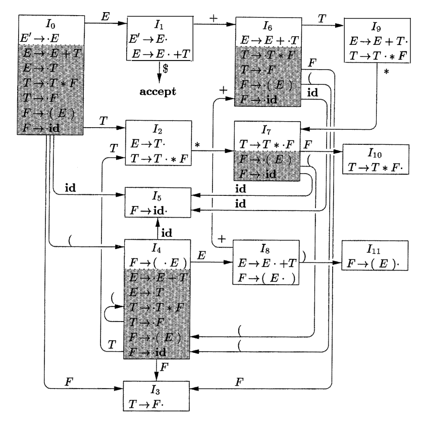

Figure 4.31: LR(0) automaton for the expression grammar (4.1)

To see how the closure is computed, $E' \to \cdot E$ is put in CLOSURE($I$) by rule (1). Since there is an $E$ immediately to the right of a dot, we add the $E$-productions with dots at the left ends: $E \to \cdot E + T$ and $E \to \cdot T$. Now there is a $T$ immediately to the right of a dot in the latter item, so we add $T \to \cdot T * F$ and $T \to \cdot F$. Next, the $F$ to the right of a dot forces us to add $F \to \cdot(E)$ and $F \to \cdot \textbf{id}$, but no other items need to be added. $\Box$

The closure can be computed as in Fig. 4.32. A convenient way to implement the function *closure* is to keep a boolean array *added*, indexed by the nonterminals of *G*, such that *added*[B] is set to **true** if and when we add the item $B \to \cdot\gamma$  for each $B$-production $B \to \gamma$ .

SetOfltems CLOSURE (I) {
J = I;
repeat
for (each item $A \to a\cdot B\beta$  in $J$ )
for (each production $B \to \gamma$  of *G*)
if ( $B \to \gamma$ is not in $J$ ) add $B \to \gamma$  to $J$;
until no more items are added to $J$ on one round;
return $J$; }

Figure 4.32: Computation of CLOSURE

Note that if one $B$-production is added to the closure of $I$ with the dot at the left end, then all $B$-productions will be similarly added to the closure. Hence, it is not necessary in some circumstances actually to list the items $B \to \cdot\gamma$  added to $I$ by CLOSURE. A list of the nonterminals $B$ whose productions were so added will suffice. We divide all the sets of items of interest into two classes:

1.  *Kernel items*: the initial item, $S' \to \cdot S$, and all items whose dots are not at the left end.

2.  *Nonkernel items*: all items with their dots at the left end, except for $S' \to \cdot S$.

Moreover, each set of items of interest is formed by taking the closure of a set of kernel items; the items added in the closure can never be kernel items, of course. Thus, we can represent the sets of items we are really interested in with very little storage if we throw away all nonkernel items, knowing that they could be regenerated by the closure process. In Fig. 4.31, nonkernel items are in the shaded part of the box for a state.

#### The Function GOTO

The second useful function is GOTO($I, X$) where $I$ is a set of items and $X$ is a grammar symbol. GOTO($I, X$) is defined to be the closure of the set of all items $[A \to \alpha X \cdot \beta ]$ such that $[A \to \alpha\cdot X\beta ]$ is in $I$. Intuitively, the GOTO function is used to define the transitions in the LR(0) automaton for a grammar. The states of the automaton correspond to sets of items, and GOTO($I, X$) specifies the transition from the state for $I$ under input $X$.

**Example 4.41:** If $I$ is the set of two items $\{[E' \to E \cdot ], [ E \to E \cdot + T]\}$, then GOTO($I, +$) contains the items

$$
\begin{array}{lrl}
E &\to&  E + \cdot T\\
T &\to&  \cdot T * F\\
T &\to&  \cdot F\\
F &\to&  \cdot ( E )\\
F &\to&  \cdot \textbf{id}
\end{array}
$$

We computed GOTO($I$, $+$) by examining $I$ for items with $+$ immediately to the right of the dot. $E' \to E \cdot$ is not such an item, but $E \to E \cdot + T$ is. We moved the dot over the $+$ to get $E \to E + \cdot T$ and then took the closure of this singleton set. $\Box$

We are now ready for the algorithm to construct C, the canonical collection of sets of LR(0) items for an augmented grammar G' the algorithm is shown in Fig. 4.33.

void items(G') {
C = {CLOSURE($\{[S' \to \cdot S]\}$)};
repeat
for(each set of items I in C)
for(each grammar symbol X)
if(GOTO(I, X) is not empty and not in C)
add GOTO(I, X) to C;
until no new sets of items are added to C on a round;
}

Figure 4.33: Computation of the canonical collection of sets of LR(0) items

**Example 4.42:** The canonical collection of sets of LR(0) items for grammar (4.1) and the GOTO function are shown in Fig. 4.31. GOTO is encoded by the transitions in the figure. $\Box$

#### Use of the LR(0) Automaton

The central idea behind "Simple LR", or SLR, parsing is the construction from the grammar of the LR(0) automaton. The states of this automaton are the sets of items from the canonical LR(0) collection, and the transitions are given by the GOTO function. The LR(0) automaton for the expression grammar (4.1) appeared earlier in Fig. 4.31.

The start state of the LR(0) automaton is CLOSURE({[$S' \to \cdot S$]}), where $S'$ is the start symbol of the augmented grammar. All states are accepting states. We say "state $j$" to refer to the state corresponding to the set of items $I_j$.

How can LR(0) automaton help with shift-reduce decisions? Shift-reduce decisions can be made as follows. Suppose that the string $\gamma$ of grammar symbols takes the LR(0) automaton from the start state 0 to some state $j$. Then, shift on next input symbol $a$ if state $j$ has a transition on $a$. Otherwise, we choose to reduce; the items in state $j$ will tell us which production to use.

The LR-parsing algorithm to be introduced in Section 4.6.3 uses its stack to keep track of states as well as grammar symbols; in fact, the grammar symbol can be recovered from the state, so the stack holds states. The next example gives a preview of how an LR(0) automaton and a stack of states can be used to make shift-reduce parsing decisions.

**Example 4.43:** Figure 4.34 illustrates the actions of a shift-reduce parser on input $\textbf{id} * \textbf{id}$, using the LR(0) automaton in Fig. 4.31. We use a STACK to hold states; for clarity, the grammar symbols corresponding to the states on the stack appear in column SYMBOLS. At line (1), the stack holds the start state 0 of the automaton; the corresponding symbol is the bottom-of-stack marker $\$$.
$$
\begin{array}{c|llrl}
\text{LINE}   &\text{STACK}    &\text{SYMBOLS}     &\text{INPUT}       &\text{ACTION}      \\
\hline
(1)    &0        &\$          &\textbf{id}  * \textbf{id} \$   &\text{shift to 5}  \\
(2)    &0\ 5      &\$ \textbf{id}       &  * \textbf{id} \$   &\text{reduce by }F \to \textbf{id} \\
(3)    &0\ 3      &\$ F        &  * \textbf{id} \$   &\text{reduce by }T \to F \\
(4)    &0\ 2      &\$ T        &  * \textbf{id} \$   &\text{shift to 7 }\\
(5)    &0\ 2\ 7    &\$ T *      &    \textbf{id} \$   &\text{shift to 5 }\\
(6)    &0\ 2\ 7\ 5  &\$ T * \textbf{id}   &       \$   &\text{reduce by }F \to \textbf{id} \\
(7)    &0\ 2\ 7\ 10 &\$ T * F    &       \$   &\text{reduce by }T \to T * F \\
(8)    &0\ 2      &\$ T        &       \$   &\text{reduce by }E \to T \\
(9)    &0\ 1      &\$ E        &       \$   &\text{accept}
\end{array}
$$

Figure 4.34: The parse of $\textbf{id}  * \textbf{id}$

The next input symbol is **id** and state 0 has a transition on **id** to state 5. We therefore shift. At line (2), state 5 (symbol **id**) has been pushed onto the stack. There is no transition from state 5 on input $*$, so we reduce. From item $[F \to \textbf{id} \cdot]$ in state 5, the reduction is by production $F \to \textbf{id}$.

With symbols, a reduction is implemented by popping the body of the production from the stack (on line (2), the body is **id**) and pushing the head of the production (in this case, $F$). With states, we pop state 5 for symbol **id**, which brings state 0 to the top and look for a transition on $F$, the head of the production. In Fig. 4.31, state 0 has a transition on $F$ to state 3, so we push state 3, with corresponding symbol $F$; see line (3).

As another example, consider line (5), with state 7 (symbol $*$ ) on top of the stack. This state has a transition to state 5 on input **id**, so we push state 5 (symbol **id**). State 5 has no transitions, so we reduce by $F \to \textbf{id}$. When we pop state 5 for the body **id**, state 7 comes to the top of the stack. Since state 7 has a transition on $F$ to state 10, we push state 10 (symbol $F$). $\Box$

### 4.6.3 The LR-Parsing Algorithm

A schematic of an LR parser is shown in Fig. 4.35. It consists of an input, an output, a stack, a driver program, and a parsing table that has two parts (ACTION and GOTO). The driver program is the same for all LR parsers; only the parsing table changes from one parser to another. The parsing program reads characters from an input buffer one at a time. Where a shift-reduce parser would shift a symbol, an LR parser shifts a *state*. Each state summarizes the information contained in the stack below it.

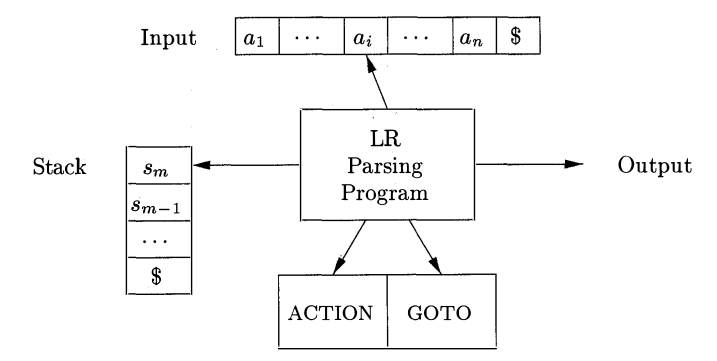

Figure 4.35: Model of an LR parser

The stack holds a sequence of states, $s_0s_1\dots s_m$, where $s_m$ is on top. In the SLR method, the stack holds states from the LR(0) automaton; the canonical-LR and LALR methods are similar. By construction, each state has a corresponding grammar symbol. Recall that states correspond to sets of items, and that there is a transition from state $i$ to state $j$ if $\text{GOTO}(I_i, X) = I_j$. All transitions to state $j$ must be for the same grammar symbol $X$. Thus, each state, except the start state 0, has a unique grammar symbol associated with it. [^4]

[^4]: The converse need not hold; that is, more than one state may have the same grammar symbol. See for example states 1 and 8 in the LR(0) automaton in Fig. 4.31, which are both entered by transitions on $E$, or states 2 and 9, which are both entered by transitions on $T$.

#### Structure of the LR Parsing Table

The parsing table consists of two parts: a parsing-action function ACTION and a goto function GOTO.

1.  The ACTION function takes as arguments a state $i$ and a terminal $a$ (or $\$$, the input endmarker). The value of $\text{ACTION}[i, a]$ can have one of four forms:

    - Shift $j$, where $j$ is a state. The action taken by the parser effectively shifts input $a$ to the stack, but uses state $j$ to represent $a$.

    - Reduce $A \to \beta$. The action of the parser effectively reduces $\beta$ on the top of the stack to head $A$.

    - Accept. The parser accepts the input and finishes parsing

    - Error. The parser discovers an error in its input and takes some corrective action. We shall have more to say about how such error-recovery routines work in Sections 4.8.3 and 4.9.4.

2.  We extend the GOTO function, defined on sets of items, to states: if $\text{GOTO}[I_i, A] = I_j$, then GOTO also maps a state $i$ and a nonterminal A to state $j$.

#### LR-Parser Configurations

To describe the behavior of an LR parser, it helps to have a notation representing the complete state of the parser: its stack and the remaining input. A *configuration* of an LR parser is a pair:
$$
(s_0s_1\dots s_m,\ a_ia_{i+1}\dots a_n\$)
$$
where the first component is the stack contents (top on the right), and the second component is the remaining input. This configuration represents the right-sentential form
$$
X_1 X_2 \dots X_m\ a_i a_{i+1}\dots a_n
$$
in essentially the same way as a shift-reduce parser would; the only difference is that instead of grammar symbols, the stack holds states from which grammar symbols can be recovered. That is, $X_i$ is the grammar symbol represented by state $s_i$. Note that $s_0$, the start state of the parser, does not represent a grammar symbol, and serves as a bottom-of-stack marker, as well as playing an important role in the parse.

#### Behavior of the LR Parser

The next move of the parser from the configuration above is determined by reading $a_i$, the current input symbol, and $s_m$, the state on top of the stack, and then consulting the entry ACTION[$s_m, a_i$] in the parsing action table. The configurations resulting after each of the four types of move are as follows

1. If $\text{ACTION}[s_m, a_i] = \text{shift }s$, the parser executes a shift move; it shifts the next state s onto the stack, entering the configuration
   $$
   (s_0s_1 \dots s_ms,\ a_{i+1}\dots a_n\$)
   $$
   The symbol $a_i$ need not be held on the stack, since it can be recovered from $s$, if needed (which in practice it never is). The current input symbol is now $a _ {i+1}$.

2. If $\text{ACTION}[s_m, a_i] = \text{reduce } A \to \beta$ , then the parser executes a reduce move, entering the configuration
   $$
   (s_0 s_1\dots s_{m-r}s,\ a_ia_{i+1}\dots a_n\$)
   $$
   where $r$ is the length of $\beta$ , and $s = \text{GOTO}[s_{m-r}, A]$. Here the parser first popped $r$ state symbols off the stack, exposing state $S_{m-r}$. The parser then pushed $s$, the entry for GOTO[$s_{m-r}, A$], onto the stack. The current input symbol is not changed in a reduce move. For the LR parsers we shall construct, $X_{m-r+1} \dots X_m$, the sequence of grammar symbols corresponding to the states popped off the stack, will always match $\beta$, the right side of the reducing production.

   The output of an LR parser is generated after a reduce move by executing the semantic action associated with the reducing production. For the time being, we shall assume the output consists of just printing the reducing production.

3. If $\text{ACTION}[s_m, a_i] = \text{accept}$, parsing is completed.

4. If $\text{ACTION}[s_m, a_i] = \text{error}$, the parser has discovered an error and calls an error recovery routine.


The LR-parsing algorithm is summarized below. All LR parsers behave in this fashion; the only difference between one LR parser and another is the information in the ACTION and GOTO fields of the parsing table.

**Algorithm 4.44:** LR-parsing algorithm.

**INPUT:** An input string $w$  and $a_n$ LR-parsing table with functions ACTION and GOTO for a grammar G.

**OUTPUT:** If $w$ is in L(G), the reduction steps of a bottom-up parse for $w$; otherwise, an error indication.

**METHOD:** Initially, the parser has $s_0$ on its stack, where $s_0$ is the initial state, and $w \$$ in the input buffer. The parser then executes the program in Fig. 4.36.$\Box$

let $a$ be the first symbol of $w \$$;
while(true) { /\* repeat forever \*/
let $s$ be the state on top of the stack;
if ( ACTION[$s, a$] = shift $t$ ) {
push t onto the stack;
let a be the next input symbol;
} else if(ACTION[s, a] = reduce $A \to \beta$ ) {
pop $|\beta|$ symbols off the stack;
let state t now be on top of the stack;
push GOTO[t, A] onto the stack;
output the production $A \to \beta$ ;
} else if(ACTION[s, a] = accept) break; /\* parsing is done \* /
else call error-recovery routine;
}

Figure 4.36: LR-parsing program

**Example 4.45:** Figure 4.37 shows the ACTION and GOTO functions of an LR-parsing table for the expression grammar (4.1), repeated here with the productions numbered:

$$
\begin{array}{llll}
(1) &E&\to& E+T\\
(2) &E&\to& T\\
(3) &T&\to& T*F\\
(4) &T&\to& F\\
(5) &F&\to& (E)\\
(6) &F&\to& \textbf{id}
\end{array}
$$

The codes for the actions are:

1.  $s_i$ means shift and stack state i,

2.  $r_j$ means reduce by the production numbered j,

3.  acc means accept,

4.  blank means error.

Note that the value of GOTO[$s, a$] for terminal $a$ is found in the ACTION field connected with the shift action on input $a$ for state $s$. The GOTO field gives GOTO[$s, A$] for nonterminals $A$. Although we have not yet explained how the entries for Fig. 4.37 were selected, we shall deal with this issue shortly.

| STATE |  A   |  C   |  T   |  I   |  O   |  N   |  G   |  O   |  TO  |
| :---: | :--: | :--: | :--: | :--: | :--: | :--: | :--: | :--: | :--: |
|       |  id  |  +   |  *   |  (   |  )   |  $   |  E   |  T   |  F   |
|   0   |  s5  |      |      |  s4  |      |      |  1   |  2   |  3   |
|   1   |      |  s6  |      |      |      | acc  |      |      |      |
|   2   |      |  r2  |  s7  |      |  r2  |  r2  |      |      |      |
|   3   |      |  r4  |  r4  |      |  r4  |  r4  |      |      |      |
|   4   |  s5  |      |      |  s4  |      |      |  8   |  2   |  3   |
|   5   |      |  r6  |  r6  |      |  r6  |  r6  |      |      |      |
|   6   |  s5  |      |      |  s4  |      |      |      |  9   |  3   |
|   7   |  s5  |      |      |  s4  |      |      |      |      |  10  |
|   8   |      |  s6  |      |      | s11  |      |      |      |      |
|   9   |      |  r1  |  s7  |      |  r1  |  r1  |      |      |      |
|  10   |      |  r3  |  r3  |      |  r3  |  r3  |      |      |      |
|  11   |      |  r5  |  r5  |      |  r5  |  r5  |      |      |      |

Figure 4.37: Parsing table for expression grammar

On input $\textbf{id} * \textbf{id} + \textbf{id}$, the sequence of stack and input contents is shown in Fig. 4.38. Also shown for clarity, are the sequences of grammar symbols corresponding to the states held on the stack. For example, at line (1) the LR parser is in state 0, the initial state with no grammar symbol, and with id the first input symbol. The action in row 0 and column **id** of the action field of Fig. 4.37 is `s5​`, meaning shift by pushing state 5. That is what has happened at line (2): the state symbol 5 has been pushed onto the stack, and **id** has been removed from the input.

Then, $*$ becomes the current input symbol, and the action of state 5 on input $*$ is to reduce by $F \to \textbf{id}$. One state symbol is popped off the stack. State 0 is then exposed. Since the GOTO of state 0 on $F$ is 3, state 3 is pushed onto the stack. We now have the configuration in line (3). Each of the remaining moves is determined similarly. $\Box$

|      | STACK | SYMBOLS |        INPUT | ACTION                 |
| :--: | :---- | :------ | -----------: | :--------------------- |
|  1   | 0    |         | $\textbf{id}*\textbf{id}+\textbf{id}$\$ | shift                  |
|  2   | 0,5 | $\textbf{id}$    |   $*\textbf{id}+\textbf{id}$\$ | reduce by $F\to \textbf{id}$    |
|  3   | 0,3  | $F$     |   $*\textbf{id}+\textbf{id}$\$ | reduce by $T\to F$     |
|  4   | 0,2  | $T$     |   $*\textbf{id}+\textbf{id}$\$ | shift                  |
|  5   | 0,2,7 | $T*$  |    $\textbf{id}+\textbf{id}$\$ | shift                  |
|  6   | 0,2,7,5 | $T*\textbf{id}$  |      $+\textbf{id}$\$ | reduce by $F\to \textbf{id}$    |
|  7   | 0,2,7,10 | $T*F$   |      $+\textbf{id}$\$ | reduce by $T\to T * F$ |
|  8   | 0,2  | $T$     |      $+\textbf{id}$\$ | reduce by $E\to T$     |
|  9   | 0,1  | $E$     |      $+\textbf{id}$\$ | shift                  |
|  10  | 0,1,6 | $E+$    |       $\textbf{id}$\$ | shift                  |
|  11  | 0,1,6,5 | $E+\textbf{id}$  |           \$ | reduce by $F\to \textbf{id}$    |
|  12  | 0,1,6,3 | $E+F$   |           \$ | reduce by $T\to F$     |
|  13  | 0,1,6,9 | $E+T$   |           \$ | reduce by $E\to E + T$ |
|  14  | 0,1   | $E$     |           \$ | accept                 |

Figure 4.38: Moves of an LR parser on $\textbf{id} * \textbf{id} + \textbf{id}$


### 4.6.4 Constructing SLR-Parsing Tables

The SLR method for constructing parsing tables is a good starting point for studying LR parsing. We shall refer to the parsing table constructed by this method as an SLR table, and to an LR parser using an SLR-parsing table as an SLR parser. The other two methods augment the SLR method with lookahead information.

The SLR method begins with LR(0) items and LR(0) automata, introduced in Section 4.5. That is, given a grammar, *G*, we augment *G* to produce *G'*, with a new start symbol $S'$. From *G'*, we construct *C*, the canonical collection of sets of items for *G'* together with the GOTO function.

The ACTION and GOTO entries in the parsing table are then constructed using the following algorithm. It requires us to know FOLLOW($A$) for each nonterminal $A$ of a grammar (see Section 4.4).

**Algorithm 4.46:** Constructing an SLR-parsing table.

**INPUT:** An augmented grammar *G'*.

**OUTPUT:** The SLR-parsing table functions ACTION and GOTO for *G'*.

**METHOD:**

1. Construct $C = \{I_0, I_1, \dots, I_n\}$, the collection of sets of LR(0) items for *G'*.

2. State $i$ is constructed from $I_i$. The parsing actions for state $i$ are determined as follows:

   a. If $[A \to \alpha \cdot a \beta ]$ is in $I_i$ and $\text{GOTO}(I_i, a) = I_j$, then set ACTION[$i, a$] to "shift $j$". Here $a$ must be a terminal.

   b. If $[A \to a \cdot]$ is in $I_i$, then set ACTION[$i, a$] to "reduce $A \to a$" for all a in FOLLOW($A$); here $A$ may not be $S'$.

   c. If $[S' \to S \cdot ]$ is in $I_i$, then set ACTION[$i, \$$] to "accept".

   If any conflicting actions result from the above rules, we say the grammar is not SLR(1). The algorithm fails to produce a parser in this case.

3. The GOTO transitions for state $i$ are constructed for all nonterminals $A$ using the rule: If $\text{GOTO}(I_i, A) = I_j$, then $\text{GOTO}[i, A] = j$.

4. All entries not defined by rules (2) and (3) are made "error".

5. The initial state of the parser is the one constructed from the set of items containing $[S' \to \cdot S]$.

$\Box$

The parsing table consisting of the ACTION and GOTO functions determined by Algorithm 4.46 is called the *SLR(1) table* for *G*. An LR parser using the SLR(1) table for *G* is called the SLR(1) parser for *G*, and a grammar having an SLR(1) parsing table is said to be *SLR(1)*. We usually omit the "(1)" after the "SLR", since we shall not deal here with parsers having more than one symbol of lookahead.

**Example 4.47:** Let us construct the *SLR table* for the augmented expression grammar. The canonical collection of sets of LR(0) items for the grammar was shown in Fig. 4.31. First consider the set of items $I_0$:
$$
\begin{array}{lll}
E'&\to& \cdot E\\
E &\to& \cdot E+T\\
E &\to& \cdot T\\
T &\to& \cdot T*F\\
T &\to& \cdot F\\
F &\to& \cdot(E)\\
F &\to& \cdot \textbf{id}
\end{array}
$$

The item $F \to \cdot (E)$ gives rise to the entry $\text{ACTION}[O, (] = \text{shift }4$, and the item $F \to \cdot \textbf{id}$ to the entry $\text{ACTION}[O, \textbf{id}] = \text{shift }5$. Other items in $I_0$ yield no actions. Now consider $I_1$:

$$
\begin{array}{lll}
E'&\to& E \cdot \\
E &\to& E \cdot + T
\end{array}
$$

The first item yields $\text{ACTION}[1, \$] = \text{accept}$, and the second yields $\text{ACTION}[1, +] = \text{shift }6$. Next consider $I_2$:

$$
\begin{array}{lll}
E &\to& T\cdot \\
T &\to& T\cdot * F
\end{array}
$$

Since $FOLLOW(E) = \{\$, +, )\}$, the first item makes

$$
\text{ACTION}[2, \$] = \text{ACTION}[2, +] = \text{ACTION}[2, )] = \text{reduce}\ E \to T
$$

The second item makes $\text{ACTION}[2, *] = \text{shift }7$. Continuing in this fashion we obtain the ACTION and GOTO tables that were shown in Fig. 4.31. In that figure, the numbers of productions in reduce actions are the same as the order in which they appear in the original grammar (4.1). That is, $E \to E + T$ is number 1, $E \to T$ is 2, and so on. $\Box$

**Example 4.48:** Every SLR(1) grammar is unambiguous, but there are many unambiguous grammars that are not SLR(1). Consider the grammar with productions
$$
\begin{array}{lll}
S&\to& L = R\ |\ R \\
L&\to& * R\ |\ \textbf{id} \\
R&\to& L
\end{array}
$$

Think of $L$ and $R$ as standing for l-value and r-value, respectively, and $*$ as an operator indicating "contents of".[^5] The canonical collection of sets of LR(0) items for grammar (4.49) is shown in Fig. 4.39.

[^5]: As in Section 2.8.3, an l-value designates a location and an r-value is a value that can be stored in a location.

$$
\begin{array}{llll}
I_0:&S'&\to& \cdot S\\
   &S &\to& \cdot L=R\\
   &S &\to& \cdot R\\
   &S &\to& \cdot *R\\
   &L &\to& \cdot \textbf{id}\\
   &R &\to& \cdot L\\
I_1:&S'&\to& S\cdot\\
I_2:&S &\to& L\cdot =R\\
   &R &\to& L\cdot\\
I_3:&S &\to& R\cdot\\
I_4:&L &\to& *\cdot R\\
   &R &\to& \cdot L\\
   &L &\to& \cdot *R\\
   &L &\to& \cdot \textbf{id}\\
I_5:&L &\to& \textbf{id}\cdot\\
I_6:&S &\to& L=\cdot R\\
   &R &\to& \cdot L\\
   &L &\to& \cdot *R\\
   &L &\to& \cdot \textbf{id}\\
I_7:&L &\to& *R\cdot \\
I_8:&R &\to& L\cdot \\
I_9:&S &\to& L=R\cdot
\end{array}
$$

Figure 4.39: Canonical LR(0) collection for grammar (4.49)

Consider the set of items $I_2$, The first item in this set makes ACTION[$2, =$] be "shift 6." Since FOLLOW($R$) contains $=$ (to see why, consider the derivation $S \implies  L = R \implies  * R = R)$, the second item sets ACTION[$2, =$] to "reduce $R \to L$". Since there is both a shift and a reduce entry in ACTION[$2, =$], state 2 has a shift/reduce conflict on input symbol $=$.

Grammar (4.49) is not ambiguous. This shift/reduce conflict arises from the fact that the SLR parser construction method is not powerful enough to remember enough left context to decide what action the parser should take on input $=$, having seen a string reducible to $L$. The canonical and LALR methods, to be discussed next, will succeed on a larger collection of grammars, including grammar (4.49). Note, however, that there are unambiguous grammars for which every LR parser construction method will produce a parsing action table with parsing action conflicts. Fortunately, such grammars can generally be avoided in programming language applications. $\Box$

### 4.6.5 Viable Prefixes

Why can LR(0) automata be used to make shift-reduce decisions? The LR(0) automaton for a grammar characterizes the strings of grammar symbols that can appear on the stack of a shift-reduce parser for the grammar. The stack contents must be a prefix of a right-sentential form. If the stack holds $\alpha$ and the rest of the input is $x$, then a sequence of reductions will take $\alpha x$ to $S$. In terms of derivations, $S\underset{rm}{\overset*\implies} \alpha x$.

Not all prefixes of right-sentential forms can appear on the stack, however, since the parser must not shift past the handle. For example, suppose

$$
E\underset{rm}{\overset*\implies} F * \textbf{id} \underset{rm}\implies (E)*\textbf{id}
$$

Then, at various times during the parse, the stack will hold $($, $(E$, and $(E)$, but it must not hold $(E)*$, since $(E)$ is a handle, which the parser must reduce to $F$ before shifting $*$ .

The prefixes of right sentential forms that can appear on the stack of a shift-reduce parser are called *viable prefixes*. They are defined as follows: a viable prefix is a prefix of a right-sentential form that does not continue past the right end of the rightmost handle of that sentential form. By this definition, it is always possible to add terminal symbols to the end of a viable prefix to obtain a right-sentential form.

SLR parsing is based on the fact that LR(0) automata recognize viable prefixes. We say item $A \to \beta_1\cdot\beta_2$ is *valid* for a viable prefix $\alpha\beta_1$ if there is a derivation $S' \underset{rm}{\overset * \implies} \alpha A w \underset{rm}\implies \alpha\beta_1\beta_2w$. In general, an item will be valid for many viable prefixes.

The fact that $A \to \beta_1\cdot\beta_2$ is valid for $\alpha\beta_1$ tells us a lot about whether to shift or reduce when we find $\alpha\beta_1$ on the parsing stack. In particular, if $\beta_2\not=\epsilon$, then it suggests that we have not yet shifted the handle onto the stack, so shift is our move. If $\beta_2=\epsilon$, then it looks as if $A \to \beta_1$ is the handle, and we should reduce by this production. Of course, two valid items may tell us to do different things for the same viable prefix. Some of these conflicts can be resolved by looking at the next input symbol, and others can be resolved by the methods of Section 4.8, but we should not suppose that all parsing action conflicts can be resolved if the LR method is applied to an arbitrary grammar.

We can easily compute the set of valid items for each viable prefix that can appear on the stack of an LR parser. In fact, it is a central theorem of LR-parsing theory that the set of valid items for a viable prefix $\gamma$  is exactly the set of items reached from the initial state along the path labeled $\gamma$  in the LR(0) automaton for the grammar. In essence, the set of valid items embodies all the useful information that can be gleaned from the stack. While we shall not prove this theorem here, we shall give an example.

---

#### Items as States of an NFA

A nondeterministic finite automaton *N* for recognizing viable prefixes can be constructed by treating the items themselves as states. There is a transition from $A \to \alpha\cdot X\beta$  to $A \to \alpha X\cdot\beta$  labeled $X$, and there is a transition from $A \to \alpha \cdot B \beta$  to $B \to \cdot \gamma$  labeled $\epsilon$. Then CLOSURE($I$) for set of items (states of *N*) $I$ is exactly the $\epsilon$-closure of a set of NFA states defined in Section 3.7.1. Thus, GOTO($I, X$) gives the transition from $I$ on symbol $X$ in the DFA constructed from *N*​ by the subset construction. Viewed in this way, the procedure `items(G')` in Fig. 4.33 is just the subset construction itself applied to the NFA *N* with items as states.

---

**Example 4.50:** Let us consider the augmented expression grammar again, whose sets of items and GOTO function are exhibited in Fig. 4.31. Clearly, the string $E + T * $ is a viable prefix of the grammar. The automaton of Fig. 4.31 will be in state 7 after having read $E + T * $. State 7 contains the items
$$
\begin{array}{lll}
T&\to& T*\cdot F\\
F&\to& \cdot(E)\\
F&\to& \cdot \textbf{id}
\end{array}
$$

which are precisely the items valid for $E+T * $. To see why, consider the following three rightmost derivations

$$
\begin{array}{lll}
E'&\underset{rm}\implies& E \\ 
&\underset{rm}\implies& E+T \\
&\underset{rm}\implies& E+T*F \\

E'&\underset{rm}\implies& E \\
&\underset{rm}\implies& E+T \\
&\underset{rm}\implies& E+T*F \\
&\underset{rm}\implies& E+T*(E) \\

E'&\underset{rm}\implies& E \\
&\underset{rm}\implies& E+T \\
&\underset{rm}\implies& E+T*F \\
&\underset{rm}\implies& E+T*\textbf{id}
\end{array}
$$

The first derivation shows the validity of $T \to T * \cdot F$, the second the validity of $F \to \cdot(E)$, and the third the validity of $F \to \cdot \textbf{id}$. It can be shown that there are no other valid items for $E + T * $, although we shall not prove that fact here. $\Box$


## 4.7 More Powerful LR Parsers

In this section, we shall extend the previous LR parsing techniques to use one symbol of lookahead on the input. There are two different methods:

1.  The "canonical-LR" or just "LR" method, which makes full use of the lookahead symbol(s). This method uses a large set of items, called the LR(1) items.

2.  The "lookahead-LR" or "LALR" method, which is based on the LR(0) sets of items, and has many fewer states than typical parsers based on the LR(1) items. By carefully introducing lookaheads into the LR(0) items, we can handle many more grammars with the LALR method than with the SLR method, and build parsing tables that are no bigger than the SLR tables. LALR is the method of choice in most situations.

After introducing both these methods, we conclude with a discussion of how to compact LR parsing tables for environments with limited memory.

### 4.7.1 Canonical LR(1) Items

We shall now present the most general technique for constructing an LR parsing table from a grammar. Recall that in the SLR method, state $i$ calls for reduction by $A \to \alpha$ if the set of items $I_i$ contains item [$A \to \alpha\cdot$] and input symbol $a$ is in FOLLOW($A$). In some situations, however, when state $i$ appears on top of the stack, the viable prefix $\beta\alpha$ on the stack is such that $\beta A$ cannot be followed by $a$ in any right-sentential form. Thus, the reduction by $A \to \alpha$ should be invalid on input $a$.

**Example 4.51:** Let us reconsider Example 4.48, where in state 2 we had item $R \to L\cdot$, which could correspond to $A \to \alpha$ above, and $a$ could be the $=$ sign, which is in FOLLOW($R$). Thus, the SLR parser calls for reduction by $R \to L$ in state 2 with $=$ as the next input (the shift action is also called for, because of item $S \to L\cdot=R$ in state 2). However, there is no right-sentential form of the grammar in Example 4.48 that begins $R = \dots$ . Thus state 2, which is the state corresponding to viable prefix $L$ only, should not really call for reduction of that $L$ to $R$. $\Box$

It is possible to carry more information in the state that will allow us to rule out some of these invalid reductions by $A \to \alpha$. By splitting states when necessary, we can arrange to have each state of an LR parser indicate exactly which input symbols can follow a handle $\alpha$ for which there is a possible reduction to A.

The extra information is incorporated into the state by redefining items to include a terminal symbol as a second component. The general form of an item becomes $[A \to \alpha \cdot \beta, a]$, where $A \to \alpha\beta$ is a production and $a$ is a terminal or the right endmarker $\$$. We call such an object an *LR(1) item*. The 1 refers to the length of the second component, called the *lookahead* of the item.[^6] The lookahead has no effect in an item of the form $[A \to \alpha\cdot\beta, a]$, where $\beta$  is not $\epsilon$, but an item of the form $[A \to \alpha\cdot, a]$ calls for a reduction by $A\to \alpha$ only if the next input symbol is $a$. Thus, we are compelled to reduce by $A \to \alpha$ only on those input symbols $a$ for which $[A \to \alpha \cdot \beta, a]$ is an LR(1) item in the state on top of the stack. The set of such $a$'s will always be a subset of FOLLOW($A$), but it could be a proper subset, as in Example 4.51.

[^6]: Lookaheads that are strings of length greater than one are possible, of course, but we shall not consider such lookaheads here.

Formally, we say LR(1) item $[A \to \alpha \cdot \beta, a]$ is *valid* for a viable prefix $\gamma$  if there is a derivation $S \underset{rm}{\overset * \implies} \delta Aw  \underset{rm}\implies \delta \alpha \beta w$, where

1.  $\gamma  = \delta \alpha$, and

2.  Either $a$ is the first symbol of $w$, or $w$  is $\epsilon$ and $a$ is \$.

**Example 4.52:** Let us consider the grammar

$$
\begin{array}{lll}
S &\to& B\ B \\
B &\to& a\ B\ |\ b
\end{array}
$$

There is a rightmost derivation $S \underset{rm}{\overset * \implies} aaBab \underset{rm}\implies aaaBab$. We see that item $[B \to a\cdot B, a]$ is valid for a viable prefix $\gamma = aaa$ by letting $\delta = aa$, $A = B$, $w = ab$, $\alpha = a$, and $\beta = B$ in the above definition. There is also a rightmost derivation $S \underset{rm}{\overset * \implies} BaB \underset{rm}\implies BaaB$. From this derivation we see that item $[B \to a\cdot B, \$]$ is valid for viable prefix $Baa$. $\Box$

### 4.7.2 Constructing LR(1) Sets of Items

The method for building the collection of sets of valid LR (1) items is essentially the same as the one for building the canonical collection of sets of LR (0) items. We need only to modify the two procedures CLOSURE and GOTO.

To appreciate the new definition of the CLOSURE operation, in particular, why $b$ must be in FIRST($\beta a$), consider an item of the form $[A \to \alpha\cdot B\beta, a]$ in the set of items valid for some viable prefix $\gamma$. Then there is a rightmost derivation $S \underset{rm}{\overset * \implies} \delta A a x \underset{rm}\implies \delta\alpha B\beta ax$, where $\gamma =\delta\alpha$. Suppose $\beta a x$ derives terminal string $b y$. Then for each production of the form $B \to \eta $ for some $\eta$, we have derivation $S \underset{rm}{\overset * \implies} \gamma Bby \underset{rm}\implies \gamma\eta by$. Thus, $[B \to \cdot\eta, b]$ is valid for $\gamma$. Note that $b$ can be the first terminal derived from $\beta$, or it is possible that $\beta$ derives $\epsilon$ in the derivation $\beta a x \implies  b y$, and $b$ can therefore be $a$. To summarize both possibilities we say that $b$ can be any terminal in FIRST($\beta a x$), where FIRST is the function from Section 4.4. Note that $x$ cannot contain the first terminal of $b y$, so $\text{FIRST}(\beta a x) = \text{FIRST}(\beta a)$. We now give the LR(1) sets of items construction.

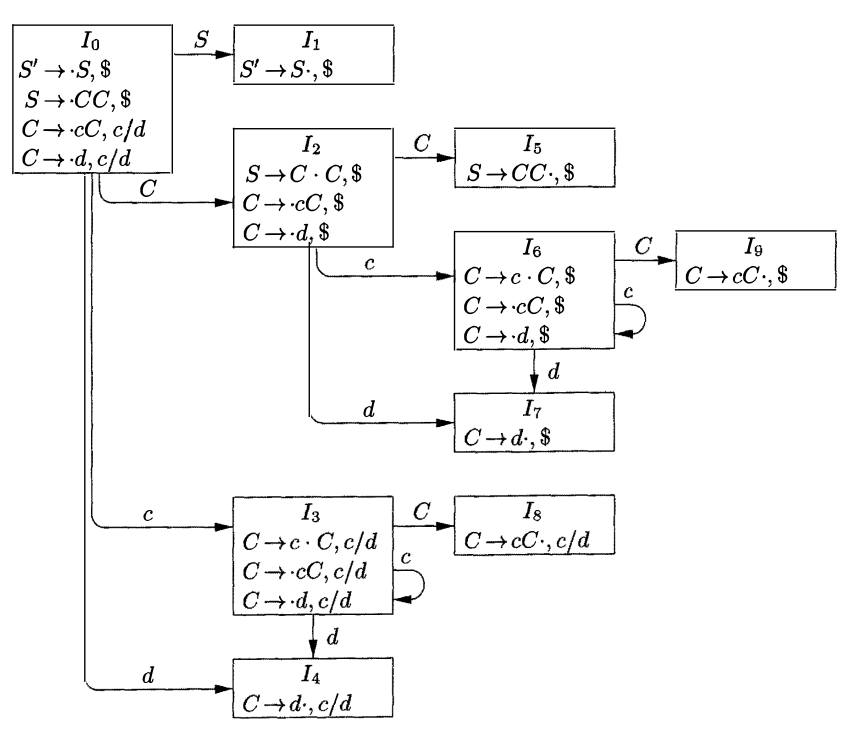

Figure 4.41: The GOTO graph for grammar (4.55)

**Algorithm 4.53:** Construction of the sets of LR(1) items.

**INPUT:** An augmented grammar *G'*.

**OUTPUT:** The sets of LR(1) items that are the set of items valid for one or more viable prefixes of *G'*.

**METHOD:** The procedures CLOSURE and GOTO and the main routine *items* for constructing the sets of items were shown in Fig. 4.40. $\Box$

SetOfItems CLOSURE(I)  { 
repeat 
for ( each item [$A \to  \alpha\cdot B\beta$, $a$]  in I ) 
for  ( each production $B \to  \gamma$  in G' ) 
for  ( each terminal b in FIRST($\beta a$)  ) 
add [$B \to  \cdot \gamma$, $b$] to set I; 
until no more items are added to I; 
return I;
} 
SetOfItems GOTO(I, X) { 
initialize J to be the empty set; 
for ( each item [$A \to  \alpha\cdot X\beta$, $a$]  in I  ) 
add item [$A \to  \alpha\cdot X\beta$, $a$] to set J; 
return CLOSURE( J ) ; 
} 
void items(G') { 
initialize C to CLOSURE( {[$S' \to \cdot S$, $]}); 
repeat 
for  ( each set of items I in C ) 
for ( each grammar symbol X ) 
if  (  GOTO(I, X)  is not empty and not in C ) 
add GOTo(I, X)  to C; 
until no new sets of items are added to C; 
} 

Figure 4.40: Sets-of-LR(1)-items construction for grammar *G'*

**Example 4.54:** Consider the following augmented grammar.

$$
\begin{array}{lll}
S' \to S\\
S \to C C \\\tag{4.55}
C \to c C | d
\end{array}
$$

We begin by computing the closure of {[$S' \to \cdot S$, \$]}. To close, we match the item [$S' \to \cdot S$, \$] with the item [$A \to \alpha \cdot B\beta$, $a$] in the procedure CLOSURE.

That is, $A = S', \alpha = \eta, B = S, \beta = \eta$, and $a = \$$. Function CLOSURE tells us to add [$B \to \cdot \gamma$, $b$] for each production $B \to \gamma$ and terminal $b$ in FIRST($\beta a$). In terms of the present grammar, $B \to \gamma$ must be $S \to C C$, and since $\beta$ is $E$ and $a$ is $\$$, $b$ may only be \$. Thus we add [$S \to \cdot C C$, \$].

We continue to compute the closure by adding all items [$C \to \cdot \gamma$ , $b$] for $b$ in FIRST($C\$$). That is, matching [$S \to \cdot C C$, \$] against [$A \to \alpha \cdot B \beta$, $a$], we have $A = S, \alpha = \gamma, B = C, \beta = C$, and $a = \$$. Since $C$ does not derive the empty string, FIRST($C\$$) = FIRST($C$). Since FIRST($C$) contains terminals $c$ and $d$, we add items [$C \to \cdot c C$, $c$], [$C \to \cdot c C$, $d$] , [$C \to \cdot d$, $c$] and [$C \to \cdot d$, $d$] . None of the new items has a nonterminal immediately to the right of the dot, so we have completed our first set of LR(1) items. The initial set of items is
$$
\begin{array}{llll}
I_0: &S \to \cdot S, \$\\
    &S \to \cdot C C, \$\\
    &C \to \cdot c C, c/d\\
    &C \to \cdot d, c/d
\end{array}
$$

The brackets have been omitted for notational convenience, and we use the notation [$C \to \cdot c C$, $c/d$] as a shorthand for the two items [$C \to \cdot c C$, $c$] and [$C \to \cdot c C$, $d$].

Now we compute GOTO($I_0$, $X$) for the various values of $X$. For $X = S$ we must close the item [$S' \to S\cdot$, \$]. No additional closure is possible, since the dot is at the right end. Thus we have the next set of items
$$
I_1: S' \to S\cdot, \$
$$
For $X = C$ we close [$S \to C\cdot C$, \$]. We add the $C$-productions with second component \$ and then can add no more, yielding
$$
\begin{array}{ll}
I_2: &S \to C \cdot C, \$\\
     &C \to \cdot c C, \$\\
     &C \to \cdot d, \$
\end{array}
$$

Next, let $X = c$. We must close {[$C \to c \cdot C$, $c/d$]}. We add the $C$-productions with second component $c / d$, yielding
$$
\begin{array}{lll}
I_3: & C \to c\cdot C&, c/d\\
    & C \to \cdot c C&, c/d\\
    & C \to \cdot d&, c/d
\end{array}
$$

Finally, let $X = d$, and we wind up with the set of items
$$
I_4: C \to d\cdot, c/d
$$
We have finished considering GOTO on $I_0$. We get no new sets from $I_1$, but $I_2$ has GOTO's on $C$, $c$, and $d$. For GOTO($I_2$, $C$) we get
$$
I_5: S \to C C\cdot, \$
$$
no closure being needed. To compute GOTO ($I_2$, $c$) we take the closure of {[$C \to c\cdot C$, \$]}, to obtain
$$
\begin{array}{ll}
I_6: & C \to c\cdot C, \$\\
     & C \to \cdot c C, \$\\
     & C \to \cdot d, \$
\end{array}
$$
Note that $I_6$ differs from $I_3$ only in second components. We shall see that it is common for several sets of LR(1) items for a grammar to have the same first components and differ in their second components. When we construct the collection of sets of LR(0) items for the same grammar, each set of LR(0) items will coincide with the set of first components of one or more sets of LR(1) items. We shall have more to say about this phenomenon when we discuss LALR parsing.

Continuing with the GOTO function for $I_2$, GOTO($I_2$, $d$) is seen to be
$$
I_7: C \to d\cdot, \$
$$
Turning now to $l_3$, the GOTO'S of $I_3$ on $c$ and $d$ are $I_3$ and $I_4$, respectively, and GOTO($I_3$, $C$) is
$$
I_8: C \to c C\cdot, c/d
$$
$I_4$ and $I_5$ have no GOTO's, since all items have their dots at the right end. The GOTO's of $I_6$ on $c$ and $d$ are $I_6$ and $I_7$, respectively, and GOTO($I_6$, $C$) is
$$
I_9: C \to c C\cdot, \$
$$
The remaining sets of items yield no GOTO's, so we are done. Figure 4.41 shows the ten sets of items with their GOTO's. $\Box$

### 4.7.3 Canonical LR(1) Parsing Tables

We now give the rules for constructing the LR(1) ACTION and GOTO functions from the sets of LR(1) items. These functions are represented by a table, as before. The only difference is in the values of the entries.

**Algorithm 4.56:** Construction of canonical-LR parsing tables.

**INPUT:** An augmented grammar *G'*.

**OUTPUT:** The canonical-LR parsing table functions ACTION and GOTO for *G'*.

**METHOD:**

1. Construct $C' = \{I_0, I_1, \dots, I_n\}$, the collection of sets of LR(1) items for *G'*.

2. State *i* of the parser is constructed from $I_i$. The parsing action for state *i* is determined as follows.

   a. If $[A\to \alpha\cdot a\beta, b]$ is in $I_i$ and $\text{GOTO}(I_i, a) = I_j$, then set ACTION[$I, a$] to “shift *j*.” Here $a$ must be a terminal.

   b. If $[A \to \alpha\cdot, a]$ is in $I_i$, $A \not= S'$, then set ACTION[$I, a$] to “reduce $A \to \alpha \cdot$”

   c. If $[S' \to S \cdot, \$]$ is in $I_i$, then set ACTION[$I, \$$] to “accept.”

   If any conflicting actions result from the above rules, we say the grammar is not LR(1). The algorithm fails to produce a parser in this case.

4. The GOTO transitions for state *i* are constructed for all nonterminals *A* using the rule: If $\text{GOTO}(I_i, A) = I_j$, then $\text{GOTO}[I, A] = j$.

5. All entries not defined by rules (2) and (3) are made “error.”

6. The initial state of the parser is the one constructed from the set of items containing $[S' \to \cdot S, \$]$.

$\Box$

The table formed from the parsing action and GOTO functions produced by Algorithm 4.56 is called the canonical LR(1) parsing table. An LR parser using this table is called a canonical-LR(1) parser. If the parsing action function has no multiply defined entries, then the given grammar is called an LR(1) grammar. As before, we omit the “(1)” if it is understood.

**Example 4.57:** The canonical parsing table for grammar (4.55) is shown in Fig. 4.42. Productions 1, 2, and 3 are $S \to C C$, $C\to cC$, and $C\to d$, respectively. $\Box$

Every SLR(1) grammar is an LR(1) grammar, but for an SLR(1) grammar the canonical LR parser may have more states than the SLR parser for the same grammar. The grammar of the previous examples is SLR and has an SLR parser with seven states, compared with the ten of Fig. 4.42.
| STATE |  AC  |  TI  |  ON  |  GO  |  TO  |
| ----: | :--: | :--: | :--: | :--: | :--: |
|       | $c$  | $d$  |  $   | $S$  | $C$  |
|     0 |  s3  |  s4  |      |  1   |  2   |
|     1 |      |      | acc  |      |      |
|     2 |  s6  |  s7  |      |      |  5   |
|     3 |  s3  |  s4  |      |      |  8   |
|     4 |  r3  |  r3  |      |      |      |
|     5 |      |      |  r1  |      |      |
|     6 |  s6  |  s7  |      |      |  9   |
|     7 |      |      |  r3  |      |      |
|     8 |  r2  |  r2  |      |      |      |
|     9 |      |      |  r2  |      |      |

Figure 4.42: Canonical parsing table for grammar (4.55)

### 4.7.4 Constructing LALR Parsing Tables

We now introduce our last parser construction method, the LALR(*lookahead*-LR) technique. This method is often used in practice, because the tables obtained by it are considerably smaller than the canonical LR tables, yet most common syntactic constructs of programming languages can be expressed conveniently by an LALR grammar. The same is almost true for SLR grammars, but there are a few constructs that cannot be conveniently handled by SLR techniques (see Example 4.48, for example).

For a comparison of parser size, the SLR and LALR tables for a grammar always have the same number of states, and this number is typically several hundred states for a language like C. The canonical LR table would typically have several thousand states for the same-size language. Thus, it is much easier and more economical to construct SLR and LALR tables than the canonical LR tables.

By way of introduction, let us again consider grammar (4.55), whose sets of LR(1) items were shown in Fig. 4.41. Take a pair of similar looking states, such as $I_4$ and $I_7$. Each of these states has only items with first component $C \to d \cdot$. In $I_4$, the lookaheads are $c$ or $d$; in $I_7$, $\$$ is the only lookahead.

To see the difference between the roles of $I_4$ and $I_7$ in the parser, note that the grammar generates the regular language **c\*dc\*d**. When reading an input $cc \dots cdcc \dots cd$, the parser shifts the first group of $c$'s and their following $d$ onto the stack, entering state 4 after reading the $d$. The parser then calls for $a$ reduction by $C \to d$, provided the next input symbol is $c$ or $d$. The requirement that $c$ or $d$ follow makes sense, since these are the symbols that could begin strings in **c\*d**. If $\$$ follows the first $d$, we have an input like $ccd$, which is not in the language, and state 4 correctly declares an error if $\$$ is the next input.

The parser enters state 7 after reading the second $d$. Then, the parser must see $\$$ on the input, or it started with a string not of the form **c\*dc\*d**. It thus makes sense that state 7 should reduce by $C \to d$ on input $\$$ and declare error on inputs $c$ or $d$.

Let us now replace $I_4$ and $I_7$ by $I_{47}$, the union of $I_4$ and $I_7$, consisting of the set of three items represented by $[C \to d\cdot, c/d/\$]$. The GOTO’s on $d$ to $I_4$ or $I_7$ from $I_0$, $I_2$, $I_3$, and $I_6$ now enter $I_{47}$. The action of state 47 is to reduce on any input. The revised parser behaves essentially like the original, although it might reduce $d$ to $C$ in circumstances where the original would declare error, for example, on input like $ccd$ or $cdcdc$. The error will eventually be caught; in fact, it will be caught before any more input symbols are shifted.

More generally, we can look for sets of LR(1) items having the same *core*, that is, set of first components, and we may merge these sets with common cores into one set of items. For example, in Fig. 4.41, $I_4$ and $I_7$ form such a pair, with core $\{ C \to d \cdot \}$. Similarly, $I_3$ and $I_6$ form another pair, with core $\{C \to c \cdot C, C \to \cdot c C, C\to \cdot d \}$. There is one more pair, $I_8$ and $I_9$, with common core $\{ C \to c C \cdot\}$. Note that, in general, a core is a set of LR(0) items for the grammar at hand, and that an LR(1) grammar may produce more than two sets of items with the same core.

Since the core of GOTO($I, X$) depends only on the core of $I$, the GOTO’s of merged sets can themselves be merged. Thus, there is no problem revising the GOTO function as we merge sets of items. The action functions are modified to reflect the non-error actions of all sets of items in the merger.

Suppose we have an LR(1) grammar, that is, one whose sets of LR(1) items produce no parsing-action conflicts. If we replace all states having the same core with their union, it is possible that the resulting union will have a conflict, but it is unlikely for the following reason: Suppose in the union there is a conflict on lookahead a because there is an item $[A \to \alpha \cdot, a]$ calling for a reduction by $A \to \alpha$, and there is another item $[B\to \beta \cdot a \gamma, b]$ calling for a shift. Then some set of items from which the union was formed has item $[A\to \alpha\cdot, a]$, and since the cores of all these states are the same, it must have an item $[B\to \beta \cdot a\gamma, c]$ for some $c$. But then this state has the same shift/reduce conflict on $a$, and the grammar was not LR(1) as we assumed. Thus, the merging of states with common cores can never produce a shift/reduce conflict that was not present in one of the original states, because shift actions depend only on the core, not the lookahead.

It is possible, however, that a merger will produce a reduce/reduce conflict, as the following example shows.

**Example 4.58:** Consider the grammar

$$
\begin{array}{lll}
S'&\to& S\\
S &\to& a A d\ |\ b B d\ |\ a B e\ |\ b A e\\
A &\to& c\\
B &\to& c
\end{array}
$$

which generates the four strings *acd*, *ace*, *bcd*, and *bce*. The reader can check that the grammar is LR(1) by constructing the sets of items. Up on doing so, we find the set of items $\{[A\to c\cdot, d]; [B\to c\cdot, e]\}$ valid for viable prefix *ac* and $\{[A\to c\cdot, e]; [B\to c\cdot, d]\}$ valid for $bc$. Neither of these sets has a conflict, and their cores are the same. However, their union, which is

$$
\begin{array}{ll}
A\to c\cdot, &d/e\\
B\to c\cdot, &d/e
\end{array}
$$

generates a reduce/reduce conflict, since reductions by both $A \to c$ and $B \to c$ are called for on inputs $d$ and $e$. $\Box$

We are now prepared to give the first of two LALR table-construction algorithms. The general idea is to construct the sets of LR(1) items, and if no conflicts arise, merge sets with common cores. We then construct the parsing table from the collection of merged sets of items. The method we are about to describe serves primarily as a definition of LALR(1) grammars. Constructing the entire collection of LR(1) sets of items requires too much space and time to be useful in practice.

**Algorithm 4.59:** An easy, but space-consuming LALR table construction.

**INPUT:** An augmented grammar *G'*.

**OUTPUT:** The LALR parsing-table functions ACTION and GOTO for *G'*.

**METHOD:**

1. Construct $C = \{I_0, I_1, \dots , I_n\}$, the collection of sets of LR(1) items.

2. For each core present among the set of LR(1) items, find all sets having that core, and replace these sets by their union.

3. Let $C' = \{J_0, J_1, \dots , J_m\}$ be the resulting sets of LR(1) items. The parsing actions for state *i* are constructed from $J_i$ in the same manner as in Algorithm 4.56. If there is a parsing action conflict, the algorithm fails to produce a parser, and the grammar is said not to be LALR(1).

4. The GOTO table is constructed as follows. If $J$ is the union of one or more sets of LR(1) items, that is, $J = I_1\cup I_2 \cup \dots \cup I_k$, then the cores of $\text{GOTO}(I_1, X), \text{GOTO}(I_2, X), \dots , \text{GOTO}(I_k, X)$ are the same, since $I_1, I_2, \dots , I_k$ all have the same core. Let $K$ be the union of all sets of items having the same core as $GOTO(I_1, X)$. Then $GOTO(J, X) = K$.

$\Box$

The table produced by Algorithm 4.59 is called the *LALR parsing table* for *G*. If there are no parsing action conflicts, then the given grammar is said to be an *LALR(1) grammar*. The collection of sets of items constructed in step(3) is called the *LALR(1) collection*.

**Example 4.60:** Again consider grammar (4.55) whose GOTO graph was shown in Fig. 4.41. As we mentioned, there are three pairs of sets of items that can be merged. $I_3$ and $I_6$ are replaced by their union:

$$
\begin{array}{lll}
I_{36} : &C\to c\cdot C&, c/d/\$\\
      &C\to \cdot c C&, c/d/\$\\
      &C\to \cdot d &, c/d/\$
\end{array}
$$

$I_4$ and $I_7$ are replaced by their union:
$$
\begin{array}{lll}
I_{47}: &C\to d\cdot&, c/d/\$
\end{array}
$$
and $I_8$ and $I_9$ are replaced by their union:
$$
\begin{array}{lll}
I_{89}: &C\to cC\cdot&, c/d/\$
\end{array}
$$
The LALR action and GOTO functions for the condensed sets of items are shown in Fig. 4.43.
| STATE |  AC  |  TI  |  ON  |   GO |   TO |
| ----: | :--: | :--: | :--: | ---: | ---: |
|       | $c$  | $d$  |  $   |  $S$ |  $C$ |
|     0 | s36  | s47  |      |    1 |    2 |
|     1 |      |      | acc  |      |      |
|     2 | s36  | s47  |      |      |    5 |
|    36 | s36  | s47  |      |      |   89 |
|    47 |  r3  |  r3  |  r3  |      |      |
|     5 |      |      |  r1  |      |      |
|    89 |  r2  |  r2  |  r2  |      |      |

Figure 4.43: LALR parsing table for the grammar of Example 4.54

To see how the GOTO's are computed, consider GOTO ($I_{36}$, $C$). In the original set of LR(1) items, GOTO($I_3$, $C$) = $I_8$, and $I_8$ is now part of $I_{89}$, so we make GOTO($I_{36}$, $C$) be $I_{89}$. We could have arrived at the same conclusion if we considered $I_6$, the other part of $I_{36}$. That is, GOTO($I_6$, $C$) = $I_9$, and $I_9$ is now part of $I_{89}$ . For another example, consider GOTO($I_2$, $c$), an entry that is exercised after the shift action of $I_2$ on input $c$. In the original sets of LR(1) items, GOTO($I_2$, $c$) = I6. Since $I_6$ is now part of $I_{36}$, GOTO ($I_2$, $c$) becomes $I_{36}$. Thus, the entry in Fig. 4.43 for state 2 and input $c$ is made s36, meaning shift and push state 36 onto the stack. $\Box$

When presented with a string from the language $c*dc*d$, both the LR parser of Fig. 4.42 and the LALR parser of Fig. 4.43 make exactly the same sequence of shifts and reductions, although the names of the states on the stack may differ. For instance, if the LR parser puts $I_3$ or $I_6$ on the stack, the LALR parser will put $I_{36}$ on the stack. This relationship holds in general for an LALR grammar. The LR and LALR parsers will mimic one another on correct inputs.

When presented with erroneous input, the LALR parser may proceed to do some reductions after the LR parser has declared an error. However, the LALR parser will never shift another symbol after the LR parser declares an error. For example, on input $ccd$ followed by $\$$, the LR parser of Fig. 4.42 will put

0 3 3 4

on the stack, and in state 4 will discover an error, because $\$$ is the next input symbol and state 4 has action error on $\$$. In contrast, the LALR parser of Fig.4.43 will make the corresponding moves, putting

0 36 36 47

on the stack. But state 47 on input $\$$ has action reduce $C \to d$. The LALR parser will thus change its stack to

0 36 36 89

Now the action of state 89 on input $\$$ is reduce $C \to cC$. The stack becomes

0 36 89

whereupon a similar reduction is called for, obtaining stack

0 2

Finally, state 2 has action error on input $\$$, so the error is now discovered.

### 4.7.5 Efficient Construction of LALR Parsing Tables

There are several modifications we can make to Algorithm 4.59 to avoid constructing the full collection of sets of LR(1) items in the process of creating an LALR(1) parsing table.

- First, we can represent any set of LR(0) or LR(1) items $I$ by its kernel, that is, by those items that are either the initial item—$[S' \to \cdot S]$ or $[S'\to \cdot S,\$]$—or that have the dot somewhere other than at the beginning of the production body.

- We can construct the LALR(1)-item kernels from the LR(0)-item kernels by a process of propagation and spontaneous generation of lookaheads, that we shall describe shortly.

- If we have the LALR(1) kernels, we can generate the LALR(1) parsing table by closing each kernel, using the function CLOSURE of Fig. 4.40, and then computing table entries by Algorithm 4.56, as if the LALR(1) sets of items were canonical LR(1) sets of items.

**Example 4.61:** We shall use as an example of the efficient LALR(1) table-construction method the non-SLR grammar from Example 4.48, which we reproduce below in its augmented form:

$$
\begin{array}{lll}
S'&\to& S\\
S &\to& L = R\ |\ R\\
L &\to& * R\ |\ \textbf{id}\\
R &\to& L
\end{array}
$$

The complete sets of LR(0) items for this grammar were shown in Fig. 4.39. The kernels of these items are shown in Fig. 4.44. $\Box$

$$
\begin{array}{llll}
I_0:&S'&\to& \cdot S \\      
I_1:&S'&\to& S\cdot \\     
I_2:&S &\to& L\cdot = R \\
   &R &\to& L\cdot \\
I_3:&S &\to& R\cdot  \\     
I_4:&L &\to& *\cdot R \\    
I_5:&L &\to& id\cdot \\
I_6:&S &\to& L = \cdot R \\
I_7:&L &\to& *R\cdot \\
I_8:&R &\to& L\cdot \\
I_9:&S &\to& L = R\cdot
\end{array}
$$

Figure 4.44: Kernels of the sets of LR(0) items for grammar (4.49)

Now we must attach the proper lookaheads to the LR(0) items in the kernels, to create the kernels of the sets of LALR(1) items. There are two ways a lookahead $b$ can get attached to an LR(0) item $B \to \gamma \cdot \delta$ in some set of LALR(1) items $J$:

1. There is a set of items $I$, with a kernel item $A \to \alpha \cdot \beta, a$, and $J = \text{GOTO}(I, X)$, and the construction of 
   $$
   \text{GOTO}(\text{CLOSURE}(\{[A \to \alpha \cdot \beta, a]\}), X)
   $$
   as given in Fig. 4.40, contains $[B \to \gamma \cdot \delta, b]$, regardless of $a$. Such a lookahead $b$ is said to be generated *spontaneously* for $B \to \gamma \cdot \delta$. As a special case, lookahead $\$$ is generated spontaneously for the item $S' \to \cdot S$ in the initial set of items.

2. All is as in (1), but $a = b$, and $\text{GOTO}(\text{CLOSURE}(\{[A \to \alpha \cdot \beta, b]\}), X)$, as given in Fig. 4.40, contains $[B\to \gamma \cdot\delta, b]$ only because $A \to \alpha \cdot \beta$ has $b$ as one of its associated lookaheads. In such a case, we say that lookaheads *propagate* from $A \to \alpha \cdot \beta$ in the kernel of $I$ to $B \to \gamma \cdot \delta$ in the kernel of $J$. Note that propagation does not depend on the particular lookahead symbol; either all lookaheads propagate from one item to another, or none do.

We need to determine the spontaneously generated lookaheads for each set of LR(0) items, and also to determine which items propagate lookaheads from which. The test is actually quite simple. Let $\#$ be a symbol not in the grammar at hand. Let $A\to \alpha \cdot \beta$ be a kernel LR(0) item in set $I$. Compute, for each $X$, $J = \text{GOTO(CLOSURE}(\{[A\to \alpha\cdot\beta, \#]\}), X)$. For each kernel item in $J$, we examine its set of lookaheads. If $\#$ is a lookahead, then lookaheads propagate to that item from $A \to \alpha\cdot\beta$. Any other lookahead is spontaneously generated. These ideas are made precise in the following algorithm, which also makes use of the fact that the only kernel items in $J$ must have $X$ immediately to the left of the dot; that is, they must be of the form $B \to \gamma X \cdot \delta$.

**Algorithm 4.62:** Determining lookaheads.

**INPUT:** The kernel $K$ of a set of LR(0) items $I$ and a grammar symbol $X$.

**OUTPUT:** The lookaheads spontaneously generated by items in $I$ for kernel items in GOTO($I, X$) and the items in $I$ from which lookaheads are propagated to kernel items in GOTO($I, X$).

**METHOD:** The algorithm is given in Fig. 4.45. $\Box$

for ( each item $A \to \alpha\cdot\beta$ in $K$ ) {
J := CLOSURE({[$A\to \alpha\cdot\beta$, \#]});
if ( [$B\to \gamma X\cdot\delta$, $a$] is in J, and a is not \# )
conclude that lookahead a is generated spontaneously for item
$\gamma X\cdot\delta$ in GOTO(I, X);
if ( [$B\to \gamma X\cdot\delta$, \#] is in J)
conclude that lookaheads propagate from $A\to \alpha\cdot\beta$  in $I$ to
$B \to \gamma \cdot \delta$ in GOTO ($I$, $X$);
}

Figure 4.45: Discovering propagated and spontaneous lookaheads

We are now ready to attach lookaheads to the kernels of the sets of LR(0) items to form the sets of LALR(1) items. First, we know that $\$$ is a lookahead for $S' \to S$ in the initial set of LR(0) items. Algorithm 4.62 gives us all the lookaheads generated spontaneously. After listing all those lookaheads, we must allow them to propagate until no further propagation is possible. There are many different approaches, all of which in some sense keep track of “new” lookaheads that have propagated into an item but which have not yet propagated out. The next algorithm describes one technique to propagate lookaheads to all items.

**Algorithm 4.63:** Efficient computation of the kernels of the LALR(1) collection of sets of items.

**INPUT:** An augmented grammar *G'*.

**OUTPUT:** The kernels of the LALR(1) collection of sets of items for *G'*.

**METHOD:**

1. Construct the kernels of the sets of LR(0) items for *G*. If space is not at a premium, the simplest way is to construct the LR(0) sets of items, as in Section 4.6.2, and then remove the nonkernel items. If space is severely constrained, we may wish instead to store only the kernel items for each set, and compute GOTO for a set of items $I$ by first computing the closure of $I$.

2. Apply Algorithm 4.62 to the kernel of each set of LR(0) items and grammar symbol $X$ to determine which lookaheads are spontaneously generated for kernel items in GOTO$(I, X)$, and from which items in $I$ lookaheads are propagated to kernel items in GOTO$(I, X)$.

3. Initialize a table that gives, for each kernel item in each set of items, the associated lookaheads. Initially, each item has associated with it only those lookaheads that we determined in step (2) were generated spontaneously.

4. Make repeated passes over the kernel items in all sets. When we visit an item $i$, we look up the kernel items to which $i$ propagates its lookaheads, using information tabulated in step (2). The current set of lookaheads for $i$ is added to those already associated with each of the items to which $i$ propagates its lookaheads. We continue making passes over the kernel items until no more new lookaheads are propagated.

$\Box$

**Example 4.64:** Let us construct the kernels of the LALR(1) items for the grammar of Example 4.61. The kernels of the LR(0) items were shown in Fig. 4.44. When we apply Algorithm 4.62 to the kernel of set of items $I_0$, we first compute $\text{CLOSURE}(\{[S' \to \cdot S, \#]\})$, which is
$$
\begin{array}{llll}
S'&\to \cdot S, \#      &L&\to \cdot * R, \#/= \\
S &\to \cdot L = R, \#  &L&\to \cdot \textbf{id}, \#/= \\
S &\to \cdot R, \#      &R&\to \cdot L, \#
\end{array}
$$

Among the items in the closure, we see two where the lookahead $=$ has been generated spontaneously. The first of these is $L \to \cdot\ * R$. This item, with $*$ to the right of the dot, gives rise to $[L \to \cdot * R, =]$. That is, $=$ is a spontaneously generated lookahead for $L \to \cdot * R$, which is in set of items $I_4$. Similarly, $[L \to \cdot \textbf{id}, =]$ tells us that $=$ is a spontaneously generated lookahead for $L\to \textbf{id}\cdot$ in $I_5$.

As $\#$ is a lookahead for all six items in the closure, we determine that the item $S'\to \cdot S$ in $I_0$ propagates lookaheads to the following six items:

$$
\begin{array}{llll}
S'&\to& S\cdot     &\text{in }I_1     \\
S &\to& L\cdot = R &\text{in }I_2 \\
S &\to& R\cdot     &\text{in }I_3     \\
L &\to& *\cdot R   &\text{in }I_4\\
L &\to& id\cdot    &\text{in }I_5\\
R &\to& L\cdot     &\text{in }I_2\\
\end{array}
$$

| FROM                    | TO                      |
| :---------------------- | :---------------------- |
| $I_0: S'\to \cdot S$    | $I_1: S'\to S\cdot$     |
|                         | $I_2: S\to L\cdot = R$  |
|                         | $I_2: R\to L\cdot$      |
|                         | $I_3: S\to R\cdot$      |
|                         | $I_4: L\to *\cdot R$    |
|                         | $I_5: L\to id\cdot$     |
| $I_2: S\to L\cdot = R$  | $I_6: S\to L = \cdot R$ |
| $I_4: L\to *\cdot R$    | $I_4: L\to *\cdot R$    |
|                         | $I_5: L\to id\cdot$     |
|                         | $I_7: L\to *R\cdot$     |
|                         | $I_8: R\to L\cdot$      |
| $I_6: S\to L = \cdot R$ | $I_4: L\to *\cdot R$    |
|                         | $I_5: L\to id\cdot$     |
|                         | $I_8: R\to L\cdot$      |
|                         | $I_9: S\to L = R\cdot$  |

Figure 4.46: Propagation of lookaheads

In Fig. 4.47, we show steps (3) and (4) of Algorithm 4.63. The column labeled INIT shows the spontaneously generated lookaheads for each kernel item. These are only the two occurrences of $=$ discussed earlier, and the spontaneous lookahead $\$$ for the initial item $S' \to \cdot S$.

On the first pass, the lookahead $\$$ propagates from $S' \to \cdot S$ in $I_0$ to the six items listed in Fig. 4.46. The lookahead $=$ propagates from $L\to *\cdot R$ in $I_4$ to items $L\to *R\cdot$ in $I_7$ and $R\to L\cdot$ in $I_8$. It also propagates to itself and to $L\to \textbf{id}\cdot$ in $I_5$, but these lookaheads are already present. In the second and third passes, the only new lookahead propagated is $\$$, discovered for the successors of $I_2$ and $I_4$ on pass 2 and for the successor of $I_6$ on pass 3. No new lookaheads are propagated on pass 4, so the final set of lookaheads is shown in the rightmost column of Fig. 4.47.

| SET    | ITEM               | INIT | PASS 1 | PASS 2 | PASS 3 |
| :----- | :----------------- | :--: | :----: | :----: | :----: |
| $I_0:$ | $S'\to \cdot S$    |  \$  |   \$   |   \$   |   \$   |
| $I_1:$ | $S'\to S\cdot$     |      |   \$   |   \$   |   \$   |
| $I_2:$ | $S\to L\cdot = R$  |      |   \$   |   \$   |   \$   |
|        | $R\to L\cdot$      |      |   \$   |   \$   |   \$   |
| $I_3:$ | $S\to R\cdot$      |      |   \$   |   \$   |   \$   |
| $I_4:$ | $L\to *\cdot R$    |  =   |  =/\$  |  =/\$  |  =/\$  |
| $I_5:$ | $L\to id\cdot$     |  =   |  =/\$  |  =/\$  |  =/\$  |
| $I_6:$ | $S\to L = \cdot R$ |      |        |   \$   |   \$   |
| $I_7:$ | $L\to *R\cdot$     |      |   =    |  =/\$  |  =/\$  |
| $I_8:$ | $R\to L\cdot$      |      |   =    |  =/\$  |  =/\$  |
| $I_9:$ | $S\to L = R\cdot$  |      |        |        |   \$   |

Figure 4.47: Computation of lookaheads

Note that the shift/reduce conflict found in Example 4.48 using the SLR method has disappeared with the LALR technique. The reason is that only lookahead $\$$ is associated with $R\to L\cdot$ in $I_2$, so there is no conflict with the parsing action of shift on $=$ generated by item $S\to L\cdot = R$ in $I_2$.

$\Box$

### 4.7.6 Compaction of LR Parsing Tables

A typical programming language grammar with 50 to 100 terminals and 100 productions may have an LALR parsing table with several hundred states. The action function may easily have 20,000 entries, each requiring at least 8 bits to encode. On small devices, a more efficient encoding than a two-dimensional array may be important. We shall mention briefly a few techniques that have been used to compress the ACTION and GOTO fields of an LR parsing table.

One useful technique for compacting the action field is to recognize that usually many rows of the action table are identical. For example, in Fig. 4.42, states 0 and 3 have identical action entries, and so do 2 and 6. We can therefore save considerable space, at little cost in time, if we create a pointer for each state into a one-dimensional array. Pointers for states with the same actions point to the same location. To access information from this array, we assign each terminal a number from zero to one less than the number of terminals, and we use this integer as an offset from the pointer value for each state. In a given state, the parsing action for the *i*th terminal will be found *i* locations past the pointer value for that state.

Further space efficiency can be achieved at the expense of a somewhat slower parser by creating a list for the actions of each state. The list consists of (terminal-symbol, action) pairs. The most frequent action for a state can be placed at the end of the list, and in place of a terminal we may use the notation “any,” meaning that if the current input symbol has not been found so far on the list, we should do that action no matter what the input is. Moreover, error entries can safely be replaced by reduce actions, for further uniformity along a row. The errors will be detected later, before a shift move.

**Example 4.65:** Consider the parsing table of Fig. 4.37. First, note that the actions for states 0, 4, 6, and 7 agree. We can represent them all by the list

$$
\begin{array}{ll}
SYMBOL   &ACTION\\
id       &s5\\
(        &s4\\
any      &error\\
\end{array}
$$

State 1 has a similar list:

$$
\begin{array}{ll}
+        &s6 \\
\$       &acc \\
any      &error
\end{array}
$$


In state 2, we can replace the error entries by r2, so reduction by production 2 will occur on any input but \*. Thus the list for state 2 is

$$
\begin{array}{ll}
*       &s7 \\
any     &r2
\end{array}
$$

State 3 has only error and r4 entries. We can replace the former by the latter, so the list for state 3 consists of only the pair (any, r4). States 5, 10, and 11 can be treated similarly. The list for state 8 is

$$
\begin{array}{ll}
+   &s6 \\
)   &s11 \\
any &error
\end{array}
$$

and for state 9

$$
\begin{array}{ll}
*   &S7 \\
any &R1
\end{array}
$$

$\Box$

We can also encode the GOTO table by a list, but here it appears more efficient to make a list of pairs for each nonterminal $A$. Each pair on the list for $A$ is of the form (currentState, nextState), indicating
GOTO [currentState, A] = nextState
This technique is useful because there tend to be rather few states in any one column of the GOTO table. The reason is that the GOTO on nonterminal $A$ can only be a state derivable from a set of items in which some items have $A$ immediately to the left of a dot. No set has items with $X$ and $Y$ immediately to the left of a dot if $X \not= Y$. Thus, each state appears in at most one GOTO column.

For more space reduction, we note that the error entries in the GOTO table are never consulted. We can therefore replace each error entry by the most common non-error entry in its column. This entry becomes the default; it is represented in the list for each column by one pair with any in place of currentState.

**Example 4.66:** Consider Fig. 4.37 again. The column for F has entry 10 for state 7, and all other entries are either 3 or error. We may replace error by 3 and create for column F the list

| CURRENTSTATE | NEXTSTATE |
| :----------- | :-------: |
| 7            |    10     |
| any          |     3     |

Similarly, a suitable list for column $T$ is

| CURRENTSTATE | NEXTSTATE |
| :----------- | :-------: |
| 6            |     9     |
| any          |     2     |


For column E we may choose either 1 or 8 to be the default; two entries are necessary in either case. For example, we might create for column E the list

| CURRENTSTATE | NEXTSTATE |
| :----------- | :-------: |
| 4            |     8     |
| any          |     1     |


$\Box$

This space savings in these small examples may be misleading, because the total number of entries in the lists created in this example and the previous one together with the pointers from states to action lists and from nonterminals to next-state lists, result in unimpressive space savings over the matrix implementation of Fig. 4.37. For practical grammars, the space needed for the list representation is typically less than ten percent of that needed for the matrix representation. The table-compression methods for finite automata that were discussed in Section 3.9.8 can also be used to represent LR parsing tables.


## 4.8 Using Ambiguous Grammars

It is a fact that every ambiguous grammar fails to be LR and thus is not in any of the classes of grammars discussed in the previous two sections. However, certain types of ambiguous grammars are quite useful in the specification and implementation of languages. For language constructs like expressions, an ambiguous grammar provides a shorter, more natural specification than any equivalent unambiguous grammar. Another use of ambiguous grammars is in isolating commonly occurring syntactic constructs for special-case optimization. With an ambiguous grammar, we can specify the special-case constructs by carefully adding new productions to the grammar.

Although the grammars we use are ambiguous, in all cases we specify disambiguating rules that allow only one parse tree for each sentence. In this way, the overall language specification becomes unambiguous, and sometimes it becomes possible to design an LR parser that follows the same ambiguity-resolving choices. We stress that ambiguous constructs should be used sparingly and in a strictly controlled fashion, otherwise, there can be no guarantee as to what language is recognized by a parser.

### 4.8.1 Precedence and Associativity to Resolve Conflicts

Consider the ambiguous grammar (4.3) for expressions with operators + and \*, repeated here for convenience:
$$
E\to E + E | E * E | (E) | id
$$
This grammar is ambiguous because it does not specify the associativity or precedence of the operators $+$ and $ * $. The unambiguous grammar (4.1), which includes productions $E\to E + T$ and $T\to T * F$, generates the same language, but gives $+$ lower precedence than $ * $, and makes both operators left associative. There are two reasons why we might prefer to use the ambiguous grammar. First, as we shall see, we can easily change the associativity and precedence of the operators $+$ and $ * $ without disturbing the productions of (4.3) or the number of states in the resulting parser. Second, the parser for the unambiguous grammar will spend a substantial fraction of its time reducing by the productions $E\to T$ and $T\to F$, whose sole function is to enforce associativity and precedence. The parser for the ambiguous grammar (4.3) will not waste time reducing by these single productions (productions whose body consists of a single nonterminal).

The sets of LR(0) items for the ambiguous expression grammar (4.3) augmented by $E_0 \to E$ are shown in Fig. 4.48. Since grammar (4.3) is ambiguous, there will be parsing-action conflicts when we try to produce an LR parsing table from the sets of items. The states corresponding to sets of items $I_7$ and $I_8$ generate these conflicts. Suppose we use the SLR approach to constructing the parsing action table. The conflict generated by $I_7$ between reduction by $E \to E + E$ and shift on $+$ or $ * $ cannot be resolved, because $+$ and $ * $ are each in FOLLOW($E$). Thus both actions would be called for on inputs $+$ and $ * $. A similar conflict is generated by $I_8$, between reduction by $E\to E * E$ and shift on inputs $+$ and $ * $. In fact, each of our LR parsing table-construction methods will generate these conflicts.

However, these problems can be resolved using the precedence and associativity information for $+$ and $ * $. Consider the input $id + id * id$, which causes a parser based on Fig. 4.48 to enter state 7 after processing $id + id$, in particular the parser reaches a configuration

| PREFIX  | STACK   | INPUT      |
| ------- | ------- | ---------- |
| $E + E$ | 0 1 4 7 | $ * id$ \$ |

For convenience, the symbols corresponding to the states 1, 4, and 7 are also shown under PREFIX.

If \* takes precedence over +, we know the parser should shift \* onto the stack, preparing to reduce the \* and its surrounding id symbols to an expression. This choice was made by the SLR parser of Fig. 4.37, based on an unambiguous grammar for the same language. On the other hand, if + takes precedence over \*, we know the parser should reduce $E + E$ to $E$. Thus the relative precedence of + followed by \* uniquely determines how the parsing action conflict between reducing $E\to E + E$ and shifting on \* in state 7 should be resolved.
$$
\begin{array}{lll}
I_0: &E'&\to \cdot E    \\
    &E &\to \cdot E + E \\
    &E &\to \cdot E * E \\
    &E &\to \cdot (E)    \\
    &E &\to \cdot id     \\
\hline
I_1: &E'&\to E \cdot \\
    &E &\to E \cdot + E \\
    &E &\to E \cdot * E \\
\hline
I_2: &E&\to (\cdot E)    \\
    &E&\to  \cdot E + E \\
    &E&\to  \cdot E * E \\
    &E&\to  \cdot (E)\\
    &E&\to  \cdot id \\
    \hline
I_3: &E&\to id\cdot \\
\hline
I_4: &E&\to E + \cdot E \\
    &E&\to \cdot E + E\\
    &E&\to \cdot E * E\\
    &E&\to \cdot (E)\\
    &E&\to \cdot id\\
    \hline
I_5:&E&\to E *\cdot E  \\
    &E&\to \cdot E + E \\
    &E&\to \cdot E * E \\
    &E&\to \cdot (E)   \\
    &E&\to \cdot id    \\
    \hline
I_6: &E&\to (E\cdot )   \\  
    &E&\to E \cdot + E  \\  
    &E&\to E \cdot * E  \\  
    \hline
I_7: &E&\to E + E \cdot \\  
     &E&\to E \cdot + E \\  
     &E&\to E \cdot * E \\  
     \hline
I_8: &E&\to E * E \cdot \\  
     &E&\to E \cdot + E \\  
     &E&\to E \cdot * E \\  
     \hline
I_9: &E&\to (E)\cdot  
\end{array}
$$

Figure 4.48: Sets of LR(0) items for an augmented expression grammar

If the input had been $id + id + id$ instead, the parser would still reach a configuration in which it had stack 0 1 4 7 after processing input $id + id$. On input + there is again a shift/reduce conflict in state 7. Now, however, the associativity of the + operator determines how this conflict should be resolved. If + is left associative, the correct action is to reduce by $E\to E + E$. That is, the id symbols surrounding the first + must be grouped first. Again this choice coincides with what the SLR parser for the unambiguous grammar would do.

In summary, assuming + is left associative, the action of state 7 on input + should be to reduce by $E\to E + E$, and assuming that \* takes precedence over +, the action of state 7 on input \* should be to shift. Similarly, assuming that \* is left associative and takes precedence over +, we can argue that state 8, which can appear on top of the stack only when $E * E$ are the top three grammar symbols, should have the action reduce $E\to E * E$ on both + and \* inputs. In the case of input +, the reason is that \* takes precedence over +, while in the case of input \*, the rationale is that \* is left associative.

Proceeding in this way, we obtain the LR parsing table shown in Fig. 4.49. Productions 1 through 4 are $E\to E + E$, $E\to E * E$, $E\to (E)$, and $E \to id$, respectively. It is interesting that a similar parsing action table would be produced by eliminating the reductions by the single productions $E\to T$ and $T\to F$ from the SLR table for the unambiguous expression grammar (4.1) shown in Fig. 4.37. Ambiguous grammars like the one for expressions can be handled in a similar way in the context of LALR and canonical LR parsing.

| STATE |  <=  |      | ACTION |      |      |  =>  | GOTO |
| :---: | :--: | :--: | :----: | :--: | :--: | :--: | :--: |
|       |  id  |  +   |   \*   |  (   |  )   |  \$  |  E   |
|   0   |  s3  |      |        |  s2  |      |      |  1   |
|   1   |      |  s4  |   s5   |      |      | acc  |      |
|   2   |  s3  |      |        |  s2  |      |      |  6   |
|   3   |      |  r4  |   r4   |      |  r4  |  r4  |      |
|   4   |  s3  |      |        |  s2  |      |      |  7   |
|   5   |  s3  |      |        |  s2  |      |      |  8   |
|   6   |      |  s4  |   s5   |      |  s9  |      |      |
|   7   |      |  r1  |   s5   |      |  r1  |  r1  |      |
|   8   |      |  r2  |   r2   |      |  r2  |  r2  |      |
|   9   |      |  r3  |   r3   |      |  r3  |  r3  |      |

Figure 4.49: Parsing table for grammar (4.3)

### 4.8.2 The “Dangling-Else” Ambiguity

Consider again the following grammar for conditional statements:
$$
\begin{array}{lrl}
stmt &\to& \text{if }expr\text{ then }stmt\text{ else }stmt\\
       &|& \text{if }expr\text{ then }stmt\\
       &|& other
\end{array}
$$

As we noted in Section 4.3.2, this grammar is ambiguous because it does not resolve the dangling-else ambiguity. To simplify the discussion, let us consider an abstraction of this grammar, where i stands for if expr then, e stands for else, and a stands for “all other productions.” We can then write the grammar, with augmenting production S'\to S, as

$$
\begin{array}{ll}
S'&\to S                  \\\tag{4.67}
S &\to i S e S | i S | a   
\end{array}
$$

The sets of LR(0) items for grammar (4.67) are shown in Fig. 4.50. The ambiguity in (4.67) gives rise to a shift/reduce conflict in $I_4$. There, $S\to iS eS$ calls for a shift of e and, since FOLLOW($S$) = {$e$, \$}, item $S\to iS$ calls for reduction by $S\to iS$ on input $e$.

Translating back to the if-then-else terminology, given
$$
\begin{array}{lll}
I_0: &S'&\to S     \\
     &S &\to iS eS \\
     &S &\to iS    \\ 
     &S &\to a     \\          
I_1: &S'&\to S     \\
I_2: &S &\to iS eS \\
     &S &\to iS    \\
     &S &\to iS eS \\
     &S &\to iS    \\
     &S &\to a     \\  
I_3: &S &\to a     \\       
I_4: &S &\to iS eS \\     
I_5: &S &\to iS eS \\
     &S &\to iS eS \\
     &S &\to iS    \\
     &S &\to a     \\ 
I_6: &S &\to iS eS \\ 
\end{array}
$$
Figure 4.50: LR(0) states for augmented grammar (4.67)
$$
\text{if }expr\text{ then }stmt
$$
on the stack and else as the first input symbol, should we shift else onto the stack (i.e., shift e) or reduce if expr then stmt (i.e., reduce by $S\to iS$)? The answer is that we should shift else, because it is “associated” with the previous then. In the terminology of grammar (4.67), the e on the input, standing for else, can only form part of the body beginning with the iS now on the top of the stack. If what follows e on the input cannot be parsed as an $S$, completing body $iS eS$, then it can be shown that there is no other parse possible.

We conclude that the shift/reduce conflict in $I_4$ should be resolved in favor of shift on input e. The SLR parsing table constructed from the sets of items of Fig. 4.50, using this resolution of the parsing-action conflict in $I_4$ on input $e$, is shown in Fig. 4.51. Productions 1 through 3 are $S\to iS eS$, $S\to iS$, and $S\to a$, respectively.
| STATE |  <=  |      | ACTION |  =>  | GOTO |
| :---: | :--: | :--: | :----: | :--: | :--: |
|       | $i$  | $e$  |  $a$   |  \$  | $S$  |
|   0   |  s2  |      |   s3   |      |  1   |
|   1   |      |      |        | acc  |      |
|   2   |  s2  |      |   s3   |      |  4   |
|   3   |      |  r3  |        |  r3  |      |
|   4   |      |  s5  |        |  r2  |      |
|   5   |  s2  |      |   s3   |      |  6   |
|   6   |      |  r1  |        |  r1  |      |

Figure 4.51: LR parsing table for the "dangling-else" grammar

For example, on input iiaea, the parser makes the moves shown in Fig. 4.52, corresponding to the correct resolution of the “dangling-else.” At line (5), state 4 selects the shift action on input e, whereas at line (9), state 4 calls for reduction by $S\to iS$ on input \$.

|      | STACK       | SYMBOLS   |         INPUT | ACTION                 |
| ---: | :---------- | :-------- | ------------: | ---------------------- |
|  (1) | 0           |           | i i a e a  \$ | shift                  |
|  (2) | 0 2         | i         |    i a e a \$ | shift                  |
|  (3) | 0 2 2       | i i       |      a e a \$ | shift                  |
|  (4) | 0 2 2 3     | i i a     |       e a  \$ | shift                  |
|  (5) | 0 2 2 4     | i i S     |       e a  \$ | reduce by $S\to a$     |
|  (6) | 0 2 2 4 5   | i i S e   |          a \$ | shift                  |
|  (7) | 0 2 2 4 5 3 | i i S e a |            \$ | reduce by $S\to a$     |
|  (8) | 0 2 2 4 5 6 | i i S e S |            \$ | reduce by $S\to iS eS$ |
|  (9) | 0 2 4       | i S       |            \$ | reduce by $S\to iS$    |
| (10) | 0 1         | S         |            \$ | accept                 |

Figure 4.52: Parsing actions on input iiaea

By way of comparison, if we are unable to use an ambiguous grammar to specify conditional statements, then we would have to use a bulkier grammar along the lines of Example 4.16.

### 4.8.3 Error Recovery in LR Parsing

An LR parser will detect an error when it consults the parsing action table and finds an error entry. Errors are never detected by consulting the GOTO table. An LR parser will announce an error as soon as there is no valid continuation for the portion of the input thus far scanned. A canonical LR parser will not make even a single reduction before announcing an error. SLR and LALR parsers may make several reductions before announcing an error, but they will never shift an erroneous input symbol onto the stack.

In LR parsing, we can implement panic-mode error recovery as follows. We scan down the stack until a states with a GOTO on a particular nonterminal A is found. Zero or more input symbols are then discarded until a symbol a is found that can legitimately follow A. The parser then stacks the state GOTO($s$, $A$) and resumes normal parsing. There might be more than one choice for the nonterminal $A$. Normally these would be nonterminals representing major program pieces, such as an expression, statement, or block. For example, if A is the nonterminal stmt, a might be semicolon or g, which marks the end of a statement sequence.

This method of recovery attempts to eliminate the phrase containing the syntactic error. The parser determines that a string derivable from $A$ contains an error. Part of that string has already been processed, and the result of this processing is a sequence of states on top of the stack. The remainder of the string is still in the input, and the parser attempts to skip over the remainder of this string by looking for a symbol on the input that can legitimately follow $A$. By removing states from the stack, skipping over the input, and pushing GOTO($s$, $A$) on the stack, the parser pretends that it has found an instance of $A$ and resumes normal parsing.

Phrase-level recovery is implemented by examining each error entry in the LR parsing table and deciding on the basis of language usage the most likely programmer error that would give rise to that error. An appropriate recovery procedure can then be constructed, presumably the top of the stack and/or first input symbols would be modified in a way deemed appropriate for each error entry.

In designing specific error-handling routines for an LR parser, we can ll in each blank entry in the action field with a pointer to an error routine that will take the appropriate action selected by the compiler designer. The actions may include insertion or deletion of symbols from the stack or the input or both, or alteration and transposition of input symbols. We must make our choices so that the LR parser will not get into an in finite loop. A safe strategy will assure that at least one input symbol will be removed or shifted eventually, or that the stack will eventually shrink if the end of the input has been reached.

Popping a stack state that covers a nonterminal should be avoided, because this modification eliminates from the stack a construct that has already been successfully parsed.

**Example 4.68:** Consider again the expression grammar
$$
E\to E + E | E * E | (E) | id
$$
Figure 4.53 shows the LR parsing table from Fig. 4.49 for this grammar, modified for error detection and recovery. We have changed each state that calls for a particular reduction on some input symbols by replacing error entries in that state by the reduction. This change has the erect of postponing the error detection until one or more reductions are made, but the error will still be caught before any shift move takes place. The remaining blank entries from Fig. 4.49 have been replaced by calls to error routines.

The error routines are as follows.

e1: This routine is called from states 0, 2, 4 and 5, all of which expect the beginning of an operand, either an id or a left parenthesis. Instead, +, \* or the end of the input was found.

  push state 3 (the GOTO of states 0, 2, 4 and 5 on id);
  issue diagnostic “missing operand.”

e2: Called from states 0, 1, 2, 4 and 5 on finding a right parenthesis.

  remove the right parenthesis from the input,
  issue diagnostic “unbalanced right parenthesis.”

| STATE | ACTION |      |      |      |      |      | GOTO |
| :---: | :----: | :--: | :--: | :--: | :--: | :--: | :--: |
|       |   id   |  +   |  \*  |  (   |  )   |  \$  |  E   |
|   0   |   s3   |  e1  |  e1  |  s2  |  e2  |  e1  |  1   |
|   1   |   e3   |  s4  |  s5  |  e3  |  e2  | acc  |      |
|   2   |   s3   |  e1  |  e1  |  s2  |  e2  |  e1  |  6   |
|   3   |   r4   |  r4  |  r4  |  r4  |  r4  |  r4  |      |
|   4   |   s3   |  e1  |  e1  |  s2  |  e2  |  e1  |  7   |
|   5   |   s3   |  e1  |  e1  |  s2  |  e2  |  e1  |  8   |
|   6   |   e3   |  s4  |  s5  |  e3  |  s9  |  e4  |      |
|   7   |   r1   |  r1  |  s5  |  r1  |  r1  |  r1  |      |
|   8   |   r2   |  r2  |  r2  |  r2  |  r2  |  r2  |      |
|   9   |   r3   |  r3  |  r3  |  r3  |  r3  |  r3  |      |
Figure 4.53: LR parsing table with error routines

e3: Called from states 1 or 6 when expecting an operator, and an id or right parenthesis is found.

  push state 4 (corresponding to symbol +) onto the stack;
  issue diagnostic “missing operator.”

e4: Called from state 6 when the end of the input is found.

  push state 9 (for a right parenthesis) onto the stack;
  issue diagnostic “missing right parenthesis.”

On the erroneous input id + ), the sequence of configurations entered by the parser is shown in Fig. 4.54.

$\Box$


## 4.9 Parser Generators

This section shows how a parser generator can be used to facilitate the construction of the front end of a compiler. We shall use the LALR parser generator Yacc as the basis of our discussion, since it implements many of the concepts discussed in the previous two sections and it is widely available. Yacc stands for "yet another compiler-compiler," reflecting the popularity of parser generators in the early 1970s when the first version of Yacc was created by S. C. Johnson. Yacc is available as a command on the UNIX system, and has been used to help implement many production compilers.

### 4.9.1 The Parser Generator Yacc

A translator can be constructed using Yacc in the manner illustrated in Fig. 4.57. First, a file, say translate.y, containing a Yacc specification of the translator is prepared. The UNIX system command
```
> yacc translate.y
```
transforms the file translate.y into a C program called y.tab.c using the LALR method outlined in Algorithm 4.63. The program y.tab.c is a representation of an LALR parser written in C, along with other C routines that the user may have prepared. The LALR parsing table is compacted as described in Section 4.7. By compiling y.tab.c along with the ly library that contains the LR parsing program using the command
```
> cc y.tab.c –ly
```
we obtain the desired object program a.out that performs the translation specified by the original Yacc program. If other procedures are needed, they can be compiled or loaded with `y.tab.c`, just as with any C program.

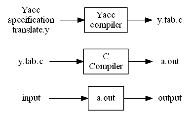

Figure 4.57: Creating an input/output translator with Yacc

A Yacc source program has three parts:
```
declarations
%%
translation rules
%%
supporting C routines
```
**Example 4.69:** To illustrate how to prepare a Yacc source program, let us construct a simple desk calculator that reads an arithmetic expression, evaluates it, and then prints its numeric value. We shall build the desk calculator starting with the following grammar for arithmetic expressions:
$$
\begin{array}{ll}
E \to E + T | T\\
T \to T * F | F\\
F \to ( E ) | digit
\end{array}
$$

The token digit is a single digit between 0 and 9. A Yacc desk calculator program derived from this grammar is shown in Fig. 4.58. $\Box$
```C
%{
#include <ctype.h>
%}
%token DIGIT
%%

line : expr '\n' { printf("%d\n", $1); }
;

expr : expr '+' term { $$ = $1 + $3; }
| term
;

term : term '*' factor { $$ = $1 * $3; }
| factor
;

factor : '(' expr ')' { $$ = $2; }
| DIGIT
;

%%

yylex() {
int c;
c = getchar();
if(isdigit(c)) {
yylval = c - 'O';
return DIGIT;
}
return c;
}
```
Figure 4.58: Yacc specification of a simple desk calculator

#### The Declarations Part

There are two sections in the declarations part of a Yacc program; both are optional. In the first section, we put ordinary C declarations, delimited by %{ and %}. Here we place declarations of any temporaries used by the translation rules or procedures of the second and third sections. In Fig. 4.58, this section contains only the include-statement
```C
#include<ctype.h>
```
that causes the C preprocessor to include the standard header file `<ctype.h>` that contains the predicate isdigit.

Also in the declarations part are declarations of grammar tokens. In Fig. 4.58, the statement
```C
%token DIGIT
```
declares DIGIT to be a token. Tokens declared in this section can then be used in the second and third parts of the Yacc specification. If Lex is used to create the lexical analyzer that passes token to the Yacc parser, then these token declarations are also made available to the analyzer generated by Lex, as discussed in Section 3.5.2.

#### The Translation Rules Part

In the part of the Yacc specification after the first `%%` pair, we put the translation rules. Each rule consists of a grammar production and the associated semantic action. A set of productions that we have been writing:
$$
<head> \to <body>_1 | <body>_2 | \dots  | <body>_n
$$
would be written in Yacc as

```
<head> : <body>_1 {<semantic action>_1}
       | <body>_2 {<semantic action>_2}
         ...
       | <body>_n {<semantic action>_n}
       ;
```
In a Yacc production, unquoted strings of letters and digits hot declared to be tokens are taken to be nontermirials. A quoted single character, e.g. 't', is taken to be the terminal symbol c, as well as the integer code for the token represented by that character (i.e., Lex would return the character code for 'c' to the parser, as an integer). Alternative bodies can be separated by a vertical bar, and a semicolon follows each head with its alternatives and their semantic actions. The first head is taken to be the start symbol.

A Yacc semantic action is a sequence of C statements. In a semantic action, the symbol `$$` refers to the attribute value associated with the nonterminal of the head, while `$i` refers to the value associated with the i^th^ grammar symbol (terminal or nonterminal) of the body. The semantic action is performed whenever we reduce by the associated production, so normally the semantic action computes a value for `$$` in terms of the `$i`'s. In the Yacc specification, we have written the two $E$-productions
$$
E \to E + T | T
$$
and their associated semantic actions as:
```C
expr : expr '+' term { $$ = $1 + $3; }
| term
;
```
Note that the nonterminal term in the first production is the third grammar symbol of the body, while + is the second. The semantic action associated with the first production adds the value of the expr and the term of the body and assigns the result as the value for the nonterminal expr of the head. We have omitted the semantic action for the second production altogether, since copying the value is the default action for productions with a single grammar symbol in the body. In general, `{ $$ = $1; }` is the default semantic action.

Notice that we have added a new starting production
```C
line : expr '\n' { printf("%d\n", $1); }
```
to the Yacc specification. This production says that an input to the desk calculator is to be an expression followed by a newline character. The semantic action associated with this production prints the decimal value of the expression followed by a newline character.

#### The Supporting C-Routines Part

The third part of a Yacc specification consists of supporting C-routines. A lexical analyzer by the name yylex() must be provided. Using Lex to produce yylex() is a common choice; see Section 4.9.3. Other procedures such as error recovery routines may be added as necessary.

The lexical analyzer yylex() produces tokens consisting of a token name and its associated attribute value. If a token name such as DIGIT is returned, the token name must be declared in the first section of the Yacc specification. The attribute value associated with a token is communicated to the parser through a Yacc-defined variable yylval.

The lexical analyzer in Fig. 4.58 is very crude. It reads input characters one at a time using the C-function getchar(). If the character is a digit, the value of the digit is stored in the variable yylval, and the token name DIGIT is returned. Otherwise, the character itself is returned as the token name.

### 4.9.2 Using Yacc with Ambiguous Grammars

Let us now modify the Yacc specification so that the resulting desk calculator becomes more useful. First, we shall allow the desk calculator to evaluate a sequence of expressions, one to a line. We shall also allow blank lines between expressions. We do so by changing the first rule to
```C
lines : lines expr '\n' { printf("%g\n", $2); }
      | lines '\n'
      | /* empty */
;
```
In Yacc, an empty alternative, as the third line is, denotes $\epsilon$.

Second, we shall enlarge the class of expressions to include numbers instead of single digits and to include the arithmetic operators `+`, `-`, (both binary and unary), `*`, and `/`. The easiest way to specify this class of expressions is to use the ambiguous grammar
$$
E \to E+E | E-E | E*E | E/E | -E | number
$$
The resulting Yacc specification is shown in Fig. 4.59.
```C
%{
#include <ctype.h>
#include <stdio.h>
#define YYSTYPE double /* double type for Yacc stack */
%}

%token NUMBER
%left '+' '-'
%left '\*' '/'
%right UMINUS

%%

lines : lines expr '\n' { printf("%g\n", $2); }
      | lines '\n'
      | /* empty */
;

expr : expr '+' expr { $$ = $1 + $3; }
     | expr '-' expr { $$ = $1 - $3; }
     | expr '\*' expr { $$ = $1 * $3; }
     | expr '/' expr { $$ = $1 / $3; }
     | '(' expr ')' { $$ = $2; }
     | '-' expr %prec UMINUS { $$ = - $2; }
     | NUMBER
     ;

%%

yylex() {
int c;
while((c = getchar())==' ');
if((c=='.'||isdigit(c))) {
ungetc(c,stdin);
scanf("%lf",&yylval);
return NUMBER;
}
return c;
}
```
Figure 4.59: Yacc specification for a more advanced desk calculator

Since the grammar in the Yacc specification in Fig. 4.59 is ambiguous, the LALR algorithm will generate parsing-action conflicts. Yacc reports the number of parsing-action conflicts that are generated. A description of the sets of items and the parsing-action conflicts can be obtained by invoking Yacc with a -v option. This option generates an additional file y.output that contains the kernels of the sets of items found for the grammar, a description of the parsing action conflicts generated by the LALR algorithm, and a readable representation of the LR parsing table showing how the parsing action conflicts were resolved. Whenever Yacc reports that it has found parsing-action conflicts, it is wise to create and consult the file y.output to see why the parsing-action conflicts were generated and to see whether they were resolved correctly.

Unless otherwise instructed Yacc will resolve all parsing action conflicts using the following two rules:

1.  A reduce/reduce conflict is resolved by choosing the conflicting production listed first in the Yacc specification.

2.  A shift/reduce conflict is resolved in favor of shift. This rule resolves the shift/reduce conflict arising from the dangling-else ambiguity correctly.

Since these default rules may not always be what the compiler writer wants, Yacc provides a general mechanism for resolving shift/reduce conflicts. In the declarations portion, we can assign precedencies and associativities to terminals. The declaration
```C
%left '+' '-'
```
makes + and - be of the same precedence and be left associative. We can declare an operator to be right associative by writing
```c
%right '^'
```
and we can force an operator to be a nonassociative binary operator(i.e., two occurrences of the operator cannot be combined at all) by writing
```c
%nonassoc '<'
```
The tokens are given precedencies in the order in which they appear in the declarations part, lowest first. Tokens in the same declaration have the same precedence. Thus, the declaration
```c
%right UMINUS
```
in Fig. 4.59 gives the token UMINUS a precedence level higher than that of the five preceding terminals.

Yacc resolves shift/reduce conflicts by attaching a precedence and associativity to each production involved in a conflict, as well as to each terminal involved in a conflict. If it must choose between shifting input symbol a and reducing by production $A \to a$, Yacc reduces if the precedence of the production is greater than that of a, or if the precedencies are the same and the associativity of the production is left. Otherwise, shift is the chosen action.

Normally, the precedence of a production is taken to be the same as that of its rightmost terminal. This is the sensible decision in most cases. For example, given productions
$$
E \to E + E | E * E
$$
we would prefer to reduce by $E \to E + E$ with lookahead +, because the + in the body has the same precedence as the lookahead, but is left associative. With lookahead \*, we would prefer to shift, because the lookahead has higher precedence than the + in the production.

In those situations where the rightmost terminal does not supply the proper precedence to a production, we can force a precedence by appending to a production the tag
```c
%prec <terminal>
```
The precedence and associativity of the production will then be the same as that of the terminal, which presumably is defined in the declaration section. Yacc does not report shift/reduce conflicts that are resolved using this precedence and associativity mechanism.

This "terminal" can be a placeholder, like UMINUS in Fig. 4.59; this terminal is not returned by the lexical analyzer, but is declared solely to define a precedence for a production. In Fig. 4.59, the declaration
```c
%right UMINUS
```
assigns to the token UMINUS a precedence that is higher than that of `*` and `/`. In the translation rules part, the tag:
```c
%prec UMINUS
```
at the end of the production
```c
expr : '-' expr
```
makes the unary-minus operator in this production have a higher precedence than any other operator.

### 4.9.3 Creating Yacc Lexical Analyzers with Lex

Lex was designed to produce lexical analyzers that could be used with Yacc. The Lex library ll will provide a driver program named yylex(), the name required by Yacc for its lexical analyzer. If Lex is used to produce the lexical analyzer, we replace the routine yylex() in the third part of the Yacc specification by the statement
```c
#include "lex.yy.c"
```
and we have each Lex action return a terminal known to Yacc. By using the `#include "lex.yy.c"` statement, the program yylex has access to Yacc's names for tokens, since the Lex output file is compiled as part of the Yacc output file y.tab.c.

Under the UNIX system, if the Lex specification is in the file first.l and the Yacc specification in second.y, we can say
```c
lex first.l
yacc second.y
cc y.tab.c -ly -ll
```
to obtain the desired translator.

The Lex specification in Fig. 4.60 can be used in place of the lexical analyzer in Fig. 4.59. The last pattern, meaning "any character," must be written `\n|.` since the dot in Lex matches any character except newline.
```c
number [0-9]+e.?|[0-9]*e.[0-9]+
%%
[ ] { /* skip blanks */ }
{number} { sscanf(yytext, "%lf", &yylval);
             return NUMBER; }
\n|. { return yytext[0]; }
```
Figure 4.60: Lex specification for yylex() in Fig. 4.59

### 4.9.4 Error Recovery in Yacc

In Yacc, error recovery uses a form of error productions. First, the user decides what "major" nonterminals will have error recovery associated with them. Typical choices are some subset of the nonterminals generating expressions, statements; blocks, and functions. The user then adds to the grammar error productions of the form $A \to \textbf{error }\alpha$, where $A$ is a major nonterminal and $\alpha$ is a string of grammar symbols, perhaps the empty string; **error** is a Yacc reserved word. Yacc will generate a parser from such a specification, treating the error productions as ordinary productions.

However, when the parser generated by Yacc encounters an error, it treats the states whose sets of items contain error productions in a special way. On encountering an error, Yacc pops symbols from its stack until it finds the top-most state on its stack whose underlying set of items includes an item of the form $A \to \cdot\textbf{error }\alpha$. The parser then "shifts" a fictitious token **error** onto the stack, as though it saw the token error on its input.

When $\alpha$ is $\epsilon$, a reduction to $A$ occurs immediately and the semantic action associated with the production $A \to \cdot \textbf{error}$ (which might be a user-specified error-recovery routine) is invoked. The parser then discards input symbols until it finds an input symbol on which normal parsing can proceed.

If $\alpha$ is not empty, Yacc skips ahead on the input looking for a substring that can be reduced to $\alpha$. If $\alpha$ consists entirely of terminals, then it looks for this string of terminals on the input, and "reduces" them by shifting them onto the stack. At this point, the parser will have $\textbf{error } \alpha$ on top of its stack. The parser will then reduce $\textbf{error } \alpha$ to $A$; and resume normal parsing.

For example, an error production of the form
$$
stmt \to \textbf{error} ;
$$
would specify to the parser that it should skip just beyond the next semicolon on seeing an error, and assume that a statement had been found. The semantic routine for this error production would not need to manipulate the input, but could generate a diagnostic message and set a flag to inhibit generation of object code, for example.
```c
%{
#include <ctype.h>
#include <stdio.h>
#define YYSTYPE double /* double type for Yacc stack */
%}

%token NUMBER
%left '+' '-'
%left '\*' '/'
%right UMINUS
%%

lines : lines expr '\n' { printf("%g\n", $2); }
| lines '\n'
| /* empty */
| error '\n' { yyerror("reenter previous line:");
yyerrok; }
;

expr : expr '+' expr { $$ = $1 + $3; }
| expr '-' expr { $$ = $1 - $3; }
| expr '\*' expr { $$ = $1 * $3; }
| expr '/' expr { $$ = $1 / $3; }
| '(' expr ')' { $$ = $2; }
| '-' expr %prec UMINUS { $$ = - $2; }
| NUMBER
;
%%
#include "lex.yy.c"
```
Figure 4.61: Desk calculator with error recovery

**Example 4.70:** Figure 4.61 shows the Yacc desk calculator of Fig. 4.59 with the error production
```c
lines: error '\n'
```
This error production causes the desk calculator to suspend normal parsing when a syntax error is found on an input line. On encountering the error, the parser in the desk calculator starts popping symbols from its stack until it encounters a state that has a shift action on the token error. State 0 is such a state (in this example, it's the only such state), since its items include
```c
lines \to error '\n'
```
Also, state 0 is always on the bottom of the stack. The parser shifts the token error onto the stack, and then proceeds to skip ahead in the input until it has found a newline character. At this point the parser shifts the newline onto the stack, reduces error ' \n' to lines, and emits the diagnostic message "reenter previous line:” The special Yacc routine yyerrok resets the parser to its normal mode of operation. $\Box$
