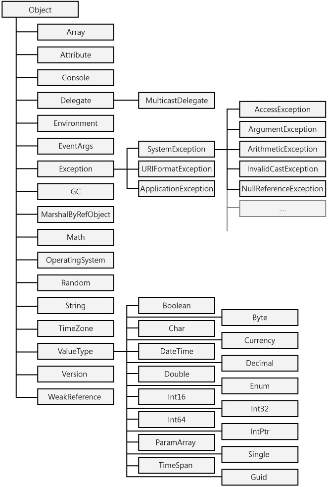

## The System.Object Type

All classes inherit—directly or indirectly—from `System.Object`, which means that you can always assign any object to a `System.Object` variable and never get a compilation or runtime error when you do so:

```FSharp
// The Object Visual Basic type is a synonym for System.Object.
let o: Object = new AnyOtherType()
```

Incidentally, note that interfaces are the only things in the .NET Framework that do not derive from `System.Object`.

### Public and Protected Methods

Because .NET types inherit from `System.Object` (see Figure 12-1), all of them expose the four instance methods that `System.Object` exposes, namely, the following.

- **Equals** 
  An overridable method that checks whether the current object has the same value as the object passed as an argument. It returns true when two object references point to the same object instance, but many classes override this method to implement a different type of equality. For example, numeric types override this method so that it returns true if the objects being compared have the same numeric value.
  
- **GetHashCode**
  An overridable method that returns a hash code for the object. This method is used when the object is a key for collections and hash tables. Ideally, the hash code should be unique for any given object instance so that you can check that two objects are "equal" by comparing their hash codes. However, implementing a hash function that provides unique values is seldom possible, and different objects might return the same hash code, so you should *never* infer that two instances with the same hash code are equal, whatever "equal" might mean for that specific type. A class can override this method to implement a different hash algorithm to improve performance when its objects are used as keys in collections. A class that overrides the `Equals` method should always override the `GetHashCode` method as well, so that two objects considered to be equal also return the same hash code.
  
- **GetType**
  A method that returns a value that identifies the type of the object. The returned value is typically used in reflection operations, as explained in Chapter 18, "Reflection."
  
- **ToString**
  An overridable method that returns the complete name of the class, for example, `MyNamespace.MyClass`. However, most classes redefine this method so that it returns a string that better describes the value of the object. For example, basic types such as `Integer`, `Double`, and `String` override this method to return the object's numeric or string value. The `ToString` method is implicitly called when you pass an object to the `Console.Write` and `Debug.Write` methods. Interestingly, `ToString` is culturally aware. For example, when applied to a numeric type, it uses a comma as the decimal separator if the current culture requires it.


The `System.Object` class also exposes two static methods:

- **Equals**
  A static member that takes two object arguments and returns true if they can be considered to be equal. It is similar to, and often used in lieu of, the instance method with the same name, which would fail if invoked on a variable reference that is `null`.
  
- **ReferenceEquals**
  A static method that takes two object arguments and returns true if they reference the same instance; ~~thus, it corresponds to the Is operator in Microsoft Visual Basic.~~ This method is similar to the `Equals` method except that derived classes can't override it.


The `System.Object` class also exposes two protected methods. Because everything in the .NET Framework derives directly or indirectly from `System.Object`, all the classes you write can invoke the following methods in their base class and override them:

- **MemberwiseClone**
  A method that returns a new object of the same type and initializes the new object's fields and properties so that the new object can be considered a copy (a clone) of the current object. You've seen this method in action in section titled "The ICloneable Interface" in Chapter 10, "Interfaces."
  
- **Finalize**
  An overridable method that the .NET Framework calls when the object is taken by the garbage collector. (For more information about this method, see the section titled "Finalize and Dispose Methods" in Chapter 9, "Object Lifetime.")


The System class hierarchy includes all the most common and useful objects in the .NET Framework, including all the basic data types. The most important classes are depicted in Figure 12-1.

 
Figure 12-1: The most important classes in the System namespace


### Value Types and Reference Types (Revisited)

Most basic data types (numbers, dates, and so on) in the .NET hierarchy inherit from `System.ValueType` and so have a common behavior. For example, `System.ValueType` overrides the `Equals` method and redefines equality so that two object references are considered equal if they have the same value (which is the way we usually compare numbers and dates), rather than if they point to the same instance. In addition, all classes deriving from `System.ValueType` override the `GetHashCode` method so that the hash code is created by taking the object's fields into account.

Classes that inherit from `System.ValueType` are commonly referred to as *value types*, to distinguish them from other classes, which are collectively named *reference types*. All numeric and `Enum` types are value types, as are types that work with dates. The .NET documentation uses the term *type* to encompass the meaning of value and reference types. I follow that convention in this book and reserve the word *class* for reference types only.

Visual Basic prevents you from explicitly inheriting from `System.ValueType`. The only way you can create a value type is by creating a Structure block:

```FSharp
[<Struct>]
type Position(x: Double,y: Double) =
    member p.X = x
    member p.Y = y
    // Add here other fields, properties, methods, and interfaces.
```

Broadly speaking, value types are more efficient than are reference types because their data isn't allocated in the managed heap and therefore isn't subject to garbage collection. More precisely, a value type declared as a local variable in a procedure is allocated on the stack; when the procedure is exited, the value is simply discarded without making any extra work for the garbage collector. (The `Finalize` method is ignored in structures.) This description isn't strictly accurate if the structure includes a member of a reference type, though. Consider this new version of the `Position` type:

```FSharp
[<Struct>]
type Position(x: Double,y: Double,desc:string) =
    member p.X = x
    member p.Y = y
    member p.Description = desc  // String is a reference type.
```

The garbage collector has to reclaim the memory used for the `Description` string member when such a structure is destroyed. In other words, value types are significantly faster than reference types are only if they don't expose any members of a reference type.

Many technical articles explain that value types are allocated on the stack and don't take memory from the managed heap, but this description isn't 100 percent correct: if a value type is used in the definition of a reference type, it does take room in the heap, as in this case:

```FSharp
type Square() =
    // These two members go in the heap, in the slot allocated for the Square object.
    member val Side : Double = 0.0 with get,set
    member val Position : Position = Position(0.0,0.0,"") with get,set
    // The pointer to the Name string is allocated in the slot for the Square
    // object, but its characters go in *another* slot of the heap.
    member val Name : String = "" with get,set
```

Other factors might affect your choice of a value type or a reference type. Value types are implicitly sealed and marked as `[<Sealed>]`, thus you should use a structure if your object acts like a primitive type and doesn't need to inherit special behaviors from other types, and other types don't need to derive from it. Also, structures can't be abstract and can't contain virtual methods, other than those inherited from `System.Object`.

A detail that might confuse many Visual Basic veterans is that the `String` class is a reference type, not a value type, as shown in Figure 12-1. You can easily demonstrate this point by assigning a `String` variable to another variable, and then testing whether both variables point to the same object:

```FSharp
let s1: String = "ABCD"
let s2: String = s1
// Prove that both variables point to the same object.
Console.WriteLine(s1 = s2)     // => True
```

.NET arrays are reference types, too, and assigning an array to an Array variable copies only the object's reference, not the array contents. The `Array` class exposes the `Clone` method to enable you to make a (shallow) copy of its elements. (See the section titled "The ICloneable Interface" in Chapter 10 for a discussion of shallow and deep copy operations.)


### Boxing and Unboxing

Even if performance is your primary concern, you shouldn't always opt for value types because sometimes reference types are faster. For example, an assignment between value types involves the copy of every field in the object, whereas assigning a reference value to a variable requires only the copy of the object's address (4 bytes in 32-bit versions of the Microsoft Windows operating system).

When you pass a value type to a method that expects an `Object` argument, a different kind of performance hit occurs because the value must be boxed in this case. *Boxing a value* means that the compiler creates a copy of it in the managed heap and assigns the address of this copy to an `Object` variable or argument so that the type can then be used as a reference type. (See the section titled "Value Types and Reference Types" in Chapter 2, "Basic Language Concepts.") A boxed value doesn't maintain a link to the original value, which means you can modify either one without affecting the other.

If this boxed value is later assigned to a variable of the original (value) type, the object is said to be *unboxed* and data is copied from the managed heap into the memory allocated to the variable (for example, on the stack if it's a local variable). Not surprisingly, boxing and unboxing take CPU time and eventually require some memory to be reclaimed during a garbage collection. The bottom line: if you carry out many assignments or frequently perform operations that result in a boxing and unboxing sequence, implementing a reference type might be a wiser choice.

Boxing occurs transparently in most cases, whereas you require an explicit CType or DirectCast operator to convert back from an `Object` to a value type if Option Strict is On. You can determine whether a call causes a boxing operation by looking at the method declaration in the object browser or in the class documentation. If the method takes an argument of the type you're passing, no boxing occurs; if it takes a generic `Object` argument, your argument will be boxed. When you create your own methods, you might consider including overloaded variations that take arguments of different types as well as a catch all procedure that takes an `Object` argument.

In general, it doesn't make sense to compare the performance of a method that uses boxing with a similar method that doesn't. An informal benchmark shows that a tight loop that calls a function that requires boxing can be up to 30 times slower than a loop that doesn't use boxing. However, you must repeat the loop 10 million times to see a meaningful difference in absolute terms, so in practice you should worry about boxing only in time-critical code sections.

You might be using boxing sometimes without knowing it. First, you implicitly box a structure if you call one of the virtual methods that the structure inherits from `System.Object`—for example, `ToString`. Second, you implicitly box a structure if you call a method of an interface that the structure exposes.

As I mentioned, boxing typically occurs transparently. In rare cases, however, you must explicitly tell Visual Basic that you want to box a value by using the `box` function. This is necessary, for example, when you want to invoke the `ToString` method (or another method inherited from `System.Object`) on an interface variable, as in this code:

```FSharp
let DisposeIt(idisp : IDisposable) =
   // Display a diagnostic message and dispose of the object.
   // (Explicitly box the reference to call ToString.)
   Console.WriteLine("Disposing " + (box idisp).ToString()) //不需要使用box
   idisp.Dispose()
```


Sometimes Microsoft Visual Basic 2005 deals with boxed variables in a rather counterintuitive way. For example, consider the following code:

```FSharp
for i = 1 to 1000 do
   for j = 1 to 100000 do
      // GetObject takes two Object arguments, and therefore causes
      // the boxing of both i and j.
      GetObject(i, j)
```

You might believe that you can optimize these loops by boxing the *i* variable yourself and passing the boxed value to the `GetObject` method, as in this code:

```FSharp
for i = 1 to 1000 do
   let obj: Object = i             // Box i manually.
   for j = 1 to 100000 do
      GetObject(obj, j)              // Only j is boxed.
   

```

The preceding snippet is actually a bit faster under Microsoft Visual Basic .NET 2003, but—surprise!—it's remarkably *slower* than the original code under Visual Basic 2005. You need a trip to ILDASM to understand why: whenever Visual Basic passes an `Object` variable to a method, it calls the `GetObjectValue` method of the `RuntimeHelpers` type (in the `System.Runtime.CompilerServices` namespace). This call adds a hidden overhead and makes the entire snippet slower.

