# DOT 语言 GUIDE
## 第一部分  设置点和线的形状和颜色
### 例1：
先来看一个例子，我们创建一个文档graph1.dot：
digraph是有向图，graph是无向图，要注意，`->`用在有向图中，`--`用在无向图中表示一条边，不能混用。 

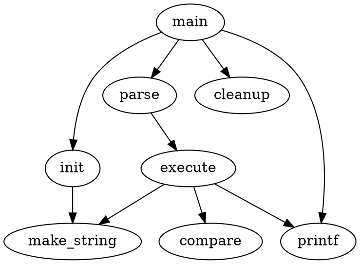
第一行给出了图的类型和名字，
当一个点第一次出现，它就被创建了
用->标示符创建一条边 

菜单$Graph\to Settings$，然后在弹出对话框点Ok，将输出输出图像文件。

画出以下图形： 

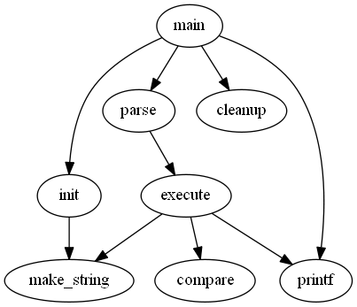
图1：Drawing of small graph

###  例2：

来看下一个稍微复杂点的例子，我们开始手动的设置一下图的属性。可以给点设置属性，也可以给边设置属性。先来讲讲怎么设置边的属性，在每条边后面的双括号里设置边的属性。也可以在用edge设置边的默认值。 

而给点设置属性就必须给每个点单独的设置一个属性，node表示点的默认值。点的默认参数是shape=ellipse, width=.75, height=.5 并且labeled by the node name. 一些点的形状在附录H中，常用的形状有 bos, circle, record, plaintext。 

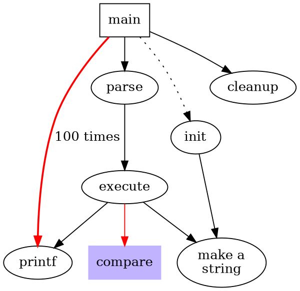
把图的尺寸设为4 inch，4 inch
把main点的形状设为方形 
weight是设置了这条边的重要程度，默认是1
让这条线是点状的
这条语句一次连了两条线
把边的默认颜色设为了red
label就是在边上写了一行字
让make_string变成了一个两行的字符串（注意那个\n）
设置了一下点的默认参数，蓝色，这个被用在了compare中

画出以下图形： 

图2：Drawing of fancy graph

### 例3：

可以设置每条边箭头的方向，用 dir，有 forward(default)，back，both，none 四种。

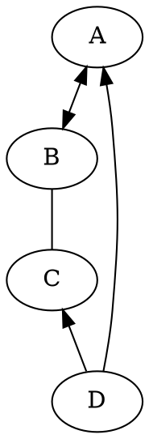

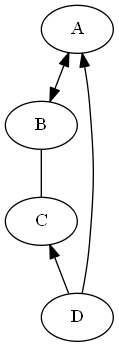

### 例4：

点的 shape 除了 record 和 Mrecord 这两种之外，其他的形状都是多边形，而我们可以对多边形进行一下属性上的设置，shape = polygon。Sides 用于设置它的边数，peripheries 用于设置多边形的外框的层数，regular = true 可以让你的多边形是一个规则的多边形，orientation = * ，可以让你的多边形旋转一个角度，如 orientation = 15 就是转了 15 度。Skew 后面跟一个（-1.0~1.0）的小数，能让你的图形斜切一个角度，distortion 是让你的图形产生透视效果。 

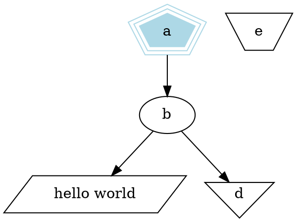

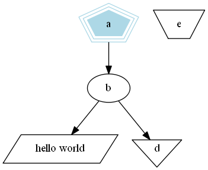

### 例5：
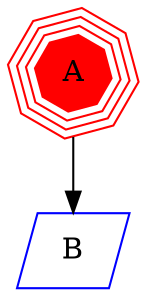
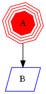

### 例6：
record 和 Mrecord 的区别就是 Mrecord 的角是圆的。Record 就是由横的和竖的矩形组成的图形。 

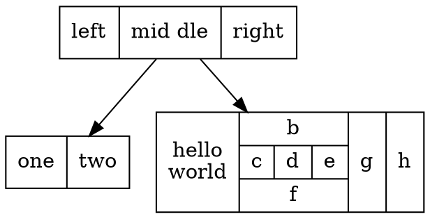
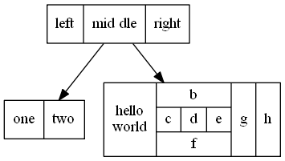

### 例7：
当你的线和线 label 比较多时，可以给线的属性 decorate = true，使得每条线的 label 与所属线之间连线。你还可以给每条线加上 headlabel 和 taillabel，给每条线的起始点和终点加上label，他们的颜色由 labelfontcolor 来决定，而 label 的颜色由 fontcolor 来决定。 

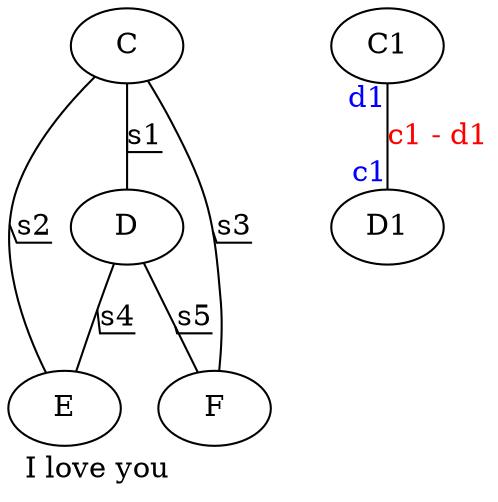
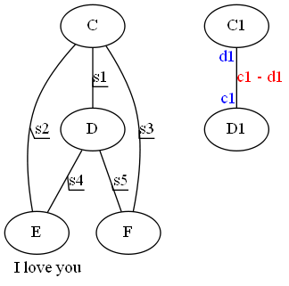

### 例8：
在 dot 中我们可以用 html 语言写一个 table。在 label 后用`< >`而不是`""`就能引入 html 语言。
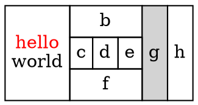

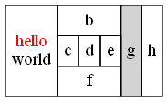

### 例9：
这样创造了一个 5 行 5 列的表格，我们可以在表格中打字。 
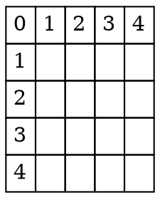

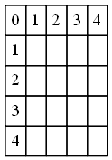

## 第二部分  设置点和线的位置，子图的概念

### 例10：
默认时图中的线都是从上到下的，我们可以将其改为从左到右，在文件的最上层打入rankdir=LR 就是从左到右，默认是 TB(top -> bottom)，也可以是 RL，BT。 

当图中时间表之类的东西时，我们会需要点能排在一行（列），这时要用到 rank，用花括号把 rank=same，然后把需要并排的点一次输入。 
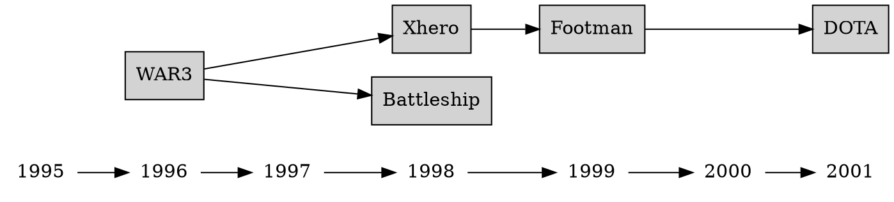
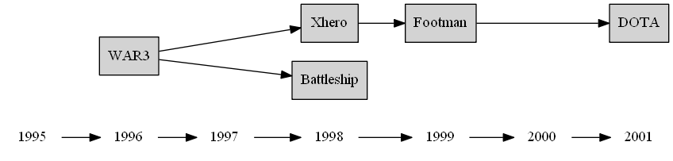

### 例11：
设立一条边时，我们可以制定这条边从起点的那个位置射出和从哪个位置结束。控制符有"n", "ne", "e",  "se", "s", "sw", "w"  和  "nw"，具体效果见下： 

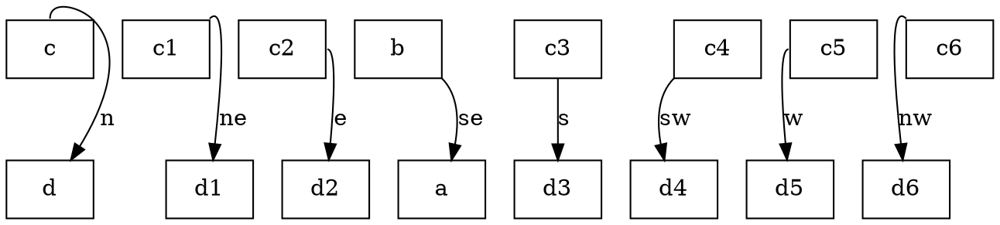
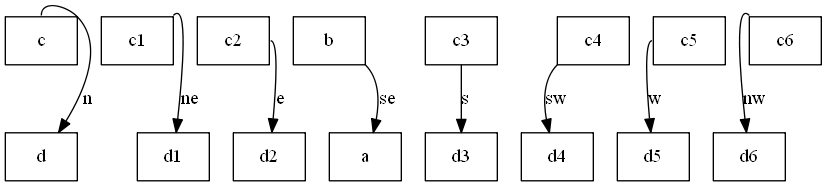

### 例12：
我们也可以在 record 中给点定义一些 port，因为 record 类型中都是一个个格子。

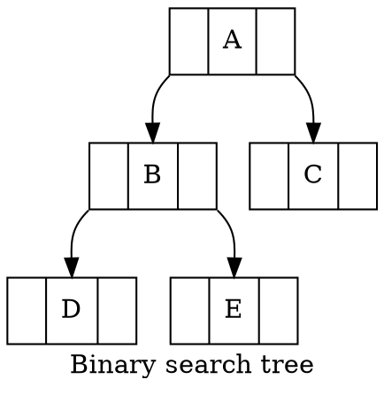
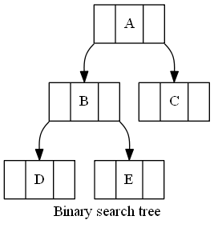

### 例13：
构造一个 HASH 表。

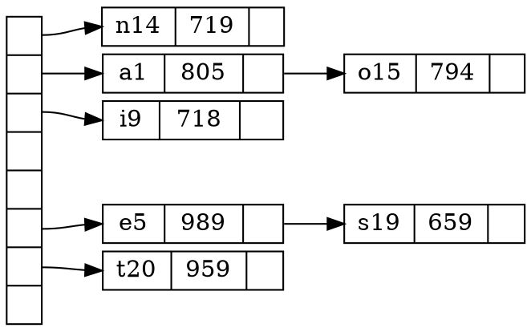
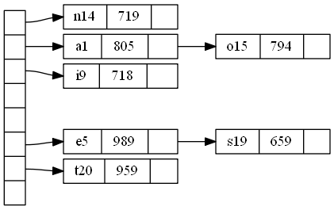
### 例14：
画一个子图就是 subgraph cluster#，必须有 cluster 前缀。 

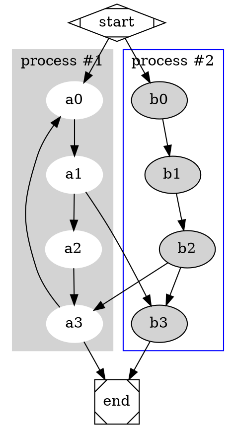

### 例15：
当你想把一条边连到一个子图的边界上，先输入 compound = true，然后就能用 lhead 和 ltail 来设置连接的子图了。 

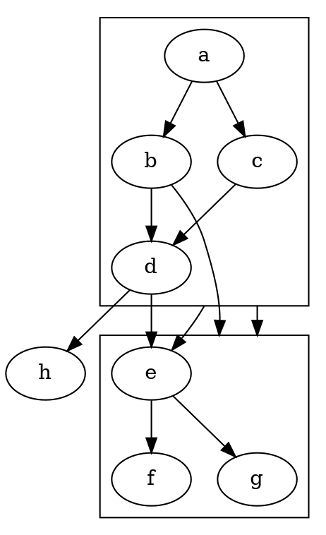

