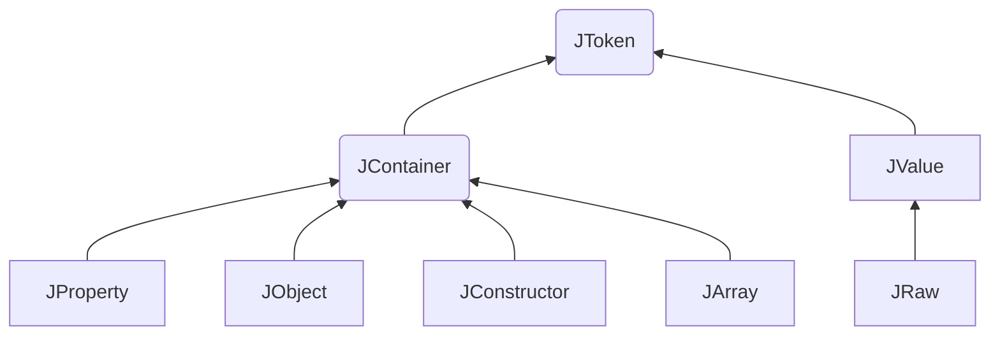
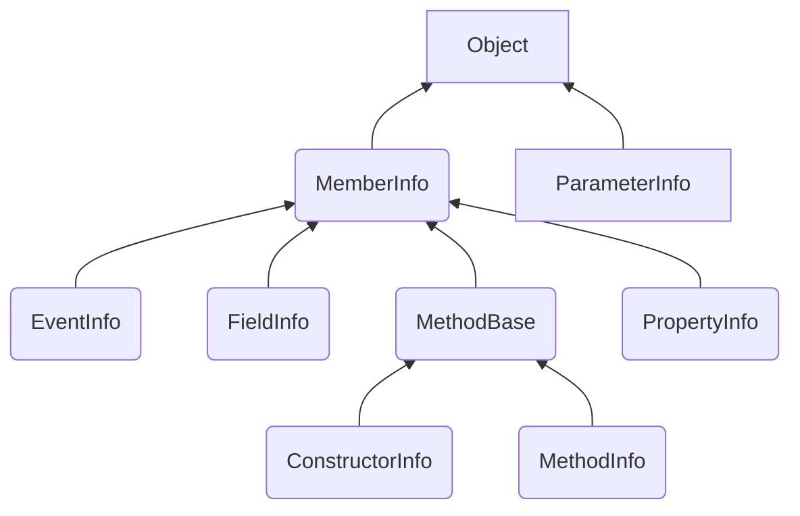

LINQ TO JSON

### 继承图

```mermaid
graph BT

I(JContainer)-->T(JToken)
V[JValue]-->T
P[JProperty]-->I
O[JObject]-->I
N[JConstructor]-->I
A[JArray]-->I
R[JRaw]-->V
```

反射继承图：

```mermaid
graph BT

m(MemberInfo)-->O[Object]
param[ParameterInfo]-->O
ei(EventInfo)-->m
fi(FieldInfo)-->m
mb(MethodBase)-->m
ci(ConstructorInfo)-->mb
mi(MethodInfo)-->mb
pi(PropertyInfo)-->m

```

