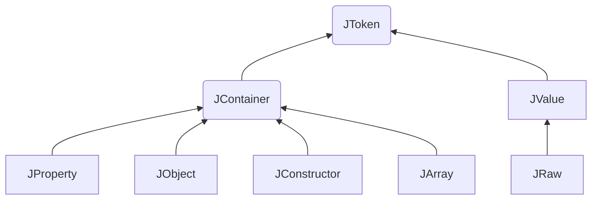

# LINQ TO JSON

FSharp.LinqToJSON

## 类型继承图



### Newtonsoft.Json.Linq Namespace

|              | Description                                              |
| :----------- | -------------------------------------------------------- |
| JArray       | Represents a JSON array.                                 |
| JConstructor | Represents a JSON constructor.                           |
| JContainer   | Represents a token that can contain other tokens.        |
| JObject      | Represents a JSON object.                                |
| JProperty    | Represents a JSON property.                              |
| JRaw         | Represents a raw JSON string.                            |
| JToken       | Represents an abstract JSON token.                       |
| JValue       | Represents a value in JSON (string, integer, date, etc). |

# Creating JSON

As well as parsing JSON from existing JSON strings, LINQ to JSON objects can be created from scratch to create new JSON structures.

## Manually Creating JSON

Setting values and creating objects and arrays one at a time gives you total control, but it is more verbose than other options.

Creating JSON

```C#
JArray array = new JArray();
JValue text = new JValue("Manual text");
JValue date = new JValue(new DateTime(2000, 5, 23));

array.Add(text);
array.Add(date);

string json = array.ToString();
```

```json
[
  "Manual text",
  "2000-05-23T00:00:00"
]
```

## Creating JSON with LINQ

Declaratively creating JSON objects using LINQ is a fast way to create JSON from collections of values.

```C#
List<Post> posts = GetPosts();

JObject rss =
    new JObject(
        new JProperty("channel",
            new JObject(
                new JProperty("title", "James Newton-King"),
                new JProperty("link", "http://james.newtonking.com"),
                new JProperty("description", "James Newton-King's blog."),
                new JProperty("item",
                    new JArray(
                        from p in posts
                        orderby p.Title
                        select new JObject(
                            new JProperty("title", p.Title),
                            new JProperty("description", p.Description),
                            new JProperty("link", p.Link),
                            new JProperty("category",
                                new JArray(
                                    from c in p.Categories
                                    select new JValue(c)))))))));

Console.WriteLine(rss.ToString());
```

```json
{
  "channel": {
    "title": "James Newton-King",
    "link": "http://james.newtonking.com",
    "description": "James Newton-King\'s blog.",
    "item": [
      {
        "title": "Json.NET 1.3 + New license + Now on CodePlex",
        "description": "Announcing the release of Json.NET 1.3, the MIT license and being available on CodePlex",
        "link": "http://james.newtonking.com/projects/json-net.aspx",
        "category": [
          "Json.NET",
          "CodePlex"
        ]
      },
      {
        "title": "LINQ to JSON beta",
        "description": "Announcing LINQ to JSON",
        "link": "http://james.newtonking.com/projects/json-net.aspx",
        "category": [
          "Json.NET",
          "LINQ"
        ]
      }
    ]
  }
}
```


