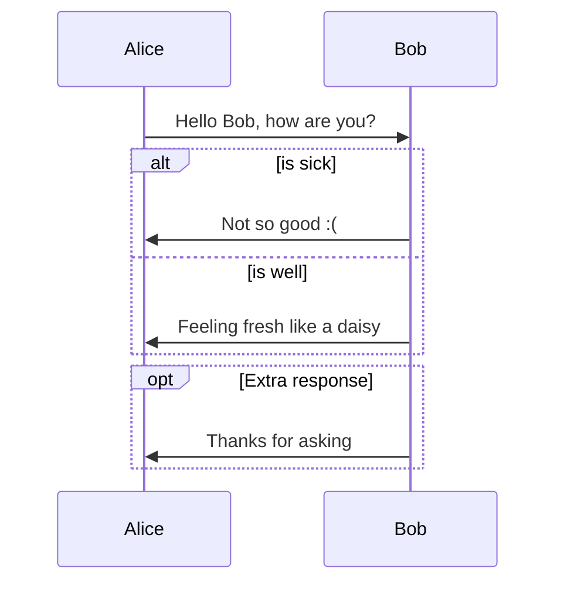
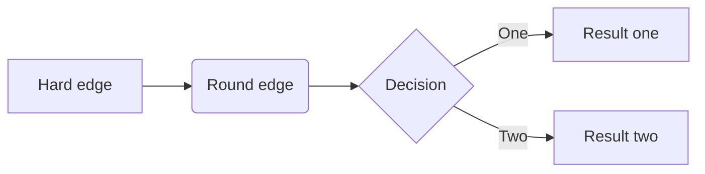
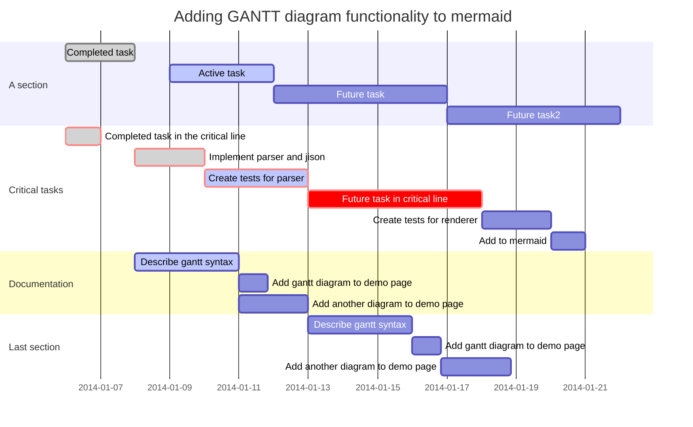

- [ ] a task list item
- [ ] list syntax required
- [ ] normal **formatting**, @mentions, #1234 refs
- [ ] incomplete
- [x] completed

$$
\begin{array}{c|lcr}
n & \text{Left} & \text{Center} & \text{Right} \\
\hline
1 & 0.24 & 1 & 125 \\
2 & -1 & 189 & -8 \\
3 & -20 & 2000 & 1+10i \\
\end{array}
$$

| First Header | Second Header |
| ------------ | ------------- |
|              |               |


### Sequence

```sequence
Alice->Bob: Hello Bob, how are you?
Note right of Bob: Bob thinks
Bob-->Alice: I am good thanks!
```


### Flowchart

```flow
st=>start: Start
op=>operation: Your Operation
cond=>condition: Yes or No?
e=>end

st->op->cond
cond(yes)->e
cond(no)->op
```

### Mermaid






